

# Interior

## WebGL

### Geometry

[Mesh](https://rabbid76.github.io/graphics-snippets/html/basic/mesh.html)

[Displacement - vertex displacement on tessellated mesh](https://rabbid76.github.io/graphics-snippets/html/basic/displacement.html)

### App

[Rubiks cube](https://rabbid76.github.io/graphics-snippets/html/app/rubiks_cube.html)

### Normal and Parallax Mapping

[No Mapping](https://rabbid76.github.io/graphics-snippets/html/technique/parallax_001_no_parallax_mapping.html)

[Normal Mapping](https://rabbid76.github.io/graphics-snippets/html/technique/parallax_002_normal_mapping.html)

[Offset Limiting](https://rabbid76.github.io/graphics-snippets/html/technique/parallax_003_offset_limiting.html)

[Steep Parallax Mapping](https://rabbid76.github.io/graphics-snippets/html/technique/parallax_004_parallax_occlusion_mapping_derivative_tbn.html)

[Parallax Occlusion Mapping](https://rabbid76.github.io/graphics-snippets/html/technique/parallax_005_parallax_relief_mapping_derivative_tbn.html)

[Cone Step Mapping](https://rabbid76.github.io/graphics-snippets/html/technique/parallax_006_cone_step_mapping_derivative_tbn.html)

[Compare of different "bump" mapping techniques](https://rabbid76.github.io/graphics-snippets/html/technique/parallax_mapping.html)

### Ambient occlusion

[SSAO (Screen Space Ambient Occlusion)](https://rabbid76.github.io/graphics-snippets/html/technique/ssao.html)

### Special

[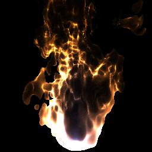 Fire](https://rabbid76.github.io/graphics-snippets/html/effect/fire.html)

### Sketch

[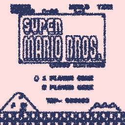 Sketch](https://rabbid76.github.io/graphics-snippets/html/sketch/sketch_texture_pen.html)

### Tools

[Light Model](https://rabbid76.github.io/graphics-snippets/html/tools/light_model_view.html)

[Light Model - property transitions](https://rabbid76.github.io/graphics-snippets/html/tools/light_model_transition.html)

[Height Map Generator](https://rabbid76.github.io/graphics-snippets/html/tools/height_map_generator.html)

[Function Plotter](https://rabbid76.github.io/graphics-snippets/html/tools/function_plotter.html)

### StackOverflow examples

[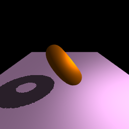 Shadow map](https://rabbid76.github.io/graphics-snippets/html/stackoverflow/shadow_map.html)

[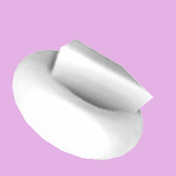 Simple fixed SSAO](https://rabbid76.github.io/graphics-snippets/html/stackoverflow/ssao_simple_b.html)

[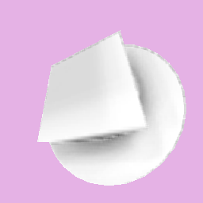 SSAO - random noise and kernel](https://rabbid76.github.io/graphics-snippets/html/stackoverflow/ssao_simple.html)

[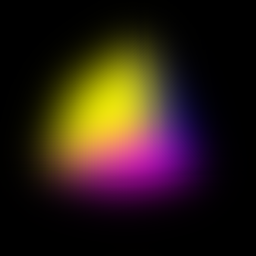 Simple blur - Blur cube](https://rabbid76.github.io/graphics-snippets/html/stackoverflow/blur_cube_color.html)

[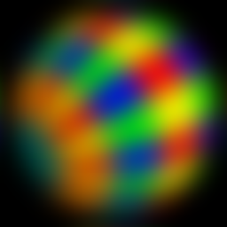 Blur sphere](https://rabbid76.github.io/graphics-snippets/html/stackoverflow/blur_sphere_texture.html)

[ Glow](https://rabbid76.github.io/graphics-snippets/html/stackoverflow/glow.html)  

[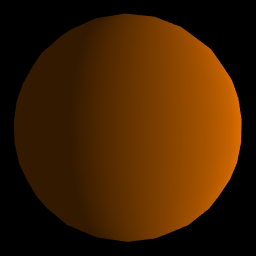 Lambertian diffuse sphere](https://rabbid76.github.io/graphics-snippets/html/stackoverflow/lambertian_sphere.html)

[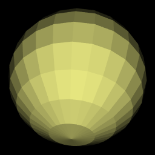 Lambertian diffuse fake light](https://rabbid76.github.io/graphics-snippets/html/stackoverflow/lambertian_fake.html)

[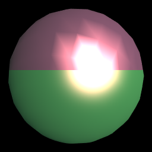 Gouraud shading / Phong shading](https://rabbid76.github.io/graphics-snippets/html/stackoverflow/gouraud_phong.html)

[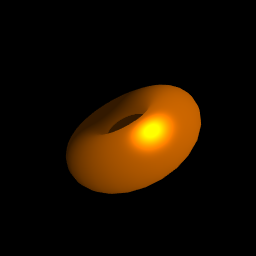 Phong light model / Blinn Phong light model](https://rabbid76.github.io/graphics-snippets/html/stackoverflow/phong_blinnphong.html)

[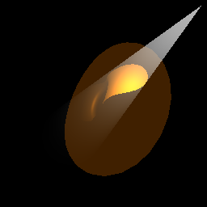 Light cone](https://rabbid76.github.io/graphics-snippets/html/stackoverflow/light_cone.html)

[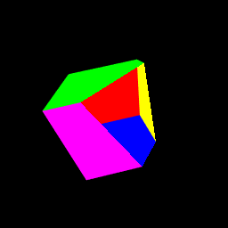 Clipping](https://rabbid76.github.io/graphics-snippets/html/stackoverflow/clip_cube.html)

[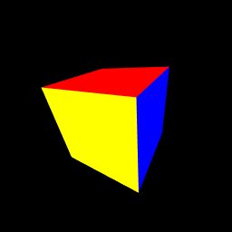 Cube color](https://rabbid76.github.io/graphics-snippets/html/stackoverflow/cube_color.html)

[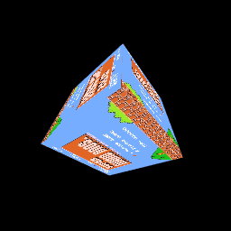 Textured cube](https://rabbid76.github.io/graphics-snippets/html/stackoverflow/cube_texture.html)

[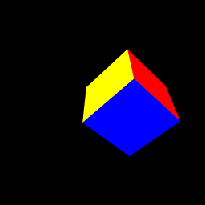 Cube - `glMatrix`](https://rabbid76.github.io/graphics-snippets/html/stackoverflow/glMatrix_cube.html)

[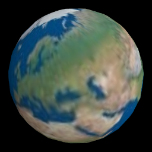 Globe](https://rabbid76.github.io/graphics-snippets/html/stackoverflow/sphere_texture.html)

[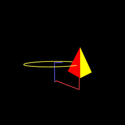 Translation and rotation](https://rabbid76.github.io/graphics-snippets/html/stackoverflow/axis_rotation.html)

[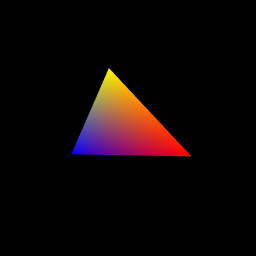 Model View Projection](https://rabbid76.github.io/graphics-snippets/html/stackoverflow/model_view_projection.html)

[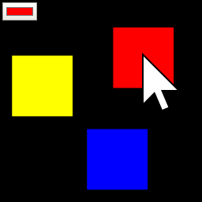 Unproject 2D - Screen coordinate to world](https://rabbid76.github.io/graphics-snippets/html/stackoverflow/unproject_2d.html)

[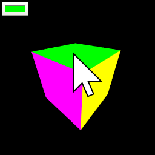 Unproject perspective - Intersect world by line of sight](https://rabbid76.github.io/graphics-snippets/html/stackoverflow/unproject_perspective.html)

[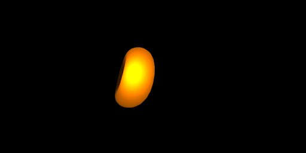 Spherical projection](https://rabbid76.github.io/graphics-snippets/html/stackoverflow/spherical_projection.html)

[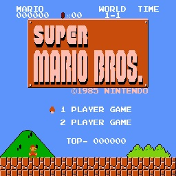 Load texture](https://rabbid76.github.io/graphics-snippets/html/stackoverflow/texture_load.html)

[ Saturate texture](https://rabbid76.github.io/graphics-snippets/html/stackoverflow/texture_saturate.html)

[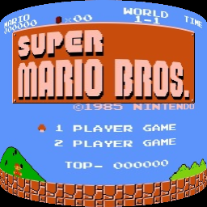 Cylindrical projected texture](https://rabbid76.github.io/graphics-snippets/html/stackoverflow/texture_cylindrical_projection.html)

[ Retro distortion](https://rabbid76.github.io/graphics-snippets/html/stackoverflow/retro_distortion.html)

[ Blending](https://rabbid76.github.io/graphics-snippets/html/stackoverflow/blending.html)

[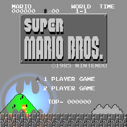 Texture flashlight](https://rabbid76.github.io/graphics-snippets/html/stackoverflow/texture_flashlight.html)

[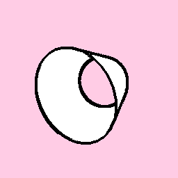 Toon silhouette](https://rabbid76.github.io/graphics-snippets/html/stackoverflow/silhouette.html)

[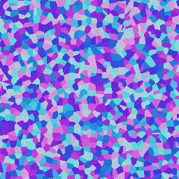 Voronoi](https://rabbid76.github.io/graphics-snippets/html/stackoverflow/voronoi.html)

[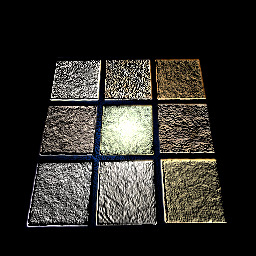 Normal map 1](https://rabbid76.github.io/graphics-snippets/html/stackoverflow/normalmap1.html)

[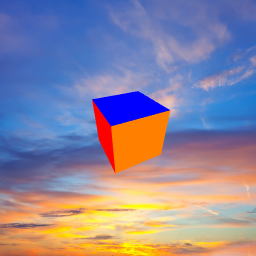 Background](https://rabbid76.github.io/graphics-snippets/html/stackoverflow/background_cube_poor_webgl.html)

### StackOverflow examples - three.js

[Background scene](https://rabbid76.github.io/graphics-snippets/html/stackoverrflow_threejs/background_scene.html)

[BSP geometry - subtract](https://rabbid76.github.io/graphics-snippets/html/stackoverrflow_threejs/geometry_bsp_subtrac.html)

[Logarithmic depth buffer (cube)](https://rabbid76.github.io/graphics-snippets/html/stackoverrflow_threejs/logarithmic_depth_cube.html)

[Dashed line shader](https://rabbid76.github.io/graphics-snippets/html/stackoverrflow_threejs/dashed_line.html)

---

## Python

### Examples

[OpenGL 4.6, Direct State Access (DSA), Spir-V Shader Program](https://github.com/Rabbid76/graphics-snippets/blob/master/example/python/dsa_spirv_cube/example_python_dsa_spirv.md)

[OpenGL 4.6, Python OpenGL 4.6, GLM navigation](https://github.com/Rabbid76/graphics-snippets/blob/master/example/python/navigation_glm/example_python_navigation_glm.md)

---

## C++

### StackOverflow examples

[Dashed line shader](https://github.com/Rabbid76/graphics-snippets/blob/master/documentation/dashed_line_shader.md)

---

## Processing

### p5.js

[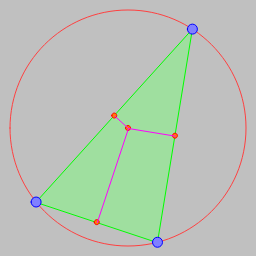 Circle by 3 points - p5.js](https://rabbid76.github.io/graphics-snippets/processing/p5js/p5js_circle_3_points.html)  

---

## Documentation

[Intersection](https://github.com/Rabbid76/graphics-snippets/blob/master/documentation/intersection.md)

[Draw geometry](https://github.com/Rabbid76/graphics-snippets/blob/master/documentation/draw_mesh.md)

[Draw elements in Python](https://github.com/Rabbid76/graphics-snippets/blob/master/documentation/draw_elements_python.md)

[Model View Projection and Depth](https://github.com/Rabbid76/graphics-snippets/blob/master/documentation/model_view_projection_depth.md)

[Matrix operations](https://github.com/Rabbid76/graphics-snippets/blob/master/documentation/matrix_operations.md)

[Matrix transformations](https://github.com/Rabbid76/graphics-snippets/blob/master/documentation/model_transformation.md)

[Tangent space](https://github.com/Rabbid76/graphics-snippets/blob/master/documentation/tangent_space.md)

[Geometry](https://github.com/Rabbid76/graphics-snippets/blob/master/documentation/geometry.md)

[Tessellation](https://github.com/Rabbid76/graphics-snippets/blob/master/documentation/tessellation.md)

[Lambertian (diffuse) reflectance model](https://github.com/Rabbid76/graphics-snippets/blob/master/documentation/light_lambertian_diffuse.md)

[Phong reflection model](https://github.com/Rabbid76/graphics-snippets/blob/master/documentation/light_phong.md)

[Blinn-Phong reflection model](https://github.com/Rabbid76/graphics-snippets/blob/master/documentation/light_blinn_phong.md)

[Normal, Parallax and Relief mapping (under construction)](https://github.com/Rabbid76/graphics-snippets/blob/master/documentation/normal_parallax_relief.md)

### Common mistakes and issues

[Common texture mistakes and issues](https://github.com/Rabbid76/graphics-snippets/blob/master/documentation/issue_texture.md)
