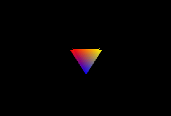
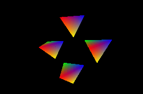
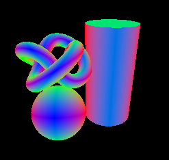
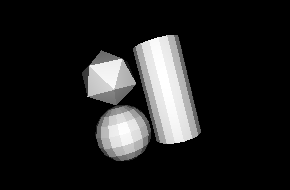
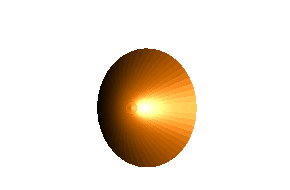
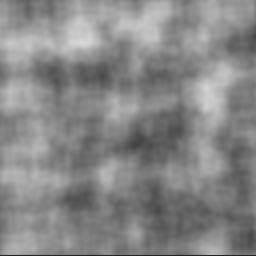
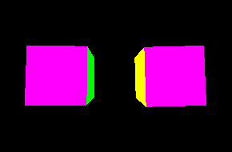
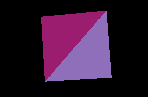
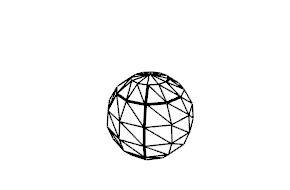

"We learn more by looking for the answer to a question and not finding it than we do from learning the answer itself."  
Lloyd Alexander, The Book of Three

---

# Graphics snippets

<!--
--><!--
--><!--
--><!--
--><!--
--><!--
--><!--
--><!--
--><!--
--><!--
--><!--
--><!--
--><!--
--><!--
--><!--
--><!--
--><!--
--><!--
--><!--
--><!--
--><!--
--><!--
--><!--
--><!--
--><!--
--><!--
--><!--
--><!--
--><!--
--><!--
--><!--
--><!--
--><!--
--><!--
--><!--
--><!--
--><!--
--><!--
--><!--
--><!--
--><!--
--><!--
--><!--
--><!--
--><!--
--><!--
--><!--
--><!--
--><!--
--><!--
--><!--
-->

This repository contains examples of rendering with OpenGL and WebGL in multiple languages.
It does not contain an application, just a collection of examples. Initially I just wanted to bring order to a bunch of examples on my local drive. 

# Interior

[WebGL](readme/content_webgl.md)

[three.js](readme/content_threejs.md)

[Python examples](readme/content_python.md)

[C++ examples](readme/content_cpp.md)

[C# examples](readme/content_csharp.md)

[p5.js and Processing](readme/content_processing_p5js.md)

[Documentation](readme/content_documentation.md)