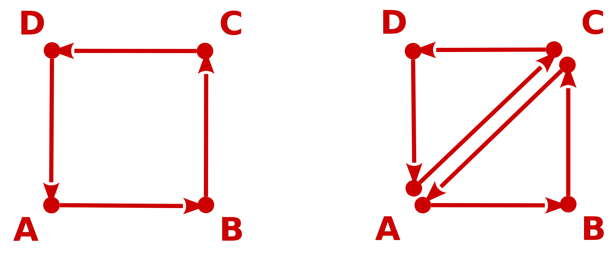
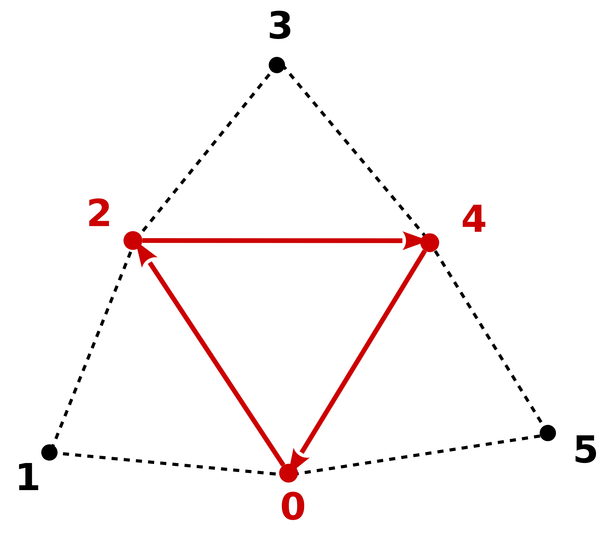

[](https://stackoverflow.com/users/5577765/rabbid76?tab=profile)

---

<!-- TOC -->

- [Draw geometry](#draw-geometry)
    - [Primitives](#primitives)
        - [Point primitives](#point-primitives)
        - [Line primitives](#line-primitives)
        - [Triangle primitives](#triangle-primitives)
            - [Triangle fan](#triangle-fan)
            - [Triangle stripe](#triangle-stripe)
            - [Triangle adjacency](#triangle-adjacency)
            - [Triangle stripe adjacency](#triangle-stripe-adjacency)
    - [Vertex attributes](#vertex-attributes)
    - [Vertex array](#vertex-array)
        - [Separated tightly packed buffers for different attributes](#separated-tightly-packed-buffers-for-different-attributes)
    - [Vertex buffer object (Array buffer)](#vertex-buffer-object-array-buffer)
        - [Separated tightly packed buffers for different attributes](#separated-tightly-packed-buffers-for-different-attributes-1)
    - [Index buffer object (Element array buffer)](#index-buffer-object-element-array-buffer)
    - [Vertex array object](#vertex-array-object)
    - [Fixed Function Pipeline - Deprecated, old school](#fixed-function-pipeline---deprecated-old-school)
    - [Vertex attributes with integral data types](#vertex-attributes-with-integral-data-types)
    - [WebGL](#webgl)
- [TODO](#todo)
    - [Investigate](#investigate)
    - [Question](#question)
    - [Answer](#answer)

<!-- /TOC -->

# Draw geometry

## Primitives

There are different types of [Primitives](https://www.khronos.org/opengl/wiki/Primitive) in OGL:

- Point primitives: `GL_POINTS`

- Line primitives: `GL_LINES`, `GL_LINE_STRIP`, `GL_LINE_LOOP`

- Line primitives with adjacency information: `GL_LINES_ADJACENCY`, `GL_LINE_STRIP_ADJACENCY`<br/>
  Adjacency do not create a further geometry, but the provide information which can be use in a geometry shader stage.

- Triangle primitives: `GL_TRIANGLES`, `GL_TRIANGLE_STRIP`, `GL_TRIANGLE_FAN`

- Triangle primitives with adjacency information: `GL_TRIANGLES_ADJACENCY`, `GL_TRIANGLE_STRIP_ADJACENCY`<br/>
  Adjacency do not create a further geometry, but the provide information which can be use in a geometry shader stage.

For the sickness of completeness there are, the list of **deprecated** primitive types: `GL_QUADS`, `GL_QUAD_STRIP`, and `GL_POLYGON`:

For tessellation there is the special primitive type `GL_PATCH`.

### Point primitives

### Line primitives

### Triangle primitives

#### Triangle fan

See [Wikipedia, Triangle fan](https://en.wikipedia.org/wiki/Triangle_fan).

#### Triangle stripe

See [Wikipedia, Triangle strip](https://en.wikipedia.org/wiki/Triangle_strip).



#### Triangle adjacency



#### Triangle stripe adjacency

<br/><hr/>

## Vertex attributes

If you do not specify the attributes indices through [layout qualifiers](https://www.khronos.org/opengl/wiki/Layout_Qualifier_(GLSL)), the attribute indexes are not specified and can have any value. There is no guarantee of the order nor that the indices are 0, 1, 2 and 3.  
You must get the attribute indexes with [`glGetAttribLocation`](https://www.khronos.org/registry/OpenGL-Refpages/gl4/html/glGetAttribLocation.xhtml) after you link the program, or you must specify the attribute indexes with [`glBindAttribLocation`](https://www.khronos.org/registry/OpenGL-Refpages/gl4/html/glBindAttribLocation.xhtml) before you link the program.

See [OpenGL 4.6 API Core Profile Specification - 7.3.1.1 Naming Active Resources](https://www.khronos.org/registry/OpenGL/specs/gl/glspec46.core.pdf#page=128&zoom=100,168,214)

> The order of the active resource list is implementation-dependent for all interfaces except for TRANSFORM_FEEDBACK_VARYING.

## Vertex array

### Separated tightly packed buffers for different attributes

e.g. Buffers for vertices (x, y, z), normals (x, y, z) and texture oordinates (u, v):

Draw the array in core mode:

```cpp
GLsizei              no_of_points; // number of vertices and attrbuts
std::vector<GLfloat> vertex;       // linearized array (no_of_points * 3): [ Vx0, Vy0, Vz0, Vx1, Vy1, Vz1, .... ]
std::vector<GLfloat> normal;       // linearized array (no_of_points * 3): [ Nx0, Ny0, Nz0, Nx1, Ny1, Nz1, .... ]
std::vector<GLfloat> color;        // linearized array (no_of_points * 5): [ R0, G0, B0, A0, R1, G1, B1, A1, .... ]

GLuint vetexAttribIndex;  // index of the vertex attrbute (shader)
GLuint normalAttribIndex; // index of the normal attribute (shader)
GLuint colorAttribIndex;  // index of the color attribute (shader)

glVertexAttribPointer( vetexAttribIndex,  3, GL_FLOAT, GL_FALSE, 0, vertex.data() ); // 3: Vx, Vy, Vz
glVertexAttribPointer( normalAttribIndex, 3, GL_FLOAT, GL_TRUE,  0, normal.data() ); // 3: Nx, Ny, Nz  -  GL_TRUE: values should be normalized
glVertexAttribPointer( colorAttribIndex,  4, GL_FLOAT, GL_FALSE, 0, color.data() );  // 4: R, G, B, A

glEnableVertexAttribArray( vetexAttribIndex );
glEnableVertexAttribArray( normalAttribIndex );
glEnableVertexAttribArray( colorAttribIndex );

glDrawArrays( GL_TRIANGLES, 0, no_of_points ); 

glDisableVertexAttribArray( vetexAttribIndex );
glDisableVertexAttribArray( normalAttribIndex );
glDisableVertexAttribArray( colorAttribIndex );
```

See:

- [`glVertexAttribPointer`](https://www.khronos.org/registry/OpenGL-Refpages/gl4/html/glVertexAttribPointer.xhtml)
- [`glEnableVertexAttribArray` / `glDisableVertexAttribArray`](https://www.khronos.org/registry/OpenGL-Refpages/gl4/html/glEnableVertexAttribArray.xhtml)
- [`glDrawArrays`](https://www.khronos.org/registry/OpenGL-Refpages/gl2.1/xhtml/glDrawArrays.xml)    

See [OpenGL 4.6 core profile specification - 10.3.9 Vertex Arrays in Buffer Objects](https://www.khronos.org/registry/OpenGL/specs/gl/glspec46.core.pdf):

> A buffer object binding point is added to the client state associated with each vertex array index. The commands that specify the locations and organizations of vertex arrays **copy the buffer object name that is bound to `ARRAY_BUFFER` to the binding point** corresponding to the vertex array index being specified. For example, the VertexAttribPointer command copies the value of `ARRAY_BUFFER_BINDING`.

See the Khronos group reference page for [`glVertexAttribPointer`](https://www.khronos.org/registry/OpenGL-Refpages/gl4/html/glVertexAttribPointer.xhtml):

> For `glVertexAttribPointer`, if normalized is set to `GL_TRUE`, it indicates that values stored in an integer format are to be mapped to the range [-1,1] (for signed values) or [0,1] (for unsigned values) when they are accessed and **converted to floating point**. Otherwise, values **will be converted to floats directly** without normalization.
  
<br/>

Draw the array in compatibility mode (**deprecated**):

```cpp
GLsizei              no_of_points; // number of vertices and attrbuts
std::vector<GLfloat> vertex;       // linearized array (no_of_points * 3): [ Vx0, Vy0, Vz0, Vx1, Vy1, Vz1, .... ]
std::vector<GLfloat> normal;       // linearized array (no_of_points * 3): [ Nx0, Ny0, Nz0, Nx1, Ny1, Nz1, .... ]
std::vector<GLfloat> color;        // linearized array (no_of_points * 5): [ R0, G0, B0, A0, R1, G1, B1, A1, .... ]

glVertexPointer( 3, GL_FLOAT, 0, vertex.data() ); // 3: Vx, Vy, Vz 
glNormalPointer(    GL_FLOAT, 0, normal.data() );
glColorPointer(  4, GL_FLOAT, 0, color.data() );  // 4: R, G, B, A  

glEnableClientState( GL_VERTEX_ARRAY );
glEnableClientState( GL_NORMAL_ARRAY );
glEnableClientState( GL_COLOR_ARRAY );

glDrawArrays( GL_TRIANGLES, 0, no_of_points );  

glDisableClientState( GL_VERTEX_ARRAY );
glDisableClientState( GL_NORMAL_ARRAY );
glDisableClientState( GL_COLOR_ARRAY );
```

See:

- [`glVertexPointer`](https://www.khronos.org/registry/OpenGL-Refpages/gl2.1/xhtml/glVertexPointer.xml)
- [`glNormalPointer`](https://www.khronos.org/registry/OpenGL-Refpages/gl2.1/xhtml/glNormalPointer.xml)
- [`glTexCoordPointer`](https://www.khronos.org/registry/OpenGL-Refpages/gl2.1/xhtml/glTexCoordPointer.xml)
- [`glColorPointer`](https://www.khronos.org/registry/OpenGL-Refpages/gl2.1/xhtml/glColorPointer.xml)
- [`glEnableClientState` / `glDisableClientState`](https://www.khronos.org/registry/OpenGL-Refpages/gl2.1/xhtml/glEnableClientState.xml)


<br/><hr/>

## Vertex buffer object (Array buffer)

It is sufficient to call [`glVertexAttribPointer`](https://www.khronos.org/registry/OpenGL-Refpages/gl4/html/glVertexAttribPointer.xhtml) once per vetrex attribute. The [Vertex Specification](https://www.khronos.org/opengl/wiki/Vertex_Specification) is kept until it is not redefined. Of course, the buffer object, where [`glVertexAttribPointer`](https://www.khronos.org/registry/OpenGL-Refpages/gl4/html/glVertexAttribPointer.xhtml) refers to must not be deleted. Also the state, whether the vertex attribute is enabled ([`glEnableVertexAttribArray`](https://www.khronos.org/registry/OpenGL-Refpages/gl4/html/glEnableVertexAttribArray.xhtml)) or not is kept until the vertex attribute is disabled again ([`glDisableVertexAttribArray`](https://www.khronos.org/registry/OpenGL-Refpages/gl4/html/glEnableVertexAttribArray.xhtml)).

The Khronos OpenGL wiki about [Vertex Specification](https://www.khronos.org/opengl/wiki/Vertex_Specification) clearly says:

> The [`glVertexAttribPointer`](https://www.khronos.org/registry/OpenGL-Refpages/gl4/html/glVertexAttribPointer.xhtml) functions **state** where an attribute index gets its array data from. 

This state can be retrieved with [`glGetVertexAttrib`](https://www.khronos.org/registry/OpenGL-Refpages/gl4/html/glGetVertexAttrib.xhtml).

More information about vertex attributes can be found in the [OpenGL 4.6. core specification](https://www.khronos.org/registry/OpenGL/specs/gl/glspec46.core.pdf) from Chapter 10.2 to 10.6.

<br/>

### Separated tightly packed buffers for different attributes

e.g. Buffers for vertices (x, y, z), normals (x, y, z) and texture coordinates (u, v):

Create the vertex array buffer:

```cpp
GLsizei              no_of_points; // number of vertices and attrbuts
std::vector<GLfloat> vertex;       // linearized array (no_of_points * 3): [ Vx0, Vy0, Vz0, Vx1, Vy1, Vz1, .... ]
std::vector<GLfloat> normal;       // linearized array (no_of_points * 3): [ Nx0, Ny0, Nz0, Nx1, Ny1, Nz1, .... ]
std::vector<GLfloat> texture;      // linearized array (no_of_points * 3): [ Tu0, Tv0, Tu1, Tv1, .... ]

GLuint vbos[3];

glGenBuffers( 3, vbos );

glBindBuffer( GL_ARRAY_BUFFER, vbos[0] );
glBufferData( GL_ARRAY_BUFFER, vertex.size() * sizeof(GLfloat), vertex.data(), GL_STATIC_DRAW );
glBindBuffer( GL_ARRAY_BUFFER, vbos[1] );
glBufferData( GL_ARRAY_BUFFER, normal.size() * sizeof(GLfloat), normal.data(), GL_STATIC_DRAW );
glBindBuffer( GL_ARRAY_BUFFER, vbos[2] );
glBufferData( GL_ARRAY_BUFFER, texture.size() * sizeof(GLfloat), texture.data(), GL_STATIC_DRAW );

glBindBuffer( GL_ARRAY_BUFFER, 0 );
```

See:

- [`glGenBuffers`](https://www.khronos.org/registry/OpenGL-Refpages/gl4/html/glGenBuffers.xhtml)
- [`glDeleteBuffers`](https://www.khronos.org/registry/OpenGL-Refpages/gl4/html/glDeleteBuffers.xhtml)
- [`glBindBuffer`](https://www.khronos.org/registry/OpenGL-Refpages/gl4/html/glBindBuffer.xhtml)

<br/>

Draw the array in core mode:

```cpp
GLuint vetexAttribIndex;  // index of the vertex attrbute (shader)
GLuint normalAttribIndex; // index of the normal attribute (shader)
GLuint texCorAttribIndex; // index of the texture coordinate attribute (shader)

glBindBuffer( GL_ARRAY_BUFFER, vbos[0] );
glVertexAttribPointer( vetexAttribIndex,  3, GL_FLOAT, GL_FALSE, 0, nullptr ); // 3: Vx, Vy, Vz
glBindBuffer( GL_ARRAY_BUFFER, vbos[1] );
glVertexAttribPointer( normalAttribIndex, 3, GL_FLOAT, GL_TRUE,  0, nullptr ); // 3: Nx, Ny, Nz  -  GL_TRUE: values should be normalized
glBindBuffer( GL_ARRAY_BUFFER, vbos[2] );
glVertexAttribPointer( texCorAttribIndex,  2, GL_FLOAT, GL_FALSE, 0, nullptr ); // 2: Tu, Tv 

glEnableVertexAttribArray( vetexAttribIndex );
glEnableVertexAttribArray( normalAttribIndex );
glEnableVertexAttribArray( texCorAttribIndex );

glDrawArrays( GL_TRIANGLES, 0, no_of_points ); 

glBindBuffer( GL_ARRAY_BUFFER, 0 );
glDisableVertexAttribArray( vetexAttribIndex );
glDisableVertexAttribArray( normalAttribIndex );
glDisableVertexAttribArray( texCorAttribIndex );
```

<br/>

Draw the array in compatibility mode (**deprecated**):

```cpp
glBindBuffer( GL_ARRAY_BUFFER, vbos[0] );
glVertexPointer(   3, GL_FLOAT, 0, nullptr ); // 3: Vx, Vy, Vz 
glBindBuffer( GL_ARRAY_BUFFER, vbos[1] );
glNormalPointer(      GL_FLOAT, 0, nullptr );
glBindBuffer( GL_ARRAY_BUFFER, vbos[1] );
glTexCoordPointer( 2, GL_FLOAT, 0, nullptr ); // 2: Tu, Tv  

glEnableClientState( GL_VERTEX_ARRAY );
glEnableClientState( GL_NORMAL_ARRAY );
glEnableClientState( GL_TEXTURE_COORD_ARRAY );

glDrawArrays( GL_TRIANGLES, 0, no_of_points );  

glBindBuffer( GL_ARRAY_BUFFER, 0 );
glDisableClientState( GL_VERTEX_ARRAY );
glDisableClientState( GL_NORMAL_ARRAY );
glDisableClientState( GL_TEXTURE_COORD_ARRAY );  
```

<br/>    

<b>Vertex attribute records set - Stride packed</b>

e.g. Vertex, Normal vector and Texture coordinate

```txt     
[ Vx0, Vy0, Vz0, Nx0, Ny0, Nz0, Tv0, Tu0,
    Vx1, Vy1, Vz1, Nx1, Ny1, Nz1, Tv1, Tu1,
    .....
]
```

<br/>

Create the vertex array buffer:

```cpp
GLsizei no_of_points;
std::vector<GLfloat> data; // attribute set: [ Vx0, Vy0, Vz0, Nx0, Ny0, Nz0, Tv0, Tu0, Vx1, Vy1, Vz1, Nx1, Ny1, Nz1, Tv1, Tu1, .... ]

GLuint vbo;

glGenBuffers( 1, &vbo );
glBindBuffer( GL_ARRAY_BUFFER, vbo );
glBufferData( GL_ARRAY_BUFFER, data.size() * sizeof(GLfloat), data.data(), GL_STATIC_DRAW );
glBindBuffer( GL_ARRAY_BUFFER, 0 );
```

<br/>

Draw the array in core mode:

```cpp
GLuint vetexAttribIndex;  // index of the vertex attrbute (shader)
GLuint normalAttribIndex; // index of the normal attribute (shader)
GLuint texCorAttribIndex; // index of the texture coordinate attribute (shader)

glBindBuffer( GL_ARRAY_BUFFER, vbo );

GLsizei stride = 8 * sizeof(GL_float); // size of one record in bytes: 8 * float [ Vx, Vy, Vz, Nx, Ny, Nz, Tv, Tu]
GLsizei offsV  = 0 * sizeof(GL_float); // offset of the vertex inside the reccord
GLsizei offsNV = 3 * sizeof(GL_float); // offset of the normal vector inside the reccord
GLsizei offsTC = 6 * sizeof(GL_float); // offset of the tecture coordinate inside the reccord

glVertexAttribPointer( vetexAttribIndex,  3, GL_FLOAT, GL_FALSE, stride, offsV );  // 3: Vx, Vy, Vz
glVertexAttribPointer( normalAttribIndex, 3, GL_FLOAT, GL_TRUE,  stride, offsNV ); // 3: Nx, Ny, Nz  -  GL_TRUE: values should be normalized
glVertexAttribPointer( texCorAttribIndex, 2, GL_FLOAT, GL_FALSE, stride, offsTC ); // 2: Tu, Tv 

glEnableVertexAttribArray( vetexAttribIndex );
glEnableVertexAttribArray( normalAttribIndex );
glEnableVertexAttribArray( texCorAttribIndex );

glDrawArrays( GL_TRIANGLES, 0, no_of_points ); 

glBindBuffer( GL_ARRAY_BUFFER, 0 );
glDisableVertexAttribArray( vetexAttribIndex );
glDisableVertexAttribArray( normalAttribIndex );
glDisableVertexAttribArray( texCorAttribIndex );
```

<br/>

Draw the array in compatibility mode (**deprecated**):

```cpp
glBindBuffer( GL_ARRAY_BUFFER, vbo );

GLsizei stride = 8 * sizeof(GL_float); // size of one record in bytes: 8 * float [ Vx, Vy, Vz, Nx, Ny, Nz, Tv, Tu]
GLsizei offsV  = 0 * sizeof(GL_float); // offset of the vertex inside the reccord
GLsizei offsNV = 3 * sizeof(GL_float); // offset of the normal vector inside the reccord
GLsizei offsTC = 6 * sizeof(GL_float); // offset of the tecture coordinate inside the reccord

glBindBuffer( GL_ARRAY_BUFFER, vbo );
glVertexPointer(   3, GL_FLOAT, stride, offsV );  // 3: Vx, Vy, Vz 
glNormalPointer(      GL_FLOAT, stride, offsNV );
glTexCoordPointer( 2, GL_FLOAT, stride, offsTC ); // 2: Tu, Tv  

glEnableClientState( GL_VERTEX_ARRAY );
glEnableClientState( GL_NORMAL_ARRAY );
glEnableClientState( GL_TEXTURE_COORD_ARRAY );

glDrawArrays( GL_TRIANGLES, 0, no_of_points );  

glBindBuffer( GL_ARRAY_BUFFER, 0 );
glDisableClientState( GL_VERTEX_ARRAY );
glDisableClientState( GL_NORMAL_ARRAY );
glDisableClientState( GL_TEXTURE_COORD_ARRAY );
```

<br/><hr/>

## Index buffer object (Element array buffer)

e.g. Vertex, Normal vector and Texture coordinate

```txt
[ Vx0, Vy0, Vz0, Nx0, Ny0, Nz0, Tv0, Tu0,
    Vx1, Vy1, Vz1, Nx1, Ny1, Nz1, Tv1, Tu1,
    .....
]
```

<br/>

Create the vertex array buffer and the index buffer:

```cpp
GLsizei no_of_points;
std::vector<GLfloat> data;    // attribute set: [ Vx0, Vy0, Vz0, Nx0, Ny0, Nz0, Tv0, Tu0, Vx1, Vy1, Vz1, Nx1, Ny1, Nz1, Tv1, Tu1, .... ]
std::vector<GLuint>  indices; // indces: [ I0, I1, I2, I3, I4, ..... ]

GLuint vbo;

glGenBuffers( 1, &vbo );
glBindBuffer( GL_ARRAY_BUFFER, vbo );
glBufferData( GL_ARRAY_BUFFER, data.size() * sizeof(GLfloat), data.data(), GL_STATIC_DRAW );
glBindBuffer( GL_ARRAY_BUFFER, 0 );

GLuint ibo;

glGenBuffers( 1, &ibo );
glBindBuffer( GL_ELEMENT_ARRAY_BUFFER, ibo );
glBufferData( GL_ELEMENT_ARRAY_BUFFER, indices.size() * sizeof(GLuint), indices.data(), GL_STATIC_DRAW );
glBindBuffer( GL_ELEMENT_ARRAY_BUFFER, 0 );
```

<br/>

Draw the array in core mode:

```cpp
GLuint vetexAttribIndex;  // index of the vertex attribute (shader)
GLuint normalAttribIndex; // index of the normal attribute (shader)
GLuint texCorAttribIndex; // index of the texture coordinate attribute (shader)

glBindBuffer( GL_ARRAY_BUFFER, vbo );

GLsizei stride = 8 * sizeof(GL_float); // size of one record in bytes: 8 * float [ Vx, Vy, Vz, Nx, Ny, Nz, Tv, Tu]
GLsizei offsV  = 0 * sizeof(GL_float); // offset of the vertex inside the reccord
GLsizei offsNV = 3 * sizeof(GL_float); // offset of the normal vector inside the reccord
GLsizei offsTC = 6 * sizeof(GL_float); // offset of the texture coordinate inside the reccord

glVertexAttribPointer( vetexAttribIndex,  3, GL_FLOAT, GL_FALSE, stride, offsV );  // 3: Vx, Vy, Vz
glVertexAttribPointer( normalAttribIndex, 3, GL_FLOAT, GL_TRUE,  stride, offsNV ); // 3: Nx, Ny, Nz  -  GL_TRUE: values should be normalized
glVertexAttribPointer( texCorAttribIndex,  2, GL_FLOAT, GL_FALSE, stride, offsTC ); // 2: Tu, Tv 

glEnableVertexAttribArray( vetexAttribIndex );
glEnableVertexAttribArray( normalAttribIndex );
glEnableVertexAttribArray( texCorAttribIndex );

glBindBuffer( GL_ELEMENT_ARRAY_BUFFER, ibo );
glDrawElements( GL_TRIANGLES, (GLsizei)indices.size(), GL_UNSIGNED_INT, nullptr );
glBindBuffer( GL_ELEMENT_ARRAY_BUFFER, 0 ); 

glBindBuffer( GL_ARRAY_BUFFER, 0 );
glDisableVertexAttribArray( vetexAttribIndex );
glDisableVertexAttribArray( normalAttribIndex );
glDisableVertexAttribArray( texCorAttribIndex );
```

<br/>

Draw the array in compatibility mode (**deprecated**):

```cpp
glBindBuffer( GL_ARRAY_BUFFER, vbo );

GLsizei stride = 8 * sizeof(GL_float); // size of one record in bytes: 8 * float [ Vx, Vy, Vz, Nx, Ny, Nz, Tv, Tu]
GLsizei offsV  = 0 * sizeof(GL_float); // offset of the vertex inside the reccord
GLsizei offsNV = 3 * sizeof(GL_float); // offset of the normal vector inside the reccord
GLsizei offsTC = 6 * sizeof(GL_float); // offset of the tecture coordinate inside the reccord

glBindBuffer( GL_ARRAY_BUFFER, vbo );
glVertexPointer(   3, GL_FLOAT, stride, offsV );  // 3: Vx, Vy, Vz 
glNormalPointer(      GL_FLOAT, stride, offsNV );
glTexCoordPointer( 2, GL_FLOAT, stride, offsTC ); // 2: Tu, Tv  

glEnableClientState( GL_VERTEX_ARRAY );
glEnableClientState( GL_NORMAL_ARRAY );
glEnableClientState( GL_TEXTURE_COORD_ARRAY );

glDrawArrays( GL_TRIANGLES, 0, no_of_points );  

glBindBuffer( GL_ARRAY_BUFFER, 0 );
glDisableClientState( GL_VERTEX_ARRAY );
glDisableClientState( GL_NORMAL_ARRAY );
glDisableClientState( GL_TEXTURE_COORD_ARRAY );
```

<br/><hr/>

## Vertex array object

To handle different vertex attribute pointers and not to specify and enable or disable them alternately, a vertex array object can be generated ([`glGenVertexArrays`](https://www.khronos.org/registry/OpenGL-Refpages/gl4/html/glGenVertexArrays.xhtml), which stores all the information about buffer location, data format, state and attribute index:

See [OpenGL 4.6 core Specification - 10.3.1 Vertex Array Objects](https://www.khronos.org/registry/OpenGL/specs/gl/glspec46.core.pdf):

> The buffer objects that are to be used by the vertex stage of the GL are collected together to form a vertex array object.
> All state related to the definition of data used by the vertex processor is encapsulated in a vertex array object.
>
> ....
>
> The currently bound vertex array object is used for all commands which modify vertex array state, such as VertexAttribPointer and EnableVertexAttribArray;
> all commands which draw from vertex arrays, such as DrawArrays and DrawElements;

<br/>

The `GL_ELEMENT_ARRAY_BUFFER` has to be bound **after** the vertex array object has been bound (`glBindVertexArray`). The `GL_ELEMENT_ARRAY_BUFFER` object is stored in the vertex array objects state vector.<br/>
If the vertex array object has been unbound and is bound again, then the `GL_ELEMENT_ARRAY_BUFFER` is known and bound again too. But if the element array buffer explicitly gets unbound while the vertex array object is bound, it is removed form the state vector.

See the [OpenGL 4.6 core specification - 10.3. VERTEX ARRAYS](https://www.khronos.org/registry/OpenGL/specs/gl/glspec46.core.pdf):

> A vertex array object is created by binding a name returned by `GenVertexArray` with the command<br/>
>
> ```cpp
> void BindVertexArray( uint array );
> ```
>
> `array` is the vertex array object name.<br/>
> **The resulting vertex array object is a new state vector**, comprising all the state and with the same initial values listed in tables 23.3 and 23.4.<br/>
> `BindVertexArray` may also be used to bind an existing vertex array object. If the bind is successful no change is made to the state of the bound vertex array object, and **any previous binding is broken**.
>
> Tables 23.3, Vertex Array Object State<br/>
> `VERTEX_ATTRIB_ARRAY_ENABLED`, `VERTEX_ATTRIB_ARRAY_SIZE`, `VERTEX_ATTRIB_ARRAY_STRIDE`, `VERTEX_ATTRIB_ARRAY_TYPE`, `VERTEX_ATTRIB_ARRAY_NORMALIZED`, `VERTEX_ATTRIB_ARRAY_INTEGER`, `VERTEX_ATTRIB_ARRAY_LONG`, `VERTEX_ATTRIB_ARRAY_DIVISOR`, `VERTEX_ATTRIB_ARRAY_POINTER`
>
> Table 23.4, Vertex Array Object State<br/>
> `ELEMENT_ARRAY_BUFFER_BINDING`, `VERTEX_ATTRIB_ARRAY_BUFFER_BINDING`, `VERTEX_ATTRIB_BINDING`, `VERTEX_ATTRIB_RELATIVE_OFFSET`, `VERTEX_BINDING_OFFSET`, `VERTEX_BINDING_STRIDE`, `VERTEX_BINDING_DIVISOR`, `VERTEX_BINDING_BUFFER`.
>
> Table 23.5, Vertex Array Data (**not in Vertex Array objects**)<br/>
> `ARRAY_BUFFER_BINDING`, `DRAW_INDIRECT_BUFFER_BINDING`, `VERTEX_ARRAY_BINDING`, `PARAMETER_BUFFER_BINDING`, `PRIMITIVE_RESTART`, `PRIMITIVE_RESTART_FIXED_INDEX`, `PRIMITIVE_RESTART_INDEX`

The OpenGL ES specification is similar, but the tables are slightly different  
[OpenGL ES 3.2 Specification; 10.4 Vertex Array Objects; page 275](https://www.khronos.org/registry/OpenGL/specs/es/3.2/es_spec_3.2.pdf) 

See the [OpenGL 4.6 core specification - 10.3.9 Vertex Arrays in Buffer Objects](https://www.khronos.org/registry/OpenGL/specs/gl/glspec46.core.pdf):

> A buffer object binding point is added to the client state associated with each vertex array index. The commands that specify the locations and organizations of vertex arrays copy the buffer object name that is bound to *ARRAY_BUFFER* to the binding point corresponding to the vertex array index being specified. For example, the '`VertexAttribPointer` command copies the value of *ARRAY_BUFFER_BINDING* (the queriable name of the buffer binding corresponding to the target *ARRAY_BUFFER*) to the client state variable *VERTEX_ATTRIB_ARRAY_BUFFER_BINDING* for the specified index-

<br/>

e.g. Vertex, Normal vector and Texture coordinate

```txt     
[ Vx0, Vy0, Vz0, Nx0, Ny0, Nz0, Tv0, Tu0,
    Vx1, Vy1, Vz1, Nx1, Ny1, Nz1, Tv1, Tu1,
    .....
]
```

<br/>
Create the vertex array buffer and the index buffer:

```cpp
GLsizei no_of_points;
std::vector<GLfloat> data;    // attribute set: [ Vx0, Vy0, Vz0, Nx0, Ny0, Nz0, Tv0, Tu0, Vx1, Vy1, Vz1, Nx1, Ny1, Nz1, Tv1, Tu1, .... ]
std::vector<GLuint>  indices; // indices: [ I0, I1, I2, I3, I4, ..... ]

GLuint vbo;

glGenBuffers( 1, &vbo );
glBindBuffer( GL_ARRAY_BUFFER, vbo );
glBufferData( GL_ARRAY_BUFFER, data.size() * sizeof(GLfloat), data.data(), GL_STATIC_DRAW );
glBindBuffer( GL_ARRAY_BUFFER, 0 );

GLuint ibo;

glGenBuffers( 1, &ibo );
glBindBuffer( GL_ELEMENT_ARRAY_BUFFER, ibo );
glBufferData( GL_ELEMENT_ARRAY_BUFFER, indices.size() * sizeof(GLuint), indices.data(), GL_STATIC_DRAW );
glBindBuffer( GL_ELEMENT_ARRAY_BUFFER, 0 );
```

<br/>

Create the vertex array object in core mode:

```cpp
GLuint vao;

glGenVertexArrays( 1, &vao );
glBindVertexArray( vao );

GLuint vetexAttribIndex;  // index of the vertex attrbute (shader)
GLuint normalAttribIndex; // index of the normal attribute (shader)
GLuint texCorAttribIndex; // index of the texture coordinate attribute (shader)

glBindBuffer( GL_ARRAY_BUFFER, vbo );

GLsizei stride = 8 * sizeof(GL_float); // size of one record in bytes: 8 * float [ Vx, Vy, Vz, Nx, Ny, Nz, Tv, Tu]
GLsizei offsV  = 0 * sizeof(GL_float); // offset of the vertex inside the reccord
GLsizei offsNV = 3 * sizeof(GL_float); // offset of the normal vector inside the reccord
GLsizei offsTC = 6 * sizeof(GL_float); // offset of the tecture coordinate inside the reccord

glVertexAttribPointer( vetexAttribIndex,  3, GL_FLOAT, GL_FALSE, stride, offsV );  // 3: Vx, Vy, Vz
glVertexAttribPointer( normalAttribIndex, 3, GL_FLOAT, GL_TRUE,  stride, offsNV ); // 3: Nx, Ny, Nz  -  GL_TRUE: values should be normalized
glVertexAttribPointer( texCorAttribIndex,  2, GL_FLOAT, GL_FALSE, stride, offsTC ); // 2: Tu, Tv 

glEnableVertexAttribArray( vetexAttribIndex );
glEnableVertexAttribArray( normalAttribIndex );
glEnableVertexAttribArray( texCorAttribIndex );

glBindBuffer( GL_ELEMENT_ARRAY_BUFFER, ibo ); // Associate the element array buffer (index buffer) to the vertex array object

glBindVertexArray( 0 ); // Unbind the vertex array object

glBindBuffer( GL_ELEMENT_ARRAY_BUFFER, 0 ); // Unbinde the element array buffer. This has to be done after the vertex array object is unbound, otherwise the association to the vertex array object would be lost.
```

See:

- [`glGenVertexArrays`](https://www.khronos.org/registry/OpenGL-Refpages/gl4/html/glGenVertexArrays.xhtml)
- [`glBindVertexArray`](https://www.khronos.org/registry/OpenGL-Refpages/gl4/html/glBindVertexArray.xhtml)
- [`glDeleteVertexArrays`](https://www.khronos.org/registry/OpenGL-Refpages/gl4/html/glDeleteVertexArrays.xhtml)

<br/>

Create the vertex array object compatibility mode (**deprecated**):

```cpp
GLuint vao;

glGenVertexArrays( 1, &vao );
glBindVertexArray( vao );

glBindBuffer( GL_ARRAY_BUFFER, vbo );

GLsizei stride = 8 * sizeof(GL_float); // size of one record in bytes: 8 * float [ Vx, Vy, Vz, Nx, Ny, Nz, Tv, Tu]
GLsizei offsV  = 0 * sizeof(GL_float); // offset of the vertex inside the reccord
GLsizei offsNV = 3 * sizeof(GL_float); // offset of the normal vector inside the reccord
GLsizei offsTC = 6 * sizeof(GL_float); // offset of the tecture coordinate inside the reccord

glBindBuffer( GL_ARRAY_BUFFER, vbo );
glVertexPointer(   3, GL_FLOAT, stride, offsV );  // 3: Vx, Vy, Vz 
glNormalPointer(      GL_FLOAT, stride, offsNV );
glTexCoordPointer( 2, GL_FLOAT, stride, offsTC ); // 2: Tu, Tv  

glEnableClientState( GL_VERTEX_ARRAY );
glEnableClientState( GL_NORMAL_ARRAY );
glEnableClientState( GL_TEXTURE_COORD_ARRAY );

glBindBuffer( GL_ELEMENT_ARRAY_BUFFER, ibo ); // Associate the element array buffer (index buffer) to the vertex array object

glBindVertexArray( 0 ); // Unbind the vertex array object

glBindBuffer( GL_ELEMENT_ARRAY_BUFFER, 0 ); // Unbinde the element array buffer. This has to be done after the vertex array object is unbound, otherwise the association to the vertex array object would be lost.
```

<br/>

Draw the array in core mode:

```cpp
glBindVertexArray( vao );
glDrawElements( GL_TRIANGLES, (GLsizei)indices.size(), GL_UNSIGNED_INT, nullptr );
glBindVertexArray( 0 );
```

<br/>

Note, if a buffer objects or a vertex array object is not further uses, it has to be deleted, to prevent memory leaks. Buffer objects ard deleted by [`glDeleteBuffers`](https://www.khronos.org/registry/OpenGL-Refpages/gl4/html/glDeleteBuffers.xhtml) and vertex array objects are deleted by [`glDeleteVertexArrays`](https://www.khronos.org/registry/OpenGL-Refpages/gl4/html/glDeleteVertexArrays.xhtml).<br/>
Buffer objects are not "created under" vertex array objects, it is not sufficient to delete the vertex array object only.<br/>
See [OpenGL Vertex Array/Buffer Objects](https://stackoverflow.com/questions/13342403/opengl-vertex-array-buffer-objects)).

<br/>

See [OpenGL ES 4.6 core Specification 3.2 - 5.1.2 Automatic Unbinding of Deleted Objects](https://www.khronos.org/registry/OpenGL/specs/gl/glspec46.core.pdf):<br/>
See [OpenGL ES 3.2 Specification - 5.1.2 Automatic Unbinding of Deleted Objects](https://www.khronos.org/registry/OpenGL/specs/es/3.2/es_spec_3.2.pdf):

> When a buffer, texture, transform feedback or render buffer object is successfully deleted, it is unbound from any bind points it is bound to in the current context, and detached from any attachments of container objects that are bound to the current context ....
>
> Attachments to unbound container objects, such as deletion of a buffer attached to a vertex array object which is not bound to the context, are not affected and continue to act as references on the deleted object ....
>
> When a buffer, query, render buffer, sampler, sync, or texture object is deleted, its name immediately becomes invalid (e.g. is marked unused), but the underlying object will not be deleted until it is no longer in use.


<br/><hr/>

## Fixed Function Pipeline - Deprecated, old school

This technique of drawing is only listed here, as unfortunately it is still often seen. This technology is only supported (partially) because it is so widespread. The support is limited to windows and linux and it requires a compatibility context, to be used. Further this is not supported by OpenGL ES or WebGL.<br/>

See [Khronos wiki - OpenGL Context](https://www.khronos.org/opengl/wiki/OpenGL_Context):

> OpenGL version 3.0 introduced the idea of deprecating functionality. Many OpenGL functions were declared deprecated, which means that users should avoid using them because they may be removed from later API versions. OpenGL 3.1 removed almost all of the functionality deprecated in OpenGL 3.0. This includes the [Fixed Function Pipeline](https://www.khronos.org/opengl/wiki/Fixed_Function_Pipeline).
>
> ....
>
> A new extension, [ARB_compatibility](https://www.khronos.org/registry/OpenGL/extensions/ARB/ARB_compatibility.txt), was introduced when OpenGL 3.1 was revealed. The presence of this extension is a signal to the user that deprecated or removed features are still available through the original entry points and enumerations. The behavior of such implementations is defined with a separate, much larger, [OpenGL Specification](https://www.khronos.org/opengl/wiki/OpenGL_Specification). Thus, there was a backwards-compatible specification and a non-backwards compatible specification.<br/>
> However, since many implementations support the deprecated and removed features anyway, some implementations want to be able to provide a way for users of higher GL versions to gain access to the old APIs. Several techniques were tried, and it has settled down into a division between Core and Compatibility contexts.

See [Khronos wiki - Fixed Function Pipeline](https://www.khronos.org/opengl/wiki/Fixed_Function_Pipeline):

> OpenGL 3.0 was the last revision of the specification which fully supported both fixed and programmable functionality. Even so, most hardware since the OpenGL 2.0 generation lacked the actual fixed-function hardware. Instead, fixed-function processes are emulated with shaders built by the system.
> In OpenGL 3.2, the [Core Profile](https://www.khronos.org/opengl/wiki/OpenGL_Context#Context_types) lacks these fixed-function concepts. The compatibility profile keeps them around. However, most newer features of OpenGL cannot work with fixed function, even when it might seem theoretically possible for them to interact.

See [Khronos wiki - Legacy OpenGL](https://www.khronos.org/opengl/wiki/Legacy_OpenGL):

> In 2008, version 3.0 of the OpenGL specification was released. With this revision, the [Fixed Function Pipeline](https://www.khronos.org/opengl/wiki/Fixed_Function_Pipeline) as well as most of the related OpenGL functions and constants were declared deprecated. These deprecated elements and concepts are now commonly referred to as legacy OpenGL.<br/>
> Legacy OpenGL is still supported by certain implementations that support core OpenGL 3.1 or higher and the [GL_ARB_compatibility](https://www.khronos.org/registry/OpenGL/extensions/ARB/ARB_compatibility.txt) extension. Implementations that do not expose this extension do only offer features defined in the core OpenGL specification the implementation is based upon.
>
> .....
>
> **Implementations of compatibility contexts**<br/>
>
> Both AMD and NVIDIA provide backwards-compatible implementations at least on Windows and Linux. Apple does only provide an implementation of the core profile and supports core OpenGL 3.2 on Mac OSX. Intel provides an implementation for Windows up to OpenGL 3.1 with Sandy Bridge CPUs and OpenGL 4.0 with Ivy Bridge CPUs. However, Intel's Linux open-source driver developers have recently stated that they will not provide backward-compatibility on Linux.

See also [Khronos forums - Forward compatible vs Core profile](https://www.opengl.org/discussion_boards/showthread.php/175052-Forward-compatible-vs-Core-profile)<br/>

<br/>
e.g. 

```cpp
glBegin(GL_TRIANGLE_FAN)
glVertex2f(-0.5f, -0.5f)
glVertex2f( 0.5f, -0.5f)
glVertex2f( 0.5f,  0.5f)
glVertex2f(-0.5f,  0.5f)
glEnd()
```

See [OpenGL 3.0 API Specification; 2.6.3 GL Commands within Begin/End; page 24](https://www.khronos.org/registry/OpenGL/specs/gl/glspec30.pdf)<br/>
or [OpenGL 4.6 API Compatibility Profile Specification; 10.7.5 Commands Allowed Between Begin and End; page 433](https://www.khronos.org/registry/OpenGL/specs/gl/glspec46.compatibility.pdf):

>The only GL commands that are allowed within any Begin/End pairs are the commands for specifying vertex coordinates, vertex colors, normal coordinates, texture coordinates, generic vertex attributes, and fog coordinates ...

<br/><hr/>

## Vertex attributes with integral data types

For vertex attributes with an integral data it has to be used [**`glVertexAttribIPointer`**](https://www.khronos.org/registry/OpenGL-Refpages/gl4/html/glVertexAttribPointer.xhtml) (focus on the **`I`**), to define an array of generic vertex attribute data.

See the [OpenGL ES specification - Chapter 10.3 Vertex Arrays](https://www.khronos.org/registry/OpenGL/specs/es/3.2/es_spec_3.2.pdf) which clearly says:
See [OpenGL 4.6 API Compatibility Profile Specification; 10.2. CURRENT VERTEX ATTRIBUTE VALUES; page m389](https://www.khronos.org/registry/OpenGL/specs/gl/glspec46.compatibility.pdf)<br/>

> When values for a vertex shader attribute variable are sourced from an enabled generic vertex attribute array,
> the array must be specified by a command compatible with the data type of the variable. 
> The values loaded into a shader attribute variable bound to generic attribute index are undefined if the array for index was not specified by:
>
> - VertexAttribFormat, for floating-point base type attributes;
> - VertexAttribIFormat with type BYTE, SHORT, or INT for signed integer base type attributes; or
> - VertexAttribIFormat with type UNSIGNED_BYTE, UNSIGNED_SHORT, or UNSIGNED_INT for unsigned integer base type attributes.

See the Khronos group reference page for [`glVertexAttribPointer`](https://www.khronos.org/registry/OpenGL-Refpages/gl4/html/glVertexAttribPointer.xhtml):

> For `glVertexAttribPointer`, if normalized is set to `GL_TRUE`, it indicates that values stored in an integer format are to be mapped to the range [-1,1] (for signed values) or [0,1] (for unsigned values) when they are accessed and **converted to floating point**. Otherwise, values **will be converted to floats directly** without normalization.
>
> For `glVertexAttribIPointer`, only the integer types `GL_BYTE`, `GL_UNSIGNED_BYTE`, `GL_SHORT`, `GL_UNSIGNED_SHORT`, `GL_INT`, `GL_UNSIGNED_INT` are accepted. **Values are always left as integer values**.

## WebGL

See the [WebGL documentation for `WebGL2RenderingContext.vertexAttribIPointer()`](https://developer.mozilla.org/en-US/docs/Web/API/WebGL2RenderingContext/vertexAttribIPointer)  which says:

> The `WebGL2RenderingContext.vertexAttribIPointer()` method of the WebGL 2 API specifies integer data formats and locations of vertex attributes in a vertex attributes array.


----
# TODO 

## Investigate

- WebgGL draw colored triangle, without shader
- OpenGL darw colored trinagle with vertex buffer object/vertex array object, without shader
- [How to include model matrix to a VBO?](https://stackoverflow.com/questions/24627445/how-to-include-model-matrix-to-a-vbo)
- [Primitive Restart](https://www.khronos.org/opengl/wiki/Vertex_Rendering#Primitive_Restart)


----

Keep this, because it was **deleted**. The answer was added to [What are the Attribute locations for fixed function pipeline in OpenGL 4.0++ core profile?](https://stackoverflow.com/questions/20573235/what-are-the-attribute-locations-for-fixed-function-pipeline-in-opengl-4-0-cor/51949673#51949673), too.

## Question

When I want to draw a simple triangle, by using OpenGL, then I can create a [compatibility context](https://www.khronos.org/opengl/wiki/OpenGL_Context#Context_types) and
use the [Fixed-Function](https://www.khronos.org/opengl/wiki/Fixed_Function_Pipeline) attributes to draw without any need of creating a [shader program](https://www.khronos.org/opengl/wiki/Shader) or a [Vertex Array Object](https://www.khronos.org/opengl/wiki/Vertex_Specification#Vertex_Array_Object).

The following code draws a simple triangle:

```cpp
float varray[]{ -0.707f, -0.75f, 0.707f, -0.75f, 0.0f, 0.75f };

glVertexPointer( 2, GL_FLOAT, 0, varray );
glEnableClientState( GL_VERTEX_ARRAY );
glDrawArrays( GL_TRIANGLES, 0, 3 );
```

To my surprise the following code works, too. It does not specify the Fixed-Function attributes or enable any client-side capability,
but it defines and enables the array of generic vertex attribute data, for the vertex attribute with the index 0 (of course the current program object is still 0):

```cpp
glVertexAttribPointer( 0, 2, GL_FLOAT, GL_FALSE, 0, varray );
glEnableVertexAttribArray( 0 );
glDrawArrays( GL_TRIANGLES, 0, 3 );
```

I can reproduce this using Nvidia GeForce 940MX and integrated Intel(R) HD Graphics 620 hardware.

I failed to find the relevant part for this behavior in the [OpenGL 4.6 API Compatibility Profile Specification](https://www.khronos.org/registry/OpenGL/specs/gl/glspec46.compatibility.pdf).

Why does this work?

Is there some mystic mapping between Fixed-Function attributes and vertex attribute indices?


## Answer

If the OpenGL extension [`ARB_vertex_program;  Modify Section 2.7, Vertex Specification`](https://www.khronos.org/registry/OpenGL/extensions/ARB/ARB_vertex_program.txt) is valid,
then there is a mapping between Fixed function attributes and attribute indices: 

> **Setting generic vertex attribute zero specifies a vertex; the four vertex coordinates are taken from the values of attribute zero.**
> A Vertex2, Vertex3, or Vertex4 command is completely equivalent to the corresponding VertexAttrib command with an index of zero. 
> Setting any other generic vertex attribute updates the current values of the attribute.
> There are no current values for vertex attribute zero.
>
> **Implementations may, but do not necessarily, use the same storage for the current values of generic and certain conventional vertex attributes**. 
> When any generic vertex attribute other than zero is specified, the current values for the corresponding conventional attribute in Table X.1 become undefined.
> Additionally, when a conventional vertex attribute is specified, the current values for the corresponding generic vertex  attribute in Table X.1 become undefined.
> For example, setting the current normal will leave generic vertex attribute 2 undefined, and vice versa.
>
    | Generic Attribute |  Conventional Attribute  | Conventional Attribute Command |
    |-------------------|--------------------------|--------------------------------|
    | 0                 | vertex position          | Vertex                         |
    | 1                 | vertex weights 0-3       | WeightARB, VertexWeightEXT     |
    | 2                 | normal                   | Normal                         |
    | 3                 | primary color            | Color                          |
    | 4                 | secondary color          | SecondaryColorEXT              |
    | 5                 | fog coordinate           | FogCoordEXT                    |
    | 6                 | -                        | -                              |
    | 7                 | -                        | -                              |
    | 8                 | texture coordinate set 0 | MultiTexCoord(TEXTURE0, ...    |
    | ...               |                          |                                |

This means there is a "mapping" between vertex attribute *0* and the fixed function attribute `GL_VERTEX_ARRAY`, but not necessarily a mapping for any other vertex attribute.<br/>
This explains the behavior in my question.

--- 
Nvidia goes a step ahead as specified in [Release Notes for NVIDIA OpenGL Shading Language Support; November 9, 2006; - pp. 7-8](http://developer.download.nvidia.com/opengl/glsl/glsl_release_notes.pdf).<br/>
There is an actual mapping between the fixed function attributes and vertex attribute indices, as specified in the table above.<br/>
See also the answer to [What are the Attribute locations for fixed function pipeline in OpenGL 4.0++ core profile?](https://stackoverflow.com/questions/20573235/what-are-the-attribute-locations-for-fixed-function-pipeline-in-opengl-4-0-cor)

I did some test and came to the result, that the following cod runs on *Nvidia GeForce 940MX*, but fails to run on integrated *Intel(R) HD Graphics 620*.  

The triangle specified as follows 

```cpp
static const float varray[]
{ 
    // x        y         red   green blue  alpha
    -0.707f, -0.75f,    1.0f, 0.0f, 0.0f, 1.0f, 
     0.707f, -0.75f,    1.0f, 1.0f, 0.0f, 1.0f,
     0.0f,    0.75f,    0.0f, 0.0f, 1.0f, 1.0f
};
```

can be drawn without any shader, by `glBegin`/`glEnd` sequence,

```cpp
glBegin( GL_TRIANGLES );
for ( int j=0; j < 3; ++j )
{
    glVertex2fv( varray + j*6 );
    glColor4fv( varray + j*6 + 2 );
}
glEnd();
```

by specifying Fixed Function attributes,

```cpp
glVertexPointer( 2, GL_FLOAT, 6*sizeof(*varray), varray );
glColorPointer( 4, GL_FLOAT, 6*sizeof(*varray), varray+2 );
glEnableClientState( GL_VERTEX_ARRAY );
glEnableClientState( GL_COLOR_ARRAY );
glDrawArrays( GL_TRIANGLES, 0, 3 );
glDisableClientState( GL_VERTEX_ARRAY );
glDisableClientState( GL_COLOR_ARRAY );
```

and specifying the array of generic vertex attributes with the indices 0 and 3, with are corresponding to the fixed function attributes `GL_VERTEX_ARRAY` and `GL_COLOR_ARRAY`, for Nvidia hardware:

```cpp
glVertexAttribPointer( 0, 2, GL_FLOAT, GL_FALSE, 6*sizeof(*varray), varray );
glVertexAttribPointer( 3, 4, GL_FLOAT, GL_FALSE, 6*sizeof(*varray), varray+2 );
glEnableVertexAttribArray( 0 );
glEnableVertexAttribArray( 3 );
glDrawArrays( GL_TRIANGLES, 0, 3 );
glDisableVertexAttribArray( 0 );
glDisableVertexAttribArray( 3 );
```

<br>
The same code will run, by using the following OpenGL 2.0 shader program,

*Vertex shader*

```glsl
#version 110

varying vec4 vertCol;

void main()
{
    vertCol     = gl_Color;
    gl_Position = gl_Vertex;
}
```

or the following OpenGL 4.0 shader program:

*Vertex shader*

```glsl
#version 400

layout (location = 0) in vec3 inPos;
layout (location = 3) in vec4 inColor;

out vec4 vertCol;

void main()
{
    vertCol     = inColor;
    gl_Position = vec4(inPos, 1.0);
}
```

The *Fragment shader* witch works in both of the above cases (for sake of completeness):

```glsl
#version 400

in vec4 vertCol;

out vec4 fragColor;

void main()
{
    fragColor = vertCol;
}
```

---

See also

[Drawing multiple triangles in OpenGL](https://stackoverflow.com/questions/47760298/drawing-multiple-triangles-in-opengl)  

<br/><hr/>

<a href="https://stackexchange.com/users/7322082/rabbid76"></a>
