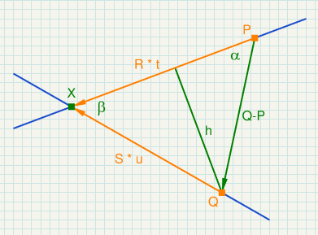
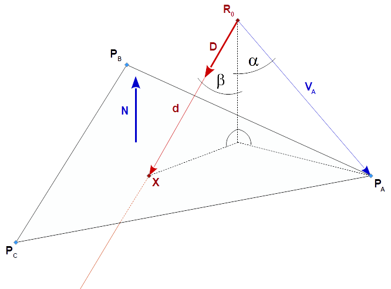

<!-- TOC -->

- [Intersection](#intersection)
  - [Intersection of 2 lines (2 dimensional)](#intersection-of-2-lines-2-dimensional)
  - [Intersection of a line and a plane](#intersection-of-a-line-and-a-plane)
    - [Intersection of the Line of Sight and the Viewport](#intersection-of-the-line-of-sight-and-the-viewport)

<!-- /TOC -->

# Intersection

<br/><hr/>

## Intersection of 2 lines (2 dimensional)



```txt
P     ... point on the 1. line
R     ... normalized direction of the 1. line

Q     ... point on the 2. line
S     ... normalized direction of the 2. line

alpha ... angle between Q-P and R
beta  ... angle between R and S

gamma  =  180° - alpha - beta

h  =  | Q - P | * sin(alpha)
u  =  h / sin(beta)

t  = | Q - P | * sin(gamma) / sin(beta)

t  =  dot(Q-P, (S.y, -S.x)) / dot(R, (S.y, -S.x))  =  determinant(mat2(Q-P, S)) / determinant(mat2(R, S))
u  =  dot(Q-P, (R.y, -R.x)) / dot(R, (S.y, -S.x))  =  determinant(mat2(Q-P, R)) / determinant(mat2(R, S))

X  =  P + R * t  =  Q + S * u
```

<br/><hr/>
## Intersection of a line and a plane



The ray is defined by a point `R0` and a direction `D`.<br/>
The plane is defined by a triangle with the three points `PA`, `PB`, and `PC`.

The normal vector of the plane can be calculated by the cross product of 2 legs of the triangle:

```txt
N  =  normalize( cross(PC-PA, PB-PA)
```

The normal distance `n` of the point `R0` to the plane is:

```txt
n  =  | R0 - PA | * cos(alpha)  =  dot(PA - R0, N)
```

It follows that the distance `d` of the intersection point `X` to the origin of the ray R0 is:

```txt
d  =  n / cos(beta)  =  n / dot(D, N)
```

The intersection point `X` is:

```txt
X  =  R0 + D * d  =  R0 + D * dot(PA - R0, N) / dot(D, N)
```

### Intersection of the Line of Sight and the Viewport


```txt
P0  ... any known point on the viewport
Z   ... Z-axis of the viewport 
C   ... camera position
LOS ... line of sight

X  =  C + LOS * dot(P0 - C, Z) / dot(LOS, Z)
```

---

<a href="https://stackexchange.com/users/7322082/rabbid76"></a>
