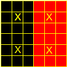
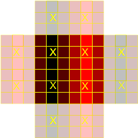
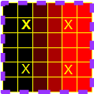
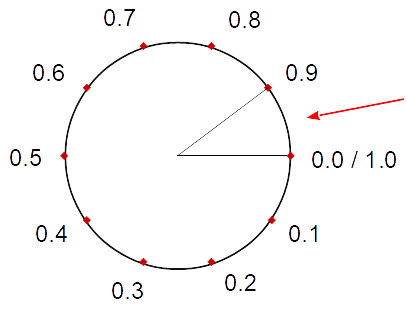
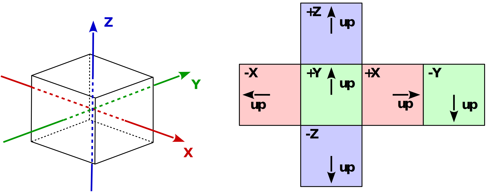
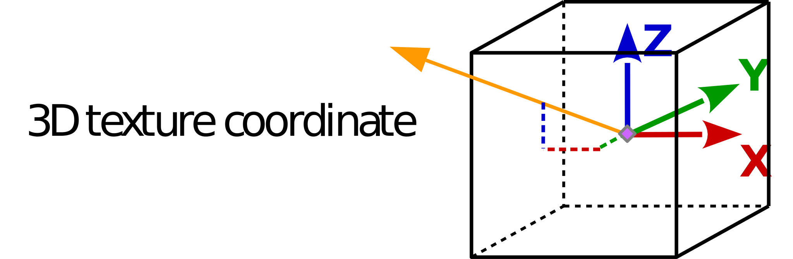

<!-- TOC -->

- [Texture and Sampler - Common mistakes and issues](#texture-and-sampler---common-mistakes-and-issues)
  - [Load Texture](#load-texture)
    - [`glTexImage2D`](#glteximage2d)
    - [`glTexSubImage3D`](#gltexsubimage3d)
    - [`glTexStorage`](#gltexstorage)
    - [Load Bitmap](#load-bitmap)
    - [Windows Bitmap](#windows-bitmap)
  - [Texture alignment (GL_UNPACK_ALIGNMENT, GL_PACK_ALIGNMENT)](#texture-alignment-gl_unpack_alignment-gl_pack_alignment)
  - [Internal texture format](#internal-texture-format)
  - [Texture Filter and Texture Wrapping](#texture-filter-and-texture-wrapping)
  - [Texture format and texture swizzle](#texture-format-and-texture-swizzle)
  - [Texture unit and texture binding](#texture-unit-and-texture-binding)
  - [Texture Coordinates](#texture-coordinates)
  - [UV wrapping](#uv-wrapping)
  - [Cubemap](#cubemap)
  - [Texture read](#texture-read)
  - [Fixed function pipeline (Texture)](#fixed-function-pipeline-texture)
  - [Texture - GLSL](#texture---glsl)
  - [Image Load Store](#image-load-store)
  - [Bindless Textures](#bindless-textures)
  - [Texture and Renderbuffer](#texture-and-renderbuffer)
  - [Texture - WebGL](#texture---webgl)
  - [Texture - three.js](#texture---threejs)
  - [TODO](#todo)

<!-- /TOC -->

# Texture and Sampler - Common mistakes and issues

[Sampler Object](https://www.khronos.org/opengl/wiki/Sampler_Object)
[Texture views](https://www.khronos.org/opengl/wiki/Texture_Storage#Texture_views)
[Sampler (GLSL)](https://www.khronos.org/opengl/wiki/Sampler_(GLSL))  
[Multibind and textures](https://www.khronos.org/opengl/wiki/Sampler_(GLSL)#Multibind_and_textures) 
[Image Format](https://www.khronos.org/opengl/wiki/Image_Format)  
[sRGB colorspace - non linear colorspace](https://www.khronos.org/opengl/wiki/Image_Format#sRGB_colorspace) 
[Image Load Store](https://www.khronos.org/opengl/wiki/Image_Load_Store)
[Bindless Texture](https://www.khronos.org/opengl/wiki/Bindless_Texture)

[OpenGL 4.6 API Compatibility Profile Specification; 7.10 Samplers; page 154](https://www.khronos.org/registry/OpenGL/specs/gl/glspec46.compatibility.pdf)  
[OpenGL 4.6 API Core Profile Specification; 7.10 Samplers; page 154](https://www.khronos.org/registry/OpenGL/specs/gl/glspec46.core.pdf)  
[OpenGL ES 3.2 Specification; 7.9 Samplers; page 118](https://www.khronos.org/registry/OpenGL/specs/es/3.2/es_spec_3.2.pdf)  

> Samplers are special uniforms used in the OpenGL Shading Language to identify the texture object used for each texture lookup. The value of a sampler indicates the texture image unit being accessed. Setting a sampler?s value to `i` selects texture image unit number `i`.

---

## Load Texture

### `glTexImage2D`

[glTexImage2D 'target is not valid'](https://stackoverflow.com/questions/48196668/glteximage2d-target-is-not-valid/48196727#48196727), [C++]  

The fist parameter of [`glTexImage2D`](https://www.khronos.org/registry/OpenGL-Refpages/gl4/html/glTexImage2D.xhtml) is the `target`, which must be `GL_TEXTURE_2D`, `GL_PROXY_TEXTURE_2D`, `GL_TEXTURE_1D_ARRAY` [...].  
[`glTexImage2D`](https://www.khronos.org/registry/OpenGL-Refpages/gl4/html/glTexImage2D.xhtml) specifies the two-dimensional texture for the texture object that is bound to the current [Texture unit](https://www.khronos.org/opengl/wiki/Texture#Texture_image_units).

See [OpenGL 4.6 core profile specification - 8.5. TEXTURE IMAGE SPECIFICATION, page 212](https://www.khronos.org/registry/OpenGL/specs/gl/glspec46.core.pdf):

>The command
>
    void TexImage2D( enum target, int level, int internalformat, sizei width, sizei height, int border, enum format, enum type, const void *data );
>
>is used to specify a two-dimensional texture image. target must be one of `TEXTURE_2D` for a two-dimensional texture, `TEXTURE_1D_ARRAY` for a onedimensional array texture, `TEXTURE_RECTANGLE` for a rectangle texture, or one of the cube map face targets from table [...]

### `glTexSubImage3D`

[(LWJGL3) OpenGL 2D Texture Array stays empty after uploading image data with glTexSubImage3D](https://stackoverflow.com/questions/52355123/lwjgl3-opengl-2d-texture-array-stays-empty-after-uploading-image-data-with-glt/52355184#52355184), [Java]  

It is not an error to pass a `width`, `height` or `depth` of 0 to `glTexSubImage3D`, but it won't have any effect to the texture objects data store.

### `glTexStorage`

[OpenGL 3.2 Why am I getting INVALID_ENUM error for glTexStorage3D?](https://stackoverflow.com/questions/49827961/opengl-3-2-why-am-i-getting-invalid-enum-error-for-gltexstorage3d/49828443#49828443), [C++]  

`GL_RGBA` is not a valid enum constant for the the 3rd paramter of [`glTexStorage3D`](https://www.khronos.org/registry/OpenGL-Refpages/gl4/html/glTexStorage3D.xhtml).

[OpenGL 4.6 API Core Profile Specification; 8.19. IMMUTABLE-FORMAT TEXTURE IMAGES; page 272](https://www.khronos.org/registry/OpenGL/specs/gl/glspec46.core.pdf):

> The `TexStorage*` commands specify properties of the texture object bound to the target parameter of each command.  
> [...]  
>
> Errors  
> An `INVALID_ENUM` error is generated if internalformat is one of the **unsized base internal formats** listed in table 8.11.

### Load Bitmap

[How to load a bmp on GLUT to use it as a texture?](https://stackoverflow.com/questions/12518111/how-to-load-a-bmp-on-glut-to-use-it-as-a-texture/50641676#50641676), [C++] [GLUT]  

A simple solution would be to use [STB library](https://stb.handmade.network/), which can be found at [GitHub - nothings/stb](https://github.com/nothings/stb).

All what is needed is one source file, the header file "stb_image.h".

Include the header file and enable image reading by the setting the preprocessor define `STB_IMAGE IMPLEMENTATION`: 

```cpp
#define STB_IMAGE_IMPLEMENTATION
#include <stb_image.h>
```

The image file can be read by the function `stbi_load`:

```cpp
const char *filename = .....; // path and filename
int         req_channels = 3; // 3 color channels of BMP-file   

int width = 0, height = 0, channels = 0;
stbi_uc *image = stbi_load( filename, &width, &height, &channels, 3 );
```

When the image is loaded to a texture object, then [`GL_UNPACK_ALIGNMENT`](https://www.khronos.org/registry/OpenGL-Refpages/gl4/html/glPixelStore.xhtml) has to be set to 1,
because the length of one line of an BMP-file is aligned to 4.  
After loading the image, the memory on the can be freed by `stbi_image_free`:  

```cpp
GLuint texture_obj = 0;
if ( image != nullptr )
{
    glGenTextures(1, &texture_obj);
    glBindTexture(GL_TEXTURE_2D, texture_obj);
  
    glPixelStorei(GL_UNPACK_ALIGNMENT, 1);
    glTexImage2D(GL_TEXTURE_2D, 0, GL_RGBA, width, height, 0, GL_RGB, GL_UNSIGNED_BYTE, image);
    glPixelStorei(GL_UNPACK_ALIGNMENT, 4); // default

    stbi_image_free( image );
}
```

---

[Texture colors replaced by purple tones](https://stackoverflow.com/questions/54174087/texture-colors-replaced-by-purple-tones/54179559#54179559), [Nim]  

The [Portable Network Graphics (PNG)](https://en.wikipedia.org/wiki/Portable_Network_Graphics) file may contain 32-bit RGBA colors.

Force the `stbi_load` to generate an image with 4 color channels, by explicitly pass 4 to the last parameter:

```py
imageData = stbi_load("Test/2d-rendering-test./stack.png",
                      addr texWidth, addr texHeight, addr channelCount, 4)
```

See [stb_image.h](https://github.com/nothings/stb/blob/master/stb_image.h):

>     Basic usage (see HDR discussion below for HDR usage):
          int x,y,n;
          unsigned char *data = stbi_load(filename, &x, &y, &n, 0);
          // ... process data if not NULL ...
          // ... x = width, y = height, n = # 8-bit components per pixel ...
> **`// ... replace '0' with '1'..'4' to force that many components per pixel`**

>           // ... but 'n' will always be the number that it would have been if you said 0
          stbi_image_free(data)

### Windows Bitmap

[OpenGL Texture Loading issue with images that Crossed each other](https://stackoverflow.com/questions/53051066/opengl-texture-loading-issue-with-images-that-crossed-each-other/53051516#53051516), [C]  

A [Windows Bitmap](https://de.wikipedia.org/wiki/Windows_Bitmap) file has a file header of 54 bytes. I this header is the format of the file encoded.

---

## Texture alignment (GL_UNPACK_ALIGNMENT, GL_PACK_ALIGNMENT)

[Failing to map a simple unsigned byte rgb texture to a quad](https://stackoverflow.com/questions/46202452/failing-to-map-a-simple-unsigned-byte-rgb-texture-to-a-quad/46203044#46203044), [C++] [GLSL]  

`GL_UNPACK_ALIGNMENT` specifies the alignment requirements for the start of each pixel row in memory. By default `GL_UNPACK_ALIGNMENT` is set to 4.
This means each row of the texture is supposed to have a lenght of 4*N bytes.

You specify a 2*2 texture with the data: 255, 0, 0, 255, 0, 0, 255, 0, 0, 255, 0, 0

With `GL_UNPACK_ALIGNMENT` set to 4 this is interpreted as

```txt
          column 1        column 2              alignment
row 1:    255, 0,   0,    255, 0,     0,        255, 0,
row 2:    0,   255, 0,    0,   undef, undef
```

So the texture is read as

```txt
          column 1   olumn 2  
row 1:    red,       red,
row 2:    green,     RGB(0, ?, ?)
```

[Opengl texture cylinder trouble](https://stackoverflow.com/questions/47111512/opengl-texture-cylinder-trouble/47113373#47113373), [C++]  
[OpenGL texture format, create image/texture data for OpenGL](https://stackoverflow.com/questions/46833380/opengl-texture-format-create-image-texture-data-for-opengl/46833638#46833638), [C++]  

By default, each row of a texture should be aligned to 4 bytes.
The texture is an RGB texture, which needs 24 bits or 3 bytes for each texel and the texture is tightly packed especially the rows of the texture.
This means that the alignment of 4 bytes for the start of a line of the texture is disregarded (except 3 times the width of the texture is divisible by 4 without a remaining).  
To deal with that the alignment has to be changed to 1.
This means the [`GL_UNPACK_ALIGNMENT`](https://www.khronos.org/registry/OpenGL-Refpages/gl4/html/glPixelStore.xhtml) parameter has to be set before loading a tightly packed texture to the GPU ([`glTexImage2D`](https://www.khronos.org/registry/OpenGL-Refpages/gl4/html/glTexImage2D.xhtml)).  
Otherwise an offset of 0-3 bytes per line is gained, at texture lookup. This causes a continuously twisted or tilted texture.

[Error when creating textures in WebGL with the RGB format](https://stackoverflow.com/questions/51582282/error-when-creating-textures-in-webgl-with-the-rgb-format)  
[Texture not showing correctly?](https://stackoverflow.com/questions/52460143/texture-not-showing-correctly/52460224#52460224)  

---

## Internal texture format

[How to render GL_SHORT in java (endian)?](https://stackoverflow.com/questions/54797387/how-to-render-gl-short-in-java-endian/54804051#54804051)

The internal format `GL_R16` for the data store of a texture image is not a singed format, but it is an unsigned integral 16 bit format. 

I don't know which OpenGL version you are using.

Desktop OpenGL provides the internal data format `GL_R16_SNORM` which is a 16 bit signed integral data format - see [`glTexImage3D`](https://www.khronos.org/registry/OpenGL-Refpages/gl4/html/glTexImage3D.xhtml).  
[`GL_R16_SNORM`](https://jogamp.org/deployment/v2.1.0/javadoc/jogl/javadoc/javax/media/opengl/GL2GL3.html#GL_R16_SNORM) is implemented in the interface [`GL2GL3`](https://jogamp.org/deployment/v2.1.0/javadoc/jogl/javadoc/javax/media/opengl/GL2GL3.html): 

```java
gl2.glTexImage3D(GL2.GL_TEXTURE_3D, 0, GL2GL3.GL_R16_SNORM, nCols, nRows, nSlices, 0, GL2.GL_RED, GL.GL_SHORT, data);
```

OpenGL ES (3.0) provides an singed integral 8 bit format `GL_R8_SNORM`.  
[`GL_R8_SNORM`](https://jogamp.org/deployment/v2.1.0/javadoc/jogl/javadoc/javax/media/opengl/GL2ES3.html#GL_R8_SNORM) is implemented interface [`GL2ES3`](https://jogamp.org/deployment/v2.1.0/javadoc/jogl/javadoc/javax/media/opengl/GL2ES3.html):

```java
gl2.glTexImage3D(GL2.GL_TEXTURE_3D, 0, GL2ES3.GL_R8_SNORM, nCols, nRows, nSlices, 0, GL2.GL_RED, GL.GL_SHORT, data);
```

As an alternative both, desktop OpenGL and OpenGL ES, provide a 16 floating point format:

e.g.

```java
gl2.glTexImage3D(GL2.GL_TEXTURE_3D, 0, GL2.GL_R16F, nCols, nRows, nSlices, 0, GL2.GL_RED, GL.GL_SHORT, data);
```

---

## Texture Filter and Texture Wrapping

[Bilinear interpolation](https://en.wikipedia.org/wiki/Bilinear_interpolation)  
[Bilinear filtering](https://en.wikipedia.org/wiki/Bilinear_filtering): `GL_LINEAR` and no mipmap or `GL_LINEAR_MIPMAP_NEAREST` and mipmap  

[Trilinear interpolation](https://en.wikipedia.org/wiki/Trilinear_interpolation)  
[Trilinear filtering](https://en.wikipedia.org/wiki/Trilinear_filtering): `GL_LINEAR_MIPMAP_LINEAR` and mipmap  
[GLAPI/glGenerateMipmap](https://www.khronos.org/opengl/wiki/GLAPI/glGenerateMipmap)  
[Common Mistakes - Automatic mipmap generation](https://www.khronos.org/opengl/wiki/Common_Mistakes#Automatic_mipmap_generation)  

[Anisotropic filtering](https://en.wikipedia.org/wiki/Anisotropic_filtering)  
[Anisotropic Filtering](https://www.geforce.com/whats-new/guides/aa-af-guide#1)  
[Sampler Object - Anisotropic filtering](https://www.khronos.org/opengl/wiki/Sampler_Object)  

[Reflection texture from FBO getting to correct image](https://stackoverflow.com/questions/50289505/reflection-texture-from-fbo-getting-to-correct-image/50291377#50291377), [C++]  

I assume the you have set the texture wrap parameters for `GL_TEXTURE_WRAP_S` and `GL_TEXTURE_WRAP_T` to `GL_CLAMP_TO_EDGE`. See [`glTexParameter`](https://www.khronos.org/registry/OpenGL-Refpages/es3.0/html/glTexParameter.xhtml).

This causes that any texture coordinate are clamped to the range `[0+1/(2*texturSize), 1-1/(2*textureSize)]`.

---

[GLSL Sampler2D tiling issue](https://stackoverflow.com/questions/46664908/glsl-sampler2d-tiling-issue/46672772#46672772), [Three.js] [GLSL]  

> GL_CLAMP_TO_EDGE causes ss coordinates to be clamped to the range `[1/(2*N), 1 ? 1/(2*N)]`, where `N` is the size of the texture in the direction of clamping.
>```cpp
> glTexParameteri(GL_TEXTURE_2D, GL_TEXTURE_WRAP_S, GL_CLAMP_TO_EDGE);
> glTexParameteri(GL_TEXTURE_2D, GL_TEXTURE_WRAP_T, GL_CLAMP_TO_EDGE);
>```

In three.js the texture wrap parameters can be set as follows (see [Texture](https://threejs.org/docs/#api/textures/Texture) and [Texture Constants](https://threejs.org/docs/#api/constants/Textures)):

```js
var texture = new THREE.TextureLoader().load( textureFileName );
texture.wrapS = THREE.ClampToEdgeWrapping;
texture.wrapT = THREE.ClampToEdgeWrapping; 
```

This means the texture coordinates, which are passed to `texture2D` are clamped, if they are less than 0.0 or greater than 1.0. In fact, the  `u` (`x`) coordinate is clamped to `[0.5/width, (width-0.5)/width]` and the `v` (`y`) coordinate is clamped to `[0.5/height, (hight-0.5)/height]`.

[OpenGL. What should take glEnable for make texute transparent and with hard pixel edges](https://stackoverflow.com/questions/53012611/opengl-what-should-take-glenable-for-make-texute-transparent-and-with-hard-pixe/53012857#53012857), [Python]  

The texture magnification function is used when the texture is magnified.  
The magnification function can be set by [`glTexParameteri`](https://www.khronos.org/registry/OpenGL-Refpages/gl4/html/glTexParameter.xhtml). Possible values are `GL_LINEAR` and `GL_NEAREST`. The initial value is `GL_LINEAR`.  
While the parameter `GL_LINEAR `would cause that the weighted average of the 4 texture elements that are closest to the specified texture coordinates are returned, `GL_NEAREST` causes that the value of the texture element that is nearest is returned, when the texture is looked up.

---

[Pygame and PyOpenGL quad texturing problem](https://stackoverflow.com/questions/53400377/pygame-and-pyopengl-quad-texturing-problem/53400813#53400813) [Python]  

> When I change `GL_TEXTURE_MIN_FILTER` to `GL_TEXTURE_MAG_FILTER` in `glTexParameteri` the texture disappears. Why?

The initial value of `GL_TEXTURE_MIN_FILTER` is `GL_NEAREST_MIPMAP_LINEAR`. If you don't change it and you don't create mipmaps, then the texture is not "complete" and will not be "shown". See [`glTexParameter`](https://www.khronos.org/registry/OpenGL-Refpages/gl4/html/glTexParameter.xhtml).

See [OpenGL 4.6 API Compatibility Profile Specification; 8.17 Texture Completeness; page 306](https://www.khronos.org/registry/OpenGL/specs/gl/glspec46.compatibility.pdf)  

>A texture is said to be *complete* if all the texture images and texture parameters required to utilize the texture for texture application are consistently defined.  
>
>... a texture is complete unless any of the following conditions hold true:
>
> - The minification filter requires a mipmap (is neither `NEAREST` nor `LINEAR`), and the texture is not mipmap complete.

---
> When I change `GL_LINEAR` to `GL_NEAREST`, nothing happens. The used texture's resolution changed to 300x300px. Why is that?

If the texture is smaller than the region where the texture is wrapped to, the the minification filter has not effect, but the magnification would have an effect. If you set the  value `GL_NEAREST` to the `GL_TEXTURE_MAG_FILTER` then the texels are not interpolated any more.

    glTexParameteri(GL_TEXTURE_2D, GL_TEXTURE_MAG_FILTER, GL_NEAREST)

---
> How can I make mipmaps and then using them?

Mipmaps can be generated by [`glGenerateMipmap`](https://www.khronos.org/registry/OpenGL-Refpages/gl4/html/glGenerateMipmap.xhtml):

<!-- language: python -->

    glTexParameteri(GL_TEXTURE_2D, GL_TEXTURE_MIN_FILTER, GL_NEAREST_MIPMAP_LINEAR)
    glTexImage2D(GL_TEXTURE_2D, 0, 3, width, height, 0, GL_RGB, GL_UNSIGNED_BYTE, textureData)
    glGenerateMipmap(GL_TEXTURE_2D)

---
> The `loadImage()` function make a texture. How knows PyOpenGL which texture should be used in the `makeQuad()` function?

OpenGL is a state engine. Each state is kept until you change it again, even beyond frames. Since you have bound the texture in `loadImage`

    glBindTexture(GL_TEXTURE_2D, bgImgGL)

the currently named texture object, which is bound to texture unit 0 is `bgImgGL`. This texture is used for drawing.

---

[OpenGL - Simple 2D Texture Not Being Displayed](https://stackoverflow.com/questions/53343472/opengl-simple-2d-texture-not-being-displayed/53345784#53345784), [C++]  

The initial value of `GL_TEXTURE_MIN_FILTER` is `GL_NEAREST_MIPMAP_LINEAR`. When using this filter, and no mipmaps are generate then the texture is not *complete*.

[OpenGL ES 3.2 Specification; 8.17 Texture Completeness; page 205](https://www.khronos.org/registry/OpenGL/specs/es/3.2/es_spec_3.2.pdf)  

>A texture is said to be *complete* if all the texture images and texture parameters required to utilize the texture for texture application are consistently defined.  
>
>... a texture is complete unless any of the following conditions hold true:
>
> - The minification filter requires a mipmap (is neither `NEAREST` nor `LINEAR`), and the texture is not mipmap complete.

---

[Problems using GLTexImage3D correctly](https://stackoverflow.com/questions/52326761/problems-using-glteximage3d-correctly/52333776#52333776), [C#]  

The texture wrap parameters `GL_TEXTURE_WRAP_S`, `GL_TEXTURE_WRAP_T` and `GL_TEXTURE_WRAP_R`  are by default `GL_REPEAT`.  
The default parameters for the minifying function (`GL_TEXTURE_MIN_FILTER`) and magnification function are (`GL_TEXTURE_MAG_FILTER`) are `GL_NEAREST_MIPMAP_LINEAR` respectively `GL_LINEAR`.  
See [`glTexParameter`](https://www.khronos.org/registry/OpenGL-Refpages/gl4/html/glTexParameter.xhtml).

The combination of "REPEAT" and "LINEAR" causes, that the first voxel is mixed (interpolated) with the last voxel of a row, column, or depth-layer, if the the texture coordinate parameters, which is passed to the lookup function, is 0.0.

If you would use the wrap parameter `GL_CLAMP_TO_EDGE`, then the first and the last voxel won't become mixed, because the texture coordinate is clamped.  

Note the texture coordinate of the first voxel (or texel) is `1/(2*N)` and the coordinate of the last voxel is `1 - 1/(2*N)`, where `N` is the number of voxels in a row, column or layer. Because of that the coordinate 0.0, is exactly in the middle of the first and the last voxel. `GL_REPEAT` would clamp the coordinate 0.0 to `1/(2*N)`. 

---

[How to properly upscale a texture in opengl?](https://stackoverflow.com/questions/53974343/how-to-properly-upscale-a-texture-in-opengl/53976359#53976359), [C++]

Lets assume you have a 2x2 texture

If this texture is wrapped on a grid of 6x6 fragments, the the center of a texel is on exactly on the texel in the middel of 3x3 tile of the 6x6 square:




The color of the other fragments depends on the the texture parameters - see [`glTexParameter`](https://www.khronos.org/registry/OpenGL-Refpages/gl4/html/glTexParameter.xhtml).

Since the texture is magnified, the `GL_TEXTURE_MAG_FILTER` is significant.

If it is `GL_NEAREST`, then the color of the fragments is that one of the closest texel, to the texture coordinates of the fragment:


If it is `GL_LINEAR`, then the color is interpolated, by the weighted average of the 4 pixels which are closest to the texture coordinates.

The interpolation at the borders of the 6x6 quad depends on the wrap parameters `GL_TEXTURE_WRAP_S` and `GL_TEXTURE_WRAP_T`.

If the parameters are `GL_REPEAT` (which is default), the the texture is treated as an endless texture and the interpolation of the interpolation of the color at the borders takes into account the texels on the opposite side of the texture. This is used for seamless textures and tiling:



If it is `GL_CLAMP_TO_EDGE`, then the interpolated color at the borders is clamped to the color of the texels at the border of the texture:



---

[Heavy image downsampling artefacts](https://stackoverflow.com/questions/54227348/heavy-image-downsampling-artefacts/54245010#54245010), [WebGL]  

The quality of minified textures can be improved by using [Trilinear filtering](https://en.wikipedia.org/wiki/Trilinear_filtering) and [Mip Mapping](https://de.wikipedia.org/wiki/Mip_Mapping).

For this the texture texture minifying function (`gl.TEXTURE_MIN_FILTER`) has to be set to one of `gl.NEAREST_MIPMAP_NEAREST`, `gl.NEAREST_MIPMAP_LINEAR`, `gl.LINEAR_MIPMAP_NEAREST` or `gl.LINEAR_MIPMAP_LINEAR` - See [WebGL 2.0 Specification; 3.7.6 Texture objects](https://www.khronos.org/registry/webgl/specs/latest/2.0/#3.7.6).

Further, mip maps can be generated by `gl.generateMipmap` automatically - See [WebGL 2.0 Specification; 5.41 GenerateMipmap requires positive image dimensions](https://www.khronos.org/registry/webgl/specs/latest/2.0/#5.41) - or even manually, by loading different images to the layers of the texture.

```js
//gl.texParameteri(gl.TEXTURE_2D, gl.TEXTURE_MIN_FILTER, gl.LINEAR);
gl.texParameteri(gl.TEXTURE_2D, gl.TEXTURE_MIN_FILTER, gl.LINEAR_MIPMAP_LINEAR);
gl.texParameteri(gl.TEXTURE_2D, gl.TEXTURE_MAG_FILTER, gl.LINEAR);

var mipLevel = 0;
gl.texImage2D(gl.TEXTURE_2D, mipLevel, gl.RGBA, gl.RGBA, gl.UNSIGNED_BYTE, image);

gl.generateMipmap(gl.TEXTURE_2D)
```

---

[OpenGl texture wrapping](https://stackoverflow.com/questions/54487795/opengl-texture-wrapping/54487868#54487868)  

See [OpenGL 4.6 API Core Profile Specification; 8.14.2 Coordinate Wrapping and Texel Selection; page 257, Table 8.20](https://www.khronos.org/registry/OpenGL/specs/gl/glspec46.core.pdf)  

>     MIRRORED_REPEAT : (size − 1) − mirror(coord mod (2 × size)) − size) 
> where `mirror(a)` returns a `if a ≥ 0`, and `−(1 + a)` otherwise.

This means if the texture is tiled then the even tiles are draw as the texture is and the odd tiles are drawn mirrored. 

If the texture coordinate are in [0, 1], [2, 3], [4, 5], ..., then the *wrap* function returns a corresponding coordinate in range [0, 1].   
If the texture coordinate are in [1, 2], [3, 4], [5, 6], ...,  then the *wrap* function returns a corresponding mirrored coordinate in range [1, 0].

The *wrap* function is applied to each coordinate separately and for each coordinate a separate, different *wrap* function can be set.

---

## Texture format and texture swizzle

[Image Format](https://www.khronos.org/opengl/wiki/Image_Format)  
[sRGB colorspace - non linear colorspace](https://www.khronos.org/opengl/wiki/Image_Format#sRGB_colorspace)  

[How will it be when in glTexImage2D I choose different internal format from how I sample it in shader?](https://stackoverflow.com/questions/45141783/how-will-it-be-when-in-glteximage2d-i-choose-different-internal-format-from-how/45142605#45142605), [C++]  
[SSAO working but has a weird Red colour overlay](https://stackoverflow.com/questions/50783034/ssao-working-but-has-a-weird-red-colour-overlay), [C++]  
[OpenGL grayscale texture as float wrong format](https://stackoverflow.com/questions/52531345/opengl-grayscale-texture-as-float-wrong-format/52540263#52540263), [C++]  

The [Image Format](https://www.khronos.org/opengl/wiki/Image_Format#Color_formats) specification of Khronos group says:

> Image formats do not have to store each component. When the shader samples such a texture, it will still resolve to a 4-value RGBA vector. The components not stored by the image format are filled in automatically. Zeros are used if R, G, or B is missing, while a missing Alpha always resolves to 1.
>
> **Note:** Texture swizzling can change what the missing values are.

See [OpenGL 4.6 API Core Profile Specification; 15.2. SHADER EXECUTION; page 487](https://www.khronos.org/registry/OpenGL/specs/gl/glspec46.core.pdf):  
See [OpenGL 4.6 API Compatibility Profile Specification; 16.1 Texture Environments and Texture Functions; page 595](https://www.khronos.org/registry/OpenGL/specs/gl/glspec46.compatibility.pdf):

> When a texture lookup is performed in a fragment shader, the GL computes the filtered texture value ... and converts it to a texture base color Cb as shown in table 15.1, ...
>```txt
> Texture Base Texture base color Internal Format    Cb              Ab
> RED                                                (Rt, 0, 0)      1
> RG                                                 (Rt, Gt, 0)     1
> RGB                                                (Rt, Gt, Bt)    1
> RGBA                                               (Rt, Gt, Bt)    At
>```
> *Table 15.1: Correspondence of filtered texture components to texture base components.*
>
> followed by swizzling the components of Cb, controlled by the values of the texture parameters `TEXTURE_SWIZZLE_R`, `TEXTURE_SWIZZLE_G`, `TEXTURE_SWIZZLE_B`, and `TEXTURE_SWIZZLE_A`. If the value of `TEXTURE_SWIZZLE_R` is denoted by swizzler, swizzling computes the first component of Cs according to
>
>```
> if (swizzler == RED)
>     Cs[0] = Cb[0];
> else if (swizzler == GREEN)
>     Cs[0] = Cb[1];
> else if (swizzler == BLUE)
>     Cs[0] = Cb[2];
> else if (swizzler == ALPHA)
>     Cs[0] = Ab;
> else if (swizzler == ZERO)
>     Cs[0] = 0;
> else if (swizzler == ONE)
>     Cs[0] = 1; // float or int depending on texture component type
>```

---

[GLSL Shader going black when I try to sample a texture](https://stackoverflow.com/questions/46340027/glsl-shader-going-black-when-i-try-to-sample-a-texture/46341189#46341189), [C] [Fixed Function]  

The internal texture format `GL_BGR` is not valid. `GL_BGR` is a valid for the format of the source texture, but the internal representation has to be `GL_RGB`.  
See [`glTexImage2D`](https://www.khronos.org/registry/OpenGL-Refpages/gl4/html/glTexImage2D.xhtml).

See the Khronos reference page [GLAPI/glTexImage2D](https://www.khronos.org/opengl/wiki/GLAPI/glTexImage2D) which says:
>To define texture images, call [`glTexImage2D`](https://www.khronos.org/registry/OpenGL-Refpages/gl4/html/glTexImage2D.xhtml). The arguments describe the parameters of the texture image, such as height, width, width of the border, level-of-detail number (see `glTexParameter`), and number of color components provided. The last three arguments describe how the image is represented in memory.  
>
>`format`​ determines the composition of each element in data​. It can assume one of these symbolic values:
>
>`GL_BGR`: Each element is an RGB triple. The GL converts it to floating point and assembles it into an RGBA element by attaching 1 for alpha. Each component is clamped to the range [0,1].

---

[What is the meaning of s,t,p,q in Vector components?](https://stackoverflow.com/questions/47969475/what-is-the-meaning-of-s-t-p-q-in-vector-components/47970288#47970288), [three.js]  

See [WebGL Specification Vesion 1.0](https://www.khronos.org/registry/webgl/specs/1.0.0/#4.3):

>4.3 Supported GLSL Constructs
>
>A WebGL implementation must only accept shaders which conform to The OpenGL ES Shading Language, Version 1.00 ...

See the [OpenGL ES Shading Language 1.00 Specification ](https://www.khronos.org/registry/OpenGL/specs/es/2.0/GLSL_ES_Specification_1.00.pdf):

>5.5 Vector Components
>
>The names of the components of a vector or scalar are denoted by a single letter. As a notational convenience, several letters are associated with each component based on common usage of position, color or texture coordinate vectors. The individual components can be selected by following the variable
name with period ( . ) and then the component name.
>
>The component names supported are:
>
> - `{x, y, z, w}` Useful when accessing vectors that represent points or normals
>
> - `{r, g, b, a}` Useful when accessing vectors that represent colors
>
> - `{s, t, p, q}` Useful when accessing vectors that represent texture coordinates
>
> The component names `x`, `r`, and `s` are, for example, synonyms for the same (first) component in a vector.
Note that the third component of the texture coordinate set, `r` in OpenGL ES, has been renamed `p` so as to avoid the confusion with `r` (for red) in a color.

---

[android bitmap pixel format for glTexImage2D](https://stackoverflow.com/questions/34705921/android-bitmap-pixel-format-for-glteximage2d/51447512#51447512), [Android]  

This issue can't be solved in OpenGL ES 1.1 but it would be solvable in OpenGL ES 3.0 or by OpenGL extension [`EXT_texture_swizzle`](https://www.khronos.org/registry/OpenGL/extensions/EXT/EXT_texture_swizzle.txt):

Since OpenGL ES 3.0 you can use the texture swizzle parameters to swap the color channels. See [`glTexParameter`](https://www.khronos.org/registry/OpenGL-Refpages/es3.0/html/glTexParameter.xhtml):
> `GL_TEXTURE_SWIZZLE_R`
>
>Sets the swizzle that will be applied to the r component of a texel before it is returned to the shader. Valid values for param are `GL_RED`, `GL_GREEN`, `GL_BLUE`, `GL_ALPHA`, `GL_ZERO` and `GL_ONE`. If `GL_TEXTURE_SWIZZLE_R` is `GL_RED`, the value for r will be taken from the first channel of the fetched texel. If `GL_TEXTURE_SWIZZLE_R` is `GL_GREEN`, the value for r will be taken from the second channel of the fetched texel. ...

This means the color channels will be swapped when the texture is looked up, when you set the following texture parameters to the texture object: 

```java  
glTexParameteri(GL_TEXTURE_2D, GL_TEXTURE_SWIZZLE_R, GL_GREEN);
glTexParameteri(GL_TEXTURE_2D, GL_TEXTURE_SWIZZLE_G, GL_BLUE);
glTexParameteri(GL_TEXTURE_2D, GL_TEXTURE_SWIZZLE_B, GL_ALPHA);
glTexParameteri(GL_TEXTURE_2D, GL_TEXTURE_SWIZZLE_A, GL_RED);
```

The relevant part in the specification can be found at [OpenGL ES 3.0.5 Specification; 3.8.14 Texture State; page 162](https://www.khronos.org/registry/OpenGL/specs/es/3.0/es_spec_3.0.pdf)

To check if an OpenGL extension is valid, [`glGetString(GL_EXTENSIONS)`](https://www.khronos.org/registry/OpenGL-Refpages/es1.1/xhtml/glGetString.xml) can be use, which returns a space-separated list of supported extensions.

A completely different solution would be to use a [`Canvas`](https://developer.android.com/reference/android/graphics/Canvas) for the conversion. Draw the [`Bitmap`](https://developer.android.com/reference/android/graphics/Bitmap#copy(android.graphics.Bitmap))  on the canvas, and then use the target bitmap, which is hold by the canvas.<br/>
I found this solution on GitHub: [fix android 2.3 can't decode bitmap in rgba8888 format](https://gist.github.com/kyze8439690/7408999)

```java
public static Bitmap convert(Bitmap bitmap, Bitmap.Config config) {
    Bitmap convertedBitmap = Bitmap.createBitmap(bitmap.getWidth(), bitmap.getHeight(), config);
    Canvas canvas          = new Canvas(convertedBitmap);
    Paint  paint           = new Paint();
    paint.setColor(Color.BLACK);
    canvas.drawBitmap(bitmap, 0, 0, paint);
    return convertedBitmap;
}
```

---

[Why do the textured image colors are not the same as the origin?](https://stackoverflow.com/questions/51994952/why-do-the-textured-image-colors-are-not-the-same-as-the-origin/52000706#52000706), [Java]  

At OpenGL there is the possibility, to use the `GL_BGR` format, which specifies a internal format where the color channels are swapped (in compare to GL_`RGB`).

See [OpenGL 4 Refpages - `glTexImage2D`](https://www.khronos.org/registry/OpenGL-Refpages/gl4/html/glTexImage2D.xhtml) and [OpenGL Renders texture with different color than original image?](https://stackoverflow.com/questions/4093190/opengl-renders-texture-with-different-color-than-original-image).

At OpenGL ES you have to manually swap the red and blue color channel, because the internal format `GL_BGR` is missing.

See [OpenGL ES 3.0 Refpages - `glTexImage2D`](https://www.khronos.org/registry/OpenGL-Refpages/es3.0/html/glTexImage2D.xhtml)
and [lwjgl - `class GL11`](http://legacy.lwjgl.org/javadoc/org/lwjgl/opengl/GL11.html).

```java
pixels = BufferUtils.createByteBuffer(bytePixels.length);
pixels.put(bytePixels);
pixels.flip();
for (int i = 0; i < pixels.length; i += 3) {
    byte t = pixels[i];
    pixels[i] = pixels[i+2];
    pixels[i+2] = t;
}
```

Another possibility would be given in OpenGL ES 3.0 or by OpenGL extension [`EXT_texture_swizzle`](https://www.khronos.org/registry/OpenGL/extensions/EXT/EXT_texture_swizzle.txt):

Since OpenGL ES 3.0 you can use the texture swizzle parameters to swap the color channels. See [`glTexParameter`](https://www.khronos.org/registry/OpenGL-Refpages/es3.0/html/glTexParameter.xhtml):
> `GL_TEXTURE_SWIZZLE_R`
>
>Sets the swizzle that will be applied to the r component of a texel before it is returned to the shader. Valid values for param are `GL_RED`, `GL_GREEN`, `GL_BLUE`, `GL_ALPHA`, `GL_ZERO` and `GL_ONE`. If `GL_TEXTURE_SWIZZLE_R` is `GL_RED`, the value for r will be taken from the first channel of the fetched texel. If `GL_TEXTURE_SWIZZLE_R` is `GL_GREEN`, the value for r will be taken from the second channel of the fetched texel. ...

This means the color channels will be swapped when the texture is looked up, by setting the following texture parameters to the texture object: 

```cpp
glTexParameteri(GL_TEXTURE_2D, GL_TEXTURE_SWIZZLE_R, GL_BLUE);
glTexParameteri(GL_TEXTURE_2D, GL_TEXTURE_SWIZZLE_B, GL_RED);
```

The relevant part in the specification can be found at [OpenGL ES 3.0.5 Specification; 3.8.14 Texture State; page 162](https://www.khronos.org/registry/OpenGL/specs/es/3.0/es_spec_3.0.pdf)

To check if an OpenGL extension is valid, [`glGetString(GL_EXTENSIONS)`](https://www.khronos.org/registry/OpenGL-Refpages/es1.1/xhtml/glGetString.xml) can be use, which returns a space-separated list of supported extensions.

---

## Texture unit and texture binding

[Texture units overlap? Rendered the wrong texture](https://stackoverflow.com/questions/52657167/texture-units-overlap-rendered-the-wrong-texture/52673057#52673057), [C++]  
[At what point is the cube drawn?](https://stackoverflow.com/questions/52678333/at-what-point-is-the-cube-drawn/52678886#52678886), [C++]  

If a values is assigned to a uniform, the the uniform has to be identified by the uniform location index. See [Uniform (GLSL)](https://www.khronos.org/opengl/wiki/Uniform_(GLSL))  

The fist parameter of [`glUniform1i`](https://www.khronos.org/registry/OpenGL-Refpages/gl4/html/glUniform.xhtml) has to be the location of the uniform and not the named texture object.

The location of a uniform can be set explicit, in shader by a [Layout Qualifier](https://www.khronos.org/opengl/wiki/Layout_Qualifier_(GLSL)#Program_separation_linkage)

e.g.

```glsl
layout(location = 7) uniform sampler2D u_gloss;
```

```cpp
initTexture(2, m_glossMapTex, "images/gloss.png");
glUniform1i(7, 2); // uniform location 7
```

If the location of the uniform is not set by a layout qualifier, then the uniform location is set automatically when the program is linked. You can ask for this location by [`glGetUniformLocation`](https://www.khronos.org/registry/OpenGL-Refpages/gl4/html/glGetUniformLocation.xhtml):

e.g.

```glsl
uniform sampler2D u_texture;
```

```cpp
GLuint program_obj = ... ;
GLint tex_location = glGetUniformLocation(program_obj , "u_texture");

GLuint tex_obj_A = ... ;
GLuint tex_obj_B = ... ;

int unit_tex0 = 0;
int unit_tex1 = 1;

glActiveTexture(GL_TEXTURE0 + unit_tex0);
glBindTexture(GL_TEXTURE_2D, tex_obj_A);
glActiveTexture(GL_TEXTURE0 + unit_tex1);
glBindTexture(GL_TEXTURE_2D, tex_obj_B);
```

Since GLSL version 4.2 this can be done in the fragment shader by specifying binding points - See [OpenGL Shading Language 4.20 Specification - 4.4.4 Opaque-Uniform Layout Qualifiers; page 60](https://www.khronos.org/registry/OpenGL/specs/gl/GLSLangSpec.4.20.pdf):

```glsl
#version 420

layout (binding = 0) uniform sampler2D u_texture0;
layout (binding = 1) uniform sampler2D u_texture1;
```

---

[glActiveTexture default behavior not as anticipated](https://stackoverflow.com/questions/49542557/glactivetexture-default-behavior-not-as-anticipated/49560106#49560106), [C++]  
[Use texture as palette in OpenGL ES 2.0 shader](https://stackoverflow.com/questions/49585086/use-texture-as-palette-in-opengl-es-2-0-shader/49585133#49585133), [Android]  

See [OpenGL 4.6 API Compatibility Profile Specification; 7.10 Samplers; page 154](https://www.khronos.org/registry/OpenGL/specs/gl/glspec46.compatibility.pdf):

> Samplers are special uniforms used in the OpenGL Shading Language to identify
the texture object used for each texture lookup. The value of a sampler indicates the texture image unit being accessed. Setting a sampler’s value to `i` selects texture image unit number `i`. 

---

[PyOpenGL fragment shader texture sampling](https://stackoverflow.com/questions/53585040/pyopengl-fragment-shader-texture-sampling/53585187#53585187), [Python]  

In glsl uniform variables are default initialized by 0 respectively 0.0. So the value of the texture sampler uniform `textureObj` is initialized by (texture unit) 0, too.

Further there is the default texture object (0). If you don't create and bind a named texture object, then there is still the default texture object (0), and [`glTexImage2D`](https://www.khronos.org/registry/OpenGL-Refpages/gl4/html/glTexImage2D.xhtml) specifies the texture image of the default texture object (0).

---

[OpenGL 4.6 API Compatibility Profile Specification; 8.1 Texture Objects; page 179](https://www.khronos.org/registry/OpenGL/specs/gl/glspec46.compatibility.pdf)  

> Textures in GL are represented by named objects. The name space for texture objects is the unsigned integers, **with zero reserved by the GL to represent the default texture object**. **The default texture object is bound to each of the** `TEXTURE_1D`, **`TEXTURE_2D`**, `TEXTURE_3D`, [...] targets during context initialization.

[GLSL - The OpenGL Shading Language 4.6; 4.3.5. Uniform Variables; page 50](https://www.khronos.org/registry/OpenGL/specs/gl/GLSLangSpec.4.60.pdf)

> The uniform qualifier is used to declare global variables whose values are the same across the entire primitive being processed. **All uniform variables are read-only and are initialized externally either at link time or through the API**. **The link-time initial value is either the value of the variable’s initializer, if present, or 0 if no initializer is present**.

---

[How do you "free" a texture unit?](https://stackoverflow.com/questions/50113147/how-do-you-free-a-texture-unit/50113279#50113279), [C++]

You can't "free" the texture unit, but you can bind the default texture object to the texture unit.

> See [OpenGL 4.6 API Compatibility Profile Specification; 8.1 Texture Objects; page 178](https://www.khronos.org/registry/OpenGL/specs/gl/glspec46.compatibility.pdf):

> Textures in GL are represented by named objects. The name space for texture objects is the unsigned integers, with **zero reserved by the GL to represent the default texture object**.  
> [...]  
> The binding is effected by calling
>
    void BindTexture( enum target, uint texture );

> with target set to the desired texture target and texture set to the unused  name.

This means

```cpp
GLuint defaultTextureObjectID = 0;
glActiveTexture(GL_TEXTURE0);
glBindTexture(GL_TEXTURE_2D, defaultTextureObjectID);
```

will bind the default texture object to texture unit 0.

Since OpenGL 4.5 it can be used
[`glBindTextureUnit`](https://www.khronos.org/registry/OpenGL-Refpages/gl4/html/glBindTextureUnit.xhtml)

> The command
>
>     void BindTextureUnit( uint unit, uint texture );
>
>binds an existing texture object to the **texture unit numbered `unit`**. `texture` **must be zero or the name of an existing texture object**. When `texture` is the name of an existing texture object, that object is bound to the target, in the corresponding texture unit, that was specified when the object was created.

The following too:

```cpp
glBindTextureUnit( 0, 0 ); // texture unit 0, default texture object (0)
```

---

[Can't texture and transform at the same time](https://stackoverflow.com/questions/54133596/cant-texture-and-transform-at-the-same-time/54135029#54135029), [C++]  

You confuse the location of the texture sampler uniform variable and the texture unit.

The location of the uniform variable is an active program resource, which can be get by [`glGetUniformLocation`](https://www.khronos.org/registry/OpenGL-Refpages/gl4/html/glGetUniformLocation.xhtml): 

```cpp 
const auto Textureloc = glGetUniformLocation(ourShader.Program, "ourTexture");
```

But you can choose a [texture unit](https://www.khronos.org/opengl/wiki/Texture#Texture_image_units) a texture unit, and bind the texture to this unit.  
Then you have to set the texture unit index value to the texture sampler uniform:

e.g.


```cpp
GLuint unit = 3;
glBindTextureUnit(unit, texture);
glUniform1i(Textureloc, unit);
```

Note, the texture unit is the link between the shader program and the texture object.

See [OpenGL 4.6 API Compatibility Profile Specification; 7.10 Samplers; page 154](https://www.khronos.org/registry/OpenGL/specs/gl/glspec46.compatibility.pdf):

> Samplers are special uniforms used in the OpenGL Shading Language to identify
the texture object used for each texture lookup. The value of a sampler indicates the texture image unit being accessed. Setting a sampler’s value to `i` selects texture image unit number `i`. 

The former code has worked and you have "seen" the texture because, if you the uniform variable "transform" is not used, then the uniform is not active and doesn't get a uniform location. So `"ourTexture"` is the only uniform left and likely has the uniform location 0 (`Textureloc == 0`).  
Since the value of `"ourTexture"` is not set explicitly, its value is the default value 0.  
In this special case the texture unit, the location `Textureloc` and the value of `"ourTexture"` are equal, they are all 0. Your code worked coincidentally. 

Since GLSL version 4.2, the texture unit can be set by a [Layout Qualifier (GLSL)](https://www.khronos.org/opengl/wiki/Layout_Qualifier_(GLSL)) within the shader, too. Set a [Binding point]( https://www.khronos.org/opengl/wiki/Layout_Qualifier_(GLSL)#Binding_points), with the texture unit:

```cpp
GLuint unit = 3;
glBindTextureUnit(unit, texture); 
```

Vertex shader: `binding = 3` means texture unit 3

```glsl
layout(binding = 3) uniform sampler2D ourTexture;
```

---

[Should I write logic in fragment shader in this case?](https://stackoverflow.com/questions/54280392/should-i-write-logic-in-fragment-shader-in-this-case/54294601#54294601), [GLSL]  

Create a 1x1 texture with a single (white) color and use it for the uniform colored cubes.
Binding and using this texture is much "cheaper" than changing the shader program: 

<!-- language: lang-js -->

```pp
let whiteTexture = gl.createTexture();
gl.bindTexture(gl.TEXTURE_2D, whiteTexture);
gl.texImage2D(gl.TEXTURE_2D, 0, gl.RGBA, 1, 1, 0, gl.RGBA, gl.UNSIGNED_BYTE,
                new Uint8Array([255,255,255,255]));
gl.texParameteri(gl.TEXTURE_2D, gl.TEXTURE_MAG_FILTER, gl.NEAREST);
gl.texParameteri(gl.TEXTURE_2D, gl.TEXTURE_MIN_FILTER, gl.NEAREST);
```

Note, the lookup to this texture (`texture2D(u_texture, TextureCoordinates)`) will always return `vec4(1.0)`.

If the texture is bound (to the texture unit which is assigned to `u_texture`), then  

```glsl
FragColor = Color * texture2D(u_texture, TextureCoordinates);
```

will sets the same fragment color as

```glsl
FragColor = Color * vec4(1.0); 
```

---

## Texture Coordinates

[OpenGL 4.6 API core profile specification; 8.5. TEXTURE IMAGE SPECIFICATION; page 214](https://www.khronos.org/registry/OpenGL/specs/gl/glspec46.core.pdf)

> An element *(i, j, k)* of the texture image is called a texel (for a two-dimensional texture or one-dimensional array texture, *k* is irrelevant; for a one-dimensional texture, *j* and *k* are both irrelevant). The texture value used in texturing a fragment is determined by sampling the texture in a shader, but may not correspond to any actual texel. See figure 8.3.
>
> 
>
> Figure 8.3. A texture image and the coordinates used to access it. This is a twodimensional texture with width 8 and height 4. A one-dimensional texture would consist of a single horizontal strip. ? and ?, values used in blending adjacent texels to obtain a texture value are also shown.

See also [OpenGL ES 3.2 Specification; 8.5. TEXTURE IMAGE SPECIFICATION; page 167](https://www.khronos.org/registry/OpenGL/specs/es/3.2/es_spec_3.2.pdf)

---

[getting a region from texture atlas with opengl using soil](https://stackoverflow.com/questions/46983464/getting-a-region-from-texture-atlas-with-opengl-using-soil/46987206#46987206), [C++] [Fixed Function]

Texture coordinates map the vertices (points) of the geometry to a point in the texture image. Thereby it is specified which part of the texture is placed on an specific part of the geometry  and together with the texture parameters (see [`glTexParameter`](https://www.khronos.org/registry/OpenGL-Refpages/gl4/html/glTexParameter.xhtml)) it specifies how the geometry  is wrapped by the texture.  
In general, the lower left point of the texture is addressed by the texture coordinate (0, 0) and the upper right point of the texture is addressed by (1, 1).

---

## UV wrapping

[Cylindrical UV mapping](https://stackoverflow.com/questions/53408154/cylindrical-uv-mapping/53409228#53409228), [GLSL]  

The vertex coordinates at the seam of the texture, where the *u* component of the texture coordinate is 0, has to be duplicated, because it has to be associated to a texture coordinate where *u==1*, too. 
At the seam of the texture which is wrapped around the circumference of the rotation body, the u coordinate starts with the value 0, but it ends on the same point with the value 1.

If you don`t do so, a transition from the last point on the circumference to the first point is generated. There is no clear seam where the texture ends and starts again, but there is linear transition from somewhere near the end of the texture to its begin. The entire texture is squeezed in this small transition area (flipped along the y axis).



---

## Cubemap

[Cubemaps](https://learnopengl.com/#!Advanced-OpenGL/Cubemaps)

[GLSL - The OpenGL Shading Language 4.6, 8.13 Cube Map Texture Selection, page 250](https://www.khronos.org/registry/OpenGL/specs/gl/GLSLangSpec.4.60.pdf)  
[OpenGL ES 3.2 Specification, 8.13 Cube Map Texture Selection, page 193](https://www.khronos.org/registry/OpenGL/specs/es/3.2/es_spec_3.2.pdf)  

>When a cube map texture is sampled, the $(s \; t \; r)$ texture coordinates are treated
as a direction vector $(r_x \; r_y \; r_z)$ emanating from the center of a cube. The $q$ coordinate is ignored. At texture application time, the interpolated per-fragment direction vector selects one of the cube map face’s two-dimensional images based on the largest magnitude coordinate direction (the major axis direction). If two or more coordinates have the identical magnitude, the implementation may define the rule to disambiguate this situation. The rule must be deterministic and depend only on $(r_x \; r_y \; r_z)$. The target column in table 8.19 explains how the major axis direction maps to the two-dimensional image of a particular cube map target.
Using the $s_c$, $t_c$, and $m_a$ determined by the major axis direction as specified in table 8.19, an updated $(s \; t)$
is calculated as follows: 
>
> $\displaystyle s\; = \; \frac{1}{2} \left( \frac{s_c}{\left|m_a\right|} \, + \, 1\right)$
>
> $\displaystyle t\; = \; \frac{1}{2} \left( \frac{t_c}{\left|m_a\right|} \, + \, 1\right)$
>
>     Major Axis Direction|        Target             |sc |tc |ma |
>     --------------------+---------------------------+---+---+---+
>            +rx          |TEXTURE_CUBE_MAP_POSITIVE_X|−rz|−ry| rx|
>            −rx          |TEXTURE_CUBE_MAP_NEGATIVE_X| rz|−ry| rx|
>            +ry          |TEXTURE_CUBE_MAP_POSITIVE_Y| rx| rz| ry|
>            −ry          |TEXTURE_CUBE_MAP_NEGATIVE_Y| rx|−rz| ry|
>            +rz          |TEXTURE_CUBE_MAP_POSITIVE_Z| rx|−ry| rz|
>            −rz          |TEXTURE_CUBE_MAP_NEGATIVE_Z|−rx|−ry| rz|
>     --------------------+---------------------------+---+---+---+
>
>    Table 8.19: Selection of cube map images based on major axis direction of texture
coordinates

---

[OpenGL Environment mapping Reflection](https://stackoverflow.com/questions/24732653/opengl-environment-mapping-reflection/44994586#44994586), [C++]    
[How to rotate Cubemap face without memory copy in OpenGL?](https://stackoverflow.com/questions/53938973/how-to-rotate-cubemap-face-without-memory-copy-in-opengl/53942886#53942886), [C++]  

The line of sight direction (`LOS`) and up vector (`up`) for each of the 6 cubemap sides is:

- `POSITIVE_X`: `LOS = ( 1.0,  0.0,  0.0); up = ( 0.0, -1.0,  0.0)`
- `NEGATIVE_X`: `LOS = (-1.0,  0.0,  0.0); up = ( 0.0, -1.0,  0.0)`
- `POSITIVE_Y`: `LOS = ( 0.0,  1.0,  0.0); up = ( 0.0,  0.0,  1.0)`
- `NEGATIVE_Y`: `LOS = ( 0.0, -1.0,  0.0); up = ( 0.0,  0.0, -1.0)`
- `POSITIVE_Z`: `LOS = ( 0.0,  0.0,  1.0); up = ( 0.0, -1.0,  0.0)`
- `NEGATIVE_Z`: `LOS = ( 0.0,  0.0, -1.0); up = ( 0.0, -1.0,  0.0)`



---

[three.js and GLSL: Scaling a Texture](https://stackoverflow.com/questions/46733385/three-js-and-glsl-scaling-a-texture/46734864#46734864), [three.js]  
  
The texture coordinate of `textureCube` is a 3D direction vector, it does a 3-dimensional look up. Cube map textures are not sampled like 2D textures. The direction goes out of the center of the cube, which is surrounded by its 6 sides. The texel on the side which is hit by the direction vector is returend by `textureCube`. The length of the direction vector does not affect the result.



See Khronos documentation [Cubemap Texture Access](https://www.khronos.org/opengl/wiki/Cubemap_Texture)
>The sampler type for cubemaps is `gsamplerCube`.
The texture coordinates for cubemaps are 3D vector directions. These are conceptually directions from the center of the cube to the texel you want to appear. The vectors do not have to be normalized.

This means that scaling the texture coordinate does **not** cause different results.

---

## Texture read

[Pixel access with glGetTexImage()?](https://stackoverflow.com/questions/48938930/pixel-access-with-glgetteximage/48941809#48941809), [C++]

The size of the array in bytes is 1048576 bytes (`256 * 256 * 4 * sizeof(GLuint)`). This is, because every color channel of a single pixel is stored in a separate `GLuint` with a size of 4 bytes (`sizeof(GLuint) == 4`). So the size of each pixel is 16 bytes because of 4 color channels per pixel and `sizeof(GLuint)` for each color channel.

Probably it will be sufficient to store every color in an `GLubyte`. Then the size of the array will be 262144 bytes (`256 * 256 * 4 * sizeof(GLubyte)`)

[opengl es 2.0 android c++ glGetTexImage alternative](https://stackoverflow.com/questions/53993820/opengl-es-2-0-android-c-glgetteximage-alternative/53993894#53993894)  

[`glGetTexImage`](https://www.khronos.org/registry/OpenGL-Refpages/gl4/html/glGetTexImage.xhtml) doesn't exist in OpenGL ES.  
In OpenGL ES, you have to attach the texture to a framebuffer and read the color plane of the framebuffer by [`glReadPixels`](https://www.khronos.org/registry/OpenGL-Refpages/es3.0/html/glReadPixels.xhtml)

```cpp
int data_size = mWidth * mHeight * 4;
GLubyte* pixels = new GLubyte[mWidth * mHeight * 4];

GLuint textureObj = ...; // the texture object - glGenTextures  

GLuint fbo;
glGenFramebuffers(1, &fbo); 
glBindFramebuffer(GL_FRAMEBUFFER, fbo);
glFramebufferTexture2D(GL_FRAMEBUFFER, GL_COLOR_ATTACHMENT0, GL_TEXTURE_2D, textureObj, 0);

glReadPixels(0, 0, mWidth, mHeight, GL_RGBA, GL_UNSIGNED_BYTE, pixels);

glBindFramebuffer(GL_FRAMEBUFFER, 0);
glDeleteFramebuffers(1, &fbo);
```

---

## Fixed function pipeline (Texture)

[OpenGL 2.1 API Specification; 3.8.16 Texture Application; page 191](https://www.khronos.org/registry/OpenGL/specs/gl/glspec20.pdf)

> Texturing is enabled or disabled using the generic Enable and Disable commands respectively, with the symbolic constants TEXTURE 1D, TEXTURE 2D, TEXTURE 3D, or TEXTURE CUBE MAP to enable the one-, two, three-dimensional, or cube map texture, respectively. If both two- and one-dimensional textures are enabled, the two-dimensional texture is used. If the three-dimensional and either of the two- or one-dimensional textures is enabled, the three-dimensional texture is used. If the cube map texture and any of the three-, two-, or one-dimensional textures is enabled, then cube map texturing is used. If all texturing is disabled, a rasterized fragment is passed on unaltered to the next stage of the GL (although its texture coordinates may be discarded). ...

[OpenGL 4.6 API Compatibility Profile Specification; 16.2 Texture Application; page 602](https://www.khronos.org/registry/OpenGL/specs/gl/glspec46.compatibility.pdf)

Texturing is enabled or disabled using the generic Enable and Disable commands, respectively, with target TEXTURE_1D, TEXTURE_2D, TEXTURE_RECTANGLE, TEXTURE_3D, or TEXTURE_CUBE_MAP to enable the one-, two-, rectangular, threedimensional, or cube map texture, respectively. If more than one of these textures is enabled, the first one enabled from the following list is used:

- cube map texture
- three-dimensional texture
- rectangular texture
- two-dimensional texture
- one-dimensional texture

[How to color QUADS in blue color without all sense color in the blue](https://stackoverflow.com/questions/48972995/how-to-color-quads-in-blue-color-without-all-sense-color-in-the-blue/48973407#48973407), [Fixed Function] [C++]  
[Draw rectangle over texture OpenGL](https://stackoverflow.com/questions/49212051/draw-rectangle-over-texture-opengl/49212217#49212217), [Fixed Function] [Python]  
[PyQt, PyOPENGL: when adding a texture to an area, then other area lost their color and become white](https://stackoverflow.com/questions/53191299/pyqt-pyopengl-when-adding-a-texture-to-an-area-then-other-area-lost-their-col/53197599#53197599) [Fixed Function] [Python]  
[Alpha blending textures and primitives](https://stackoverflow.com/questions/52687369/alpha-blending-textures-and-primitives/52687512#52687512), [Fixed Function] [C++]  
[All texture colors affected by colored rectangle - OpenGL](https://stackoverflow.com/questions/53180760/all-texture-colors-affected-by-colored-rectangle-opengl/53180908#53180908), [Fixed Function] [C++]  

If texturing is enabled, then by default the color of the texel is multiplied by the current color, because by default the texture environment mode (`GL_TEXTURE_ENV_MODE`) is `GL_MODULATE`. See [`glTexEnv`](https://www.khronos.org/registry/OpenGL-Refpages/gl2.1/xhtml/glTexEnv.xml).

This causes that the color of the texels of the texture is "mixed" by the last color which you have set by [`glColor4f`](https://www.khronos.org/registry/OpenGL-Refpages/gl2.1/xhtml/glColor.xml).

Set a "white" color before you render the texture, to solve your issue:

```cpp
glColor3f(1.0f, 1.0f, 1.0f);
```

Likewise you can change the environment mode to `GL_REPLACE`, instead:

```cpp
glTexEnvi(GL_TEXTURE_ENV, GL_TEXTURE_ENV_MODE, GL_REPLACE);
```

[Trouble Texturing a cube with glDrawarrays](https://stackoverflow.com/questions/52728716/trouble-texturing-a-cube-with-gldraw-arrays/52729889#52729889)

Two-dimensional texturing has to be enable, see [`glEnable`](https://www.khronos.org/registry/OpenGL-Refpages/gl2.1/xhtml/glEnable.xml):

```cpp
glEnable(GL_TEXTURE_2D)
```

---

[Texture and image handling with (py)OpenGL](https://stackoverflow.com/questions/54243031/texture-and-image-handling-with-pyopengl/54243162#54243162), [Python]  

Two-dimensional texturing is enabled by [`glEnable(GL_TEXTURE_2D)`](https://www.khronos.org/registry/OpenGL-Refpages/gl2.1/xhtml/glEnable.xml) and can be disabled by `glDisable(GL_TEXTURE_2D)`.  
If texturing is enables then the texture wich is currently bound when the geometry is drawn by the [`glBegin`/`glEnd`](https://www.khronos.org/registry/OpenGL-Refpages/gl2.1/xhtml/glBegin.xml) sequence is applied.

When [`glVertex`](https://www.khronos.org/registry/OpenGL-Refpages/gl2.1/xhtml/glVertex.xml) is called, the the current texture coordinates are associated with the vertex coordinate. The texture coordinate is set by [`glTexCoord2f`](https://www.khronos.org/registry/OpenGL-Refpages/gl2.1/xhtml/glTexCoord.xml).

---

## Texture - GLSL

[Sampler (GLSL)](https://www.khronos.org/opengl/wiki/Sampler_(GLSL))  
[Multibind and textures](https://www.khronos.org/opengl/wiki/Sampler_(GLSL)#Multibind_and_textures)  
[texture vs texture2D in GLSL](https://stackoverflow.com/questions/12307278/texture-vs-texture2d-in-glsl)  

See [OpenGL 4.6 API core profile specification; 15.2.1 Texture Access; page 486](https://www.khronos.org/registry/OpenGL/specs/gl/glspec46.core.pdf)

> When a texture lookup is performed in a fragment shader, the GL computes the filtered texture value in the manner described in sections 8.14 and 8.15,
and converts it to a texture base color Cb as shown in table 15.1, followed by swizzling the components of Cb, ...
>
> Table 15.1:
> - `GL_RED`: (red, 0.0, 0.0, 1.0 )
> - `GL_RG`: (red, green, 0.0, 1.0 )
> - `GL_RGB`: (red, green, blue, 1.0 )
> - `GL_RGBA`: (red, green, blue, alpha )

See [OpenGL Shading Language 4.60 Specification; 4.4.6 Opaque-Uniform Layout Qualifiers; page 79](https://www.khronos.org/registry/OpenGL/specs/gl/GLSLangSpec.4.60.pdf)

> Image and sampler types both take the uniform layout qualifier identifier for binding:
>
    layout-qualifier-id :
        binding = integer-constant-expression

>The identifier binding specifies which unit will be bound. Any uniform sampler or image variable declared without a binding qualifier is initially bound to unit zero. After a program is linked, the unit referenced by a sampler or image uniform variable declared with or without a binding identifier can be updated by the OpenGL API.

---

## Image Load Store

Image load/store is the ability of Shaders to more-or-less arbitrarily read from and write to images:

- extension `GL_ARB_shader_image_load_store`, `EXT_shader_image_load_store`
- [Image Load Store](https://www.khronos.org/opengl/wiki/Image_Load_Store)

---

## Bindless Textures

Bindless Textures are a method for passing Textures to Shader by a name, rather than by binding them to the OpenGL Context.
These texture can be used by samplers or images.

**Bindless Textures are not part of the OpenGL standard yet (OpenGL 4.6)**.

- [Bindless Texture](https://www.khronos.org/opengl/wiki/Bindless_Texture)
- [NVIDIA GTX 680 OpenGL Bindless Textures Demo](http://www.geeks3d.com/20120511/nvidia-gtx-680-opengl-bindless-textures-demo/)
- [ARB_bindless_texture](https://www.opengl.org/registry/specs/ARB/bindless_texture.txt)

---

## Texture and Renderbuffer

[Image Format](https://www.khronos.org/opengl/wiki/Image_Format)

These formats are required for both textures and renderbuffers. Any of the combinations presented in each row is a required format.

| Base format   | Data type           | Bitdepth per component |
|---------------|---------------------|------------------------|
| RGBA, RG, RED | unsigned normalized | 8, 16                  |
| RGBA, RG, RED | float               | 16, 32                 |
| RGBA, RG, RED | signed integral     | 8, 16, 32              |
| RGBA, RG, RED | unsigned integral   | 8, 16, 32              |

Also, the following other formats must be supported for both textures and renderbuffers:

- `GL_RGB10_A2`
- `GL_RGB10_A2UI`
- `GL_R11F_G11F_B10F`
- `GL_SRGB8_ALPHA8`
- `GL_DEPTH_COMPONENT16`
- `GL_DEPTH_COMPONENT24`
- `GL_DEPTH_COMPONENT32F`
- `GL_DEPTH24_STENCIL8`
- `GL_DEPTH32F_STENCIL8`
- `GL_STENCIL_INDEX8`

 There is a big difference between the *internalFormat* (3rd) paramter and the *format* (7th) paramter of [`glTexImage2D`](https://www.khronos.org/registry/OpenGL-Refpages/gl4/html/glTexImage2D.xhtml). The former specifies the format of the target texture (GPU) and the later specifies together, with the *type* (8th) paramter, the format of the source texture (CPU). This causes that the parameters may need different enum constants. If this paramters are not proper set this may cause an `GL_INVALID_ENUM` error (1281).

---

## Texture - WebGL

[WebGL texImage2D parameters](https://stackoverflow.com/questions/53899162/webgl-teximage2d-parameters/53899276#53899276), [WebGL]  

See [WebGL Specification - 5.14 The WebGL context](https://www.khronos.org/registry/webgl/specs/latest/1.0/#5.14):

>     [...]
>     void texImage2D(GLenum target, GLint level, GLint internalformat,
>                     GLsizei width, GLsizei height, GLint border, GLenum format,
>                     GLenum type, [AllowShared] ArrayBufferView? pixels);
>     void texImage2D(GLenum target, GLint level, GLint internalformat,
>                     GLenum format, GLenum type, TexImageSource source); // May throw DOMException

Since image is `image` is a `TexImageSource` it has to be

<s>`gl.texImage2D(gl.TEXTURE_2D, 0, gl.RGBA, 10, 10, 0, gl.RGBA, gl.UNSIGNED_BYTE, image);`</s>
`gl.texImage2D(gl.TEXTURE_2D, 0, gl.RGBA, gl.RGBA, gl.UNSIGNED_BYTE, image);`

Note, the size of the bitmap is encode int the `image` object.

---

## Texture - three.js

[How can I map a texture image onto a shader geometry?](https://stackoverflow.com/questions/53999716/how-can-i-map-a-texture-image-onto-a-shader-geometry/54003812#54003812), [three.js]  

In the fragment shader has to be declared a [uniform](https://www.khronos.org/opengl/wiki/Uniform_(GLSL)) variable of type `sampler2D`:

[Vertex Shader](https://www.khronos.org/opengl/wiki/Vertex_Shader):

```glsl
varying vec2 vUv;

void main() {
    vUv = uv;
    gl_Position = projectionMatrix * modelViewMatrix * vec4(position, 1.0);
}
```

[Fragment Shader](https://www.khronos.org/opengl/wiki/Fragment_Shader):

```glsl
precision highp float;

uniform sampler2D u_texture; // <---------------------------------- texture sampler uniform

varying vec2 vUv;

void main(){
    gl_FragColor = texture2D(u_texture, vUv);
}
```

With the shaders a [`THREE.ShaderMaterial`](https://threejs.org/docs/#api/en/materials/ShaderMaterial) can be created.

First load the texture:

```js
var texture = new THREE.TextureLoader().load ('js/textures/earth.jpg');
```

Then specify the set of [Uniform](https://threejs.org/docs/#api/en/core/Uniform)s (in this case there is the texture uniform only):  

```js
var uniforms = {
    u_texture: {type: 't', value: texture}
};
``` 

Finally create the material:

```js
var material = new THREE.ShaderMaterial({  
    uniforms: uniforms,
    vertexShader: document.getElementById('vertex-shader').textContent,
    fragmentShader: document.getElementById('fragment-shader').textContent
});
```

The material can be used in the same manner as any other material.

---

## TODO

[What and why about GLSL textureGrad](https://stackoverflow.com/questions/21009985/what-and-why-about-glsl-texturegrad)  
[What is, in simple terms, textureGrad()?](https://stackoverflow.com/questions/52975878/what-is-in-simple-terms-texturegrad)

---

<a href="https://stackexchange.com/users/7322082/rabbid76"></a>

  [C]: https://stackoverflow.com/questions/tagged/c
  [C++]: https://stackoverflow.com/questions/tagged/c%2b%2b
  [C#]: https://stackoverflow.com/questions/tagged/c%23
  [Java]: https://stackoverflow.com/questions/tagged/java
  [Python]: https://stackoverflow.com/questions/tagged/python
  [Nim]]: https://stackoverflow.com/questions/tagged/nim
  [GLSL]: https://stackoverflow.com/questions/tagged/glsl
  [Android]: https://stackoverflow.com/questions/tagged/android
  [GLUT]: https://stackoverflow.com/questions/tagged/glut
  [WebGL]: https://stackoverflow.com/questions/tagged/webgl
  [three.js]: https://stackoverflow.com/questions/tagged/three.js
  [Fixed Function]: https://www.khronos.org/opengl/wiki/Fixed_Function_Pipeline
