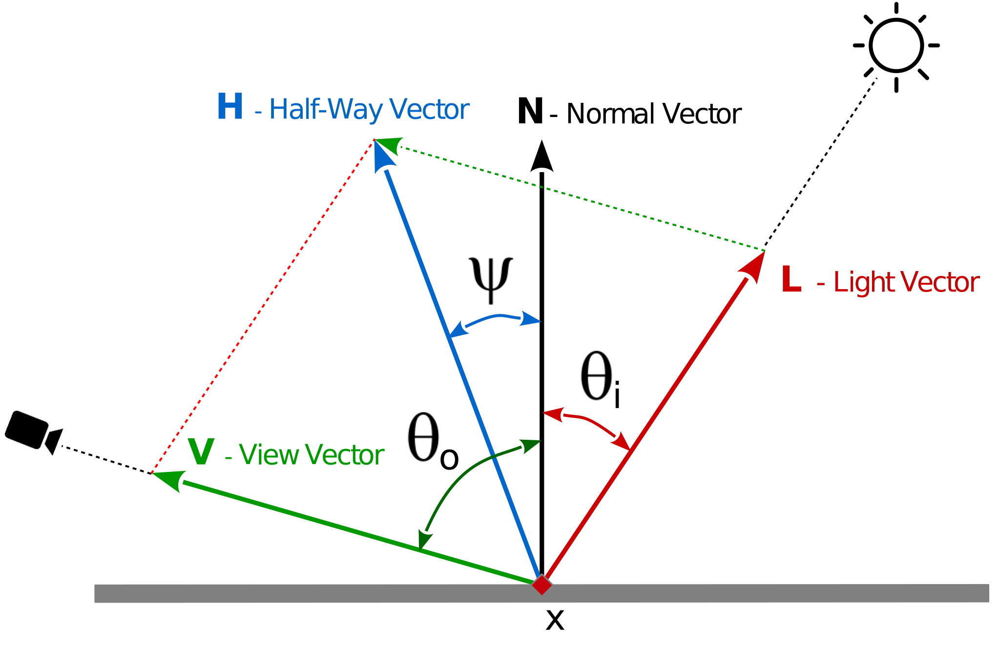

<!-- TOC -->

- [Blinn-Phong model](#blinn-phong-model)

<!-- /TOC -->

# Blinn-Phong model

The Blinn-Phong reflection model (also called the modified Phong reflection model) is a modification to the Phong reflection model developed by Jim Blinn.
Blinn-Phong is the default shading model used in OpenGL and Direct3D's fixed-function pipeline (before Direct3D 10 and OpenGL 3.1),
and is carried out on each vertex as it passes down the graphics pipeline; pixel values between vertices are interpolated by Gouraud shading by default,
rather than the more computationally-expensive Phong shading.



```txt
f_BlinnPhong = max(0, pow(cos(theta_H), sh)) = max(0, pow(dot(N, H), sh))
```

<br/>

GLSL coding:

```glsl
float Distribution_BlinnPhong( vec3 esVEye, vec3 esVLight, vec3 esPtNV, float shininess )
{
    vec3 halfVector = normalize( esVEye + esVLight );
    float NdotH = max( dot( esPtNV, halfVector ), 0.0 );
    return ( shininess + 2.0 ) * pow( NdotH, shininess ) / ( 2.0 * 3.14159265 );
}
```

<br/>

See also:

- [wikipedia, Blinn-Phong shading model](https://en.wikipedia.org/wiki/Blinn%E2%80%93Phong_shading_model)
- [Dave Edwards, Solomon Boulos, Jared Johnson and Peter Shirley, The Halfway Vector Disk for BRDF Modeling](http://www.cs.utah.edu/~boulos/papers/brdftog.pdf)
- [James F. Blinn, Models of light reflection for computer synthesized picture, 1977](http://miffysora.wdfiles.com/local&ndash;files/blinn-model-for-specular-reflection/Blinn.pdf)
- [Learning Modern 3D Graphics Programming - Blinn-Phong Model](https://alfonse.bitbucket.io/oldtut/Illumination/Tut11%20BlinnPhong%20Model.html)


<br/><hr/>

<a href="https://stackexchange.com/users/7322082/rabbid76"></a>

