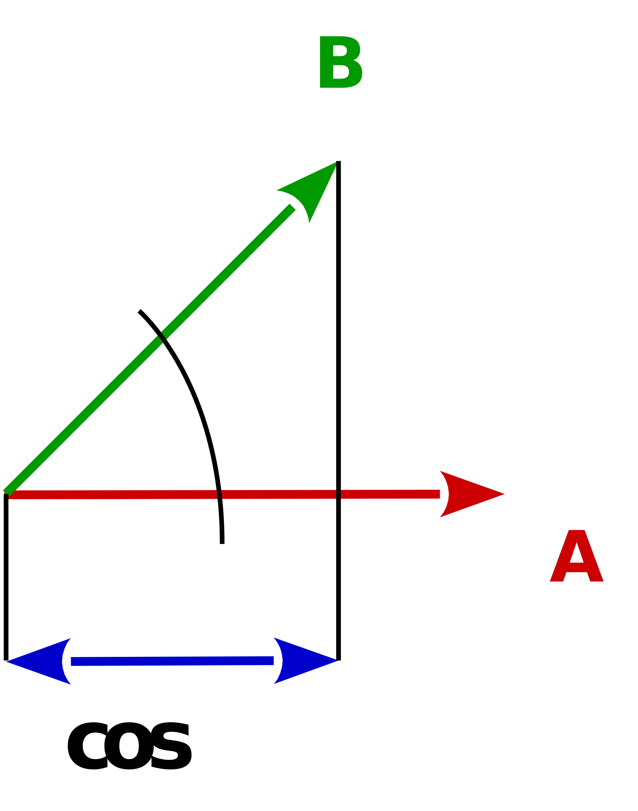
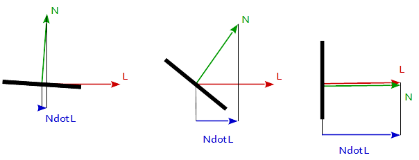
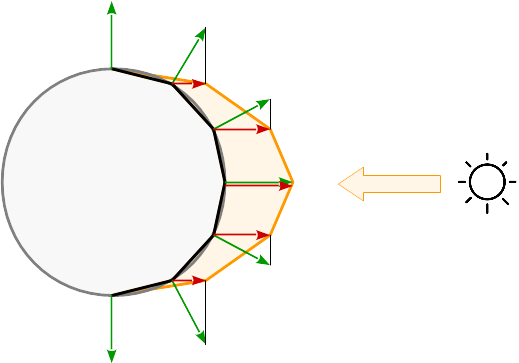

# Lambertian reflectance model

To model the reflection of light in computer graphics is used a Bidirectional reflectance distribution function (BRDF).
BRDF is a function that gives the relation between the light reflected along an outgoing direction and the light incident from an incoming direction. 

A perfect diffuse surface has a BRDF that has the same value for all incident and outgoing directions. This substantially reduces the computations and thus it is commonly used to model diffuse surfaces as it is physically plausible, even though there are no pure diffuse materials in the real world.  This BRDF is called Lambertian reflection because it obeys Lambert's cosine law. 

Lambertian reflection is often used as a model for diffuse reflection. This technique causes all closed polygons (such as a triangle within a 3D mesh) to reflect light equally in all directions when rendered. The diffusion coefficient is calculated from the angle between the normal vector and the light vector.

    f_Lambertian = max( 0.0, dot( N, L )

where `N` is the normal vector of the surface, and `L` is the vector towards to the light source.  

## How it works 

In general The *dot* product of 2 vectors is equal the *cosine* of the angle between the 2 vectors multiplied by the magnitude (lenght) of both vectors. 

    dot( A, B ) == length( A ) * length( B ) * cos( angle_A_B ) 

This follows, that the *dot* product of 2 unit vectors is equal the *cosine* of the angle between the 2 vectors, because the length of a unit vector is 1.

    uA = normalize( A )
    uB = normalize( B )
    cos( angle_A_B ) == dot( uA, uB )

    

If we take a look at the *cos(x)* function between the angles -90 degrees and 90 degrees then we can see that it has a maximum of 1 at an angle of 0 degrees and It goes down to 0 at the angles of 90 degrees and -90 degrees.

![cos(x) in [-90, 90]](image/cos_-90_90.png)

This behavior is exactly that what we want for the reflection model. When the nromal vetor of the surface and the diretion to the light source are in the same direction (the angle between is 0 degrees) then we want a maximium of reflection.
In contrast, if the vectors a orthonormalized (the angle in between is 90 degrees) then we want a minimum of reflection and we want a smooth and continuous functional running between the two borders of 0 degrees and 90 degrees.

If the light model is calculated in the vertex shader, the reflection is calculated for each corner of the primitive. In between the primitives the reflections are interpolate according to its barycentric coordinates.
See the resulting reflections on a spherical surface:

See also:

  - Question: [Issue Understanding Lighting in OpenGL](https://stackoverflow.com/questions/8088907/issue-understanding-lighting-in-opengl/45066742#45066742)
  - Question: [GLSL fixed function fragment program replacement](https://stackoverflow.com/questions/8421778/glsl-fixed-function-fragment-program-replacement/45716107#45716107)
  - OGL documentation: [Phong Lighting Model](https://stackoverflow.com/documentation/opengl/4209/basic-lighting/14741/phong-lighting-model#t=201707181626390284374)
