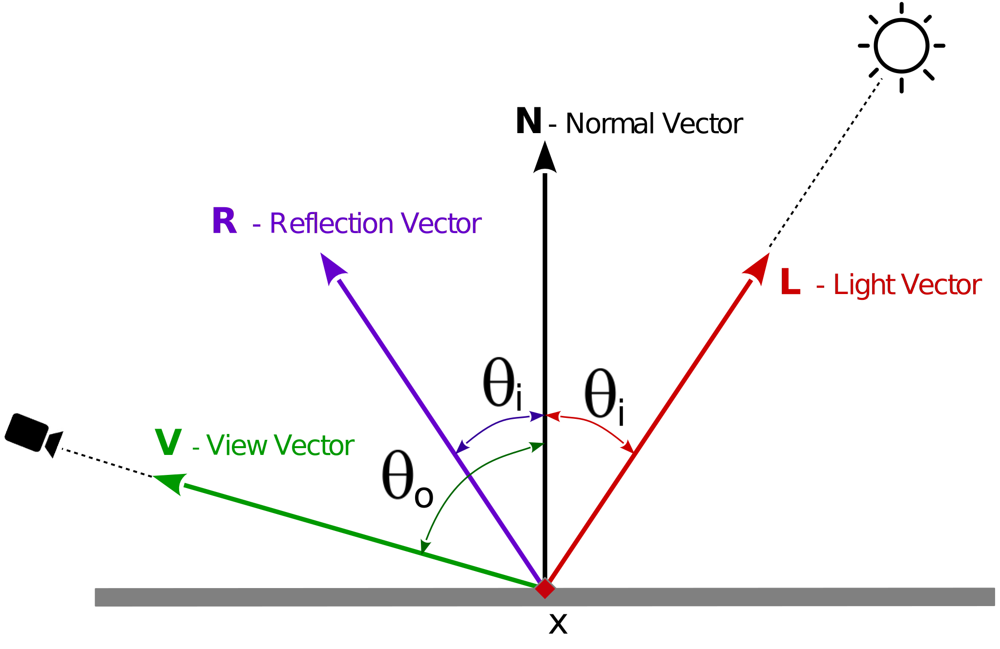
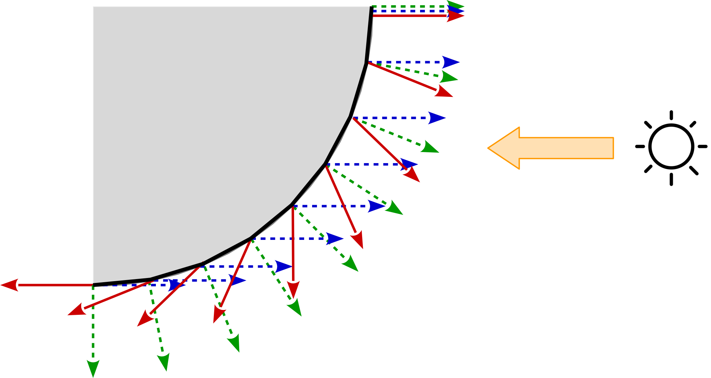
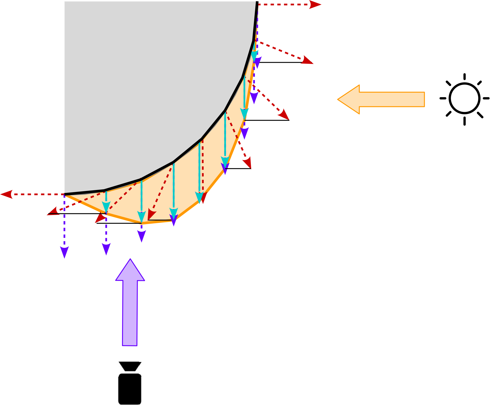

[](https://stackoverflow.com/users/5577765/rabbid76?tab=profile)

---

<!-- TOC -->

- [Phong reflection model](#phong-reflection-model)
    - [Obvious issues](#obvious-issues)
        - [Phong Clipping](#phong-clipping)
        - [Phong Distortion](#phong-distortion)

<!-- /TOC -->

# Phong reflection model

**About the nomenclature**

The [Phong reflection model][1] must not be confused with [Phong shading][2]. While [Phong shading][2] in common means the technique, which does the light calculations per fragment, is the [Phong reflection model][1] a light model, which was presented by Bui Tuong Phong in 1975.<br/>
Note, in compare to [Phong shading][2], at [Gouraud Shading][3], the light calculations ar done per vertex. The calculated light is interpolated according to the [Barycentric coordinate][4] of the fragment on the primitive. This increases the performance, but gives a big loss of quality, especially on large primitives.<br/>
In common the [Phong reflection model][1] and the [Phong shading][2] technique are used together. 

The Phong model is easy to compute with a small number of operations, but it is an empirical model which obeys neither energy conservation nor [reciprocity][5]. It is an approximation model, based on an statistic distribution of microfacettes. It depends on an `alpha` angle, which is calculated after reflecting the incident direction. \n



```txt
alpha   = theta_o - theta_i
f_phong = max(0, pow(cos(alpha), sh)
```

`sh` (shininess) in [0, infinite] characterizes the shape of the specular highlight (from 0 or dull to more glossy surface). The Phong model works well with large exponents, but has issues and limitations with small exponents.

`cos(alpha)` can be caluclated by the dot product of the view vector and the reflection vector:

```txt
R       = reflect(L, N)
VdotR   = dot(V, R)
f_phong = max(0, pow(VdotR, sh))
```






<br/>
GLSL coding:

```glsl
float Distribution_Phong( vec3 esVEye, vec3 esVLight, vec3 esPtNV, float shininess ) 
{
    vec3 reflVector = normalize( reflect( -esVLight, esPtNV ) );
    return 4.0 * max( pow( dot(reflVector, esVEye), 0.3 * shininess ), 0.0 );
}
```

<br/>
Furthermore, the performance of this model could be improved by an optimization of the exponential operator, like the approximation given by Schlick:

```glsl
VdotR_sh = VdotR / (sh - sh * VdotR - VdotR)
```

<br/>

## Obvious issues

### Phong Clipping

If the light is close to the surface, the specular area tends to have very sharp edges. This is part of the nature of specular reflections. If the light is almost perpendicular to the surface, the specular reflection will shine brightest when the light is almost eclipsed by the surface. This creates a strong discontinuity at the point where the light is no longer in view.<br/>
You generally see this most with rough surfaces (small exponents). With smoother surfaces, this is rarely seen.

### Phong Distortion

This ring area shows one of the main limitations of the Phong model. When trying to depict a surface that is rough but still has specular highlights, the Phong model starts to break down. It will not allow any specular contribution from areas outside of a certain region.

This region comes from the angle between the reflection direction and the view direction. This area is the region where the reflection direction and view direction are more than 90 degrees apart.

Under the microfacet model, there is still some chance that some microfacets are oriented towards the camera, even if reflection direction is pointed sharply away. Thus, there should be at least some specular contribution from those areas. The Phong model cannot allow this, due to how it is computed.

<br/>

See also:

- [wikipedia, Phong reflection model][1]
- [wikibooks, GLSL Programming/Unity/Smooth Specular Highlights](https://en.wikibooks.org/wiki/GLSL_Programming/Unity/Smooth_Specular_Highlights)
- [Bui Tuong Phong, University of Utah, Illumination for computer generated pictures, 1975](http://www.cs.northwestern.edu/~ago820/cs395/Papers/Phong_1975.pdf)
- [Sebastien Lagarde, Relationship between Phong and Blinn lighting model](https://seblagarde.wordpress.com/2012/03/29/relationship-between-phong-and-blinn-lighting-model/)
- [Learning Modern 3D Graphics Programming - Phong Model](https://alfonse.bitbucket.io/oldtut/Illumination/Tut11%20Phong%20Model.html)
- [Phong lighting: add specular lighting separately or with ambient and diffuse?](https://stackoverflow.com/questions/48160165/phong-lighting-add-specular-lighting-separately-or-with-ambient-and-diffuse/48162382#48162382)


  [1]: https://en.wikipedia.org/wiki/Phong_reflection_model
  [2]: https://en.wikipedia.org/wiki/Phong_shading
  [3]: https://en.wikipedia.org/wiki/Gouraud_shading
  [4]: https://en.wikipedia.org/wiki/Barycentric_coordinate_system
  [5]: https://en.wikipedia.org/wiki/Reciprocity_(photography)


<br/><hr/>

<a href="https://stackexchange.com/users/7322082/rabbid76"></a>
