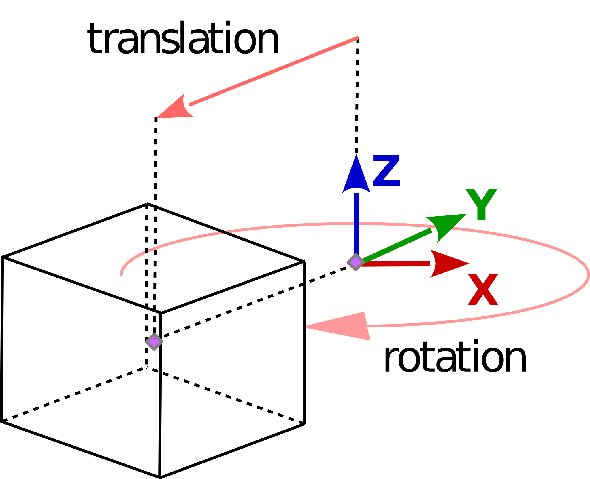
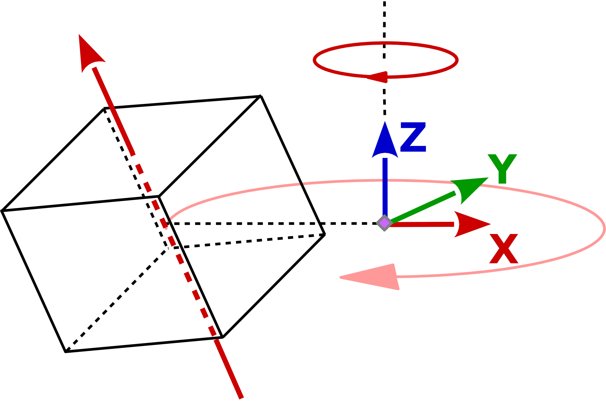
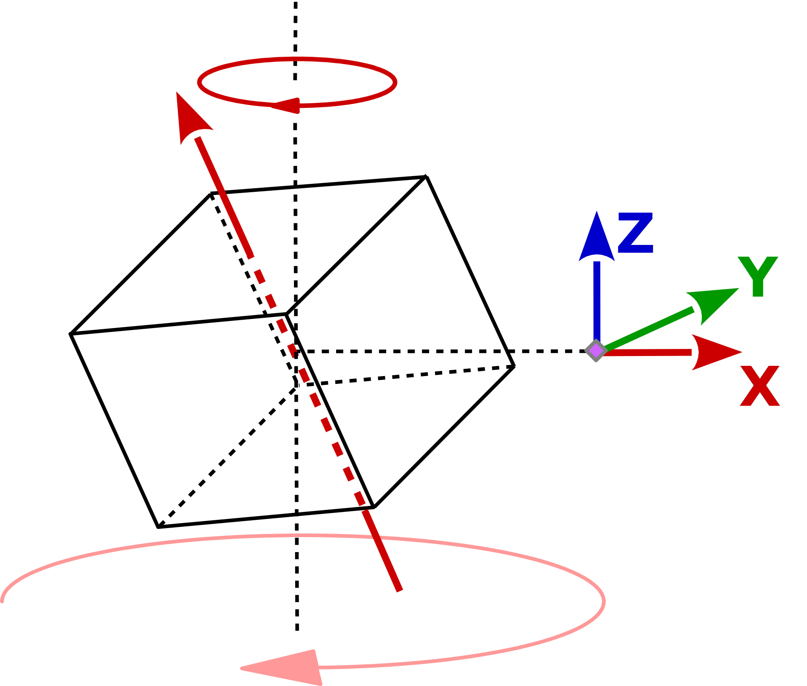
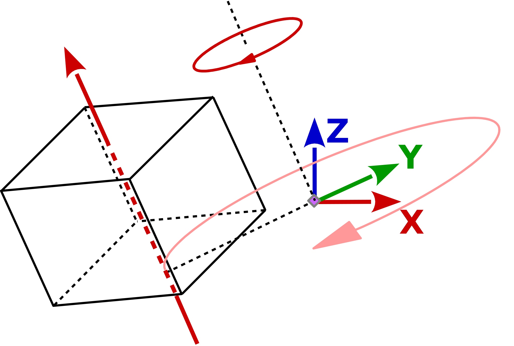
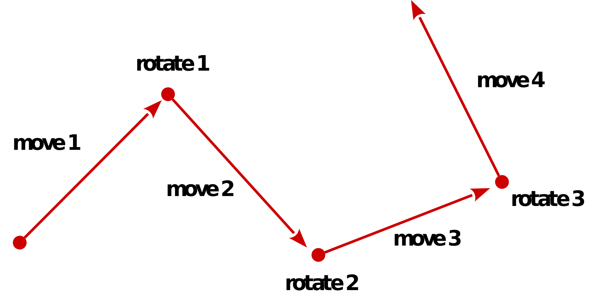

# Matrix definitions and operations

## Matrix definitons

### 3*3 matrix

A 3*3 matrix looks like this:
   
      c0  c1  c2             x   y   z 
    [ Xx  Yx  Zx ]        [  0   4   8 ]     
    [ Xy  Yy  Zy ]        [  1   5   9 ]     
    [ Xz  Yz  Zz ]        [  2   6  10 ]

And the memory image of a 3*3 matrix like this:

    [ Xx, Xy, Xz, Yx, Yy, Yz, Zx, Zy, Zz, Tx, Ty, Tz ]

Initializing a `mat3 m33` in GLSL:

    mat3 m33 = mat3(
        vec3( Xx, Xy, Xz ),
        vec3( Yx, Xy, Yz ),
        vec3( Zx  Zy  Zz ),
        vec3( Tx, Ty, Tz ) );

Addressing the columns of a `mat3 m33;` in GLSL:

    vec3 x = m33[0].xyz;
    vec3 y = m33[1].xyz;
    vec3 z = m33[2].xyz;    

### 4*4 matrix

A 4*4 matrix looks like this:

      c0  c1  c2  c3            c0  c1  c2  c3
    [ Xx  Yx  Zx  Tx ]        [  0   4   8  12 ]     
    [ Xy  Yy  Zy  Ty ]        [  1   5   9  13 ]     
    [ Xz  Yz  Zz  Tz ]        [  2   6  10  14 ]     
    [  0   0   0   1 ]        [  3   7  11  15 ] 

And the memory image of a 4*4 matrix looks like this:

    [ Xx, Xy, Xz, 0, Yx, Yy, Yz, 0, Zx, Zy, Zz, 0, Tx, Ty, Tz, 1 ]

Initializing a `mat4 m44` in GLSL:

    mat4 m44 = mat4(
        vec4( Xx, Xy, Xz, 0.0),
        vec4( Yx, Xy, Yz, 0.0),
        vec4( Zx  Zy  Zz, 0.0),
        vec4( Tx, Ty, Tz, 1.0) );

Addressing the columns of a `mat4 m44;` in GLSL:

    vec4 c0 = m44[0].xyzw;
    vec4 c1 = m44[1].xyzw;
    vec4 c2 = m44[2].xyzw;
    vec4 c3 = m44[3].xyzw;

 
See further:  

- [GLSL Programming/Vector and Matrix Operations][1]
- [Data Type (GLSL)][2]    
- [GLSL 4x4 Matrix Fields][3]
- [Matrix Translation in GLSL is infinitely stretched][9] 
- [What is wrong with my matrix stack implementation (OpenGL ES 2.0)?][10]
   

 

## Deprecated OpenGL compatibility mode matrix stack

In OpenGL there is one matrix stack for each matrix mode (See [**`glMatrixMode`**][4]). The matrix modes are `GL_MODELVIEW`, `GL_PROJECTION`, and `GL_TEXTURE`.

Multiplication: See the documentation of [**`glMultMatrix`**][5]:
>`glMultMatrix` multiplies the current matrix with the one specified using `m`, and replaces the current matrix with the product.

Translation: See the documentation of [**`glTranslate`**][6]:
>`glTranslate` produces a translation by `x y z` . The current matrix (see `glMatrixMode`) is multiplied by this translation matrix, with the product replacing the current matrix.

Rotation: See the documentation of [**`glRotate`**][7]:
>`glRotate` produces a rotation of angle degrees around the vector `x y z` . The current matrix (see `glMatrixMode`) is multiplied by a rotation matrix with the product replacing the current matrix.

Scaling: See the documentation of [**`glScale`**][8]:
>`glScale`produces a nonuniform scaling along the `x`, `y`, and `z` axes. The three parameters indicate the desired scale factor along each of the three axes.
The current matrix (see `glMatrixMode`) is multiplied by this scale matrix.

 

## Matrix operations

### Matrix translation

C++:

    void glTranslatef( GLfloat x, GLfloat y, GLfloat z )
    {
        float translation[]{
            1.0f, 0.0f, 0.0f, 0.0f,
            0.0f, 1.0f, 0.0f, 0.0f,
            0.0f, 0.0f, 1.0f, 0.0f,
            x,    y,    z,    1.0f };

        multiplyMatrix(&modelViewMatrix[0], translation, &modelViewMatrix[0]);
    }

Python:

    def Translate(matA, trans):
        matB = numpy.copy(matA)
        for i in range(0, 4): matB[3,i] = matA[0,i] * trans[0] + matA[1,i] * trans[1] + matA[2,i] * trans[2] + matA[3,i] 
        return matB

Note, this would be what [`glm::translate`][6] does.

    glm::mat4 translation = glm::translate(glm::mat4(), glm::vec3(0.5, 0.0, 0.0));

### Matrix rotation

C++:

    void glRotatef( GLfloat angle, GLfloat x, GLfloat y, GLfloat z )
    {
        float radians = angle * M_PI/180;
        float c = cos(radians);
        float s = sin(radians);
        
        float rotation[16]{
           x*x*(1.0f-c)+c,   x*y*(1.0f-c)-z*s, x*z*(1.0f-c)+y*s, 0.0f,
           y*x*(1.0f-c)+z*s, y*y*(1.0f-c)+c,   y*z*(1.0f-c)-x*s, 0.0f,
           z*x*(1.0f-c)-y*s  z*y*(1.0f-c)+x*s, z*z*(1.0f-c)+c,   0.0f,
           0.0f,             0.0f,             0.0f,             1.0f };

        multiplyMatrix(&rotationMatrix[0], rotation, &rotationMatrix[0]);
    }  

Python:

    def Rotate(matA, angRad, axis):
        matB = numpy.copy(matA)
        s, c = math.sin(angRad), math.cos(angRad)
        x, y, z = axis[0], axis[1], axis[2] 
        return numpy.matrix( [
            [x*x*(1-c)+c,   x*y*(1-c)-z*s, x*z*(1-c)+y*s, 0],
            [y*x*(1-c)+z*s, y*y*(1-c)+c,   y*z*(1-c)-x*s, 0],
            [z*x*(1-c)-y*s  z*y*(1-c)+x*s, z*z*(1-c)+c,   0],
            [0,             0,             0,             1] ] )

### Matrix scaling

C++:

    void glScalef( GLfloat x, GLfloat y, GLfloat z )
    {
        float scaling[]{
            x,    0.0f, 0.0f, 0.0f,
            0.0f, y,    0.0f, 0.0f,
            0.0f, 0.0f, z,    0.0f,
            0.0f, 0.0f, 0.0f, 1.0f };

        multiplyMatrix(&modelViewMatrix[0], scaling, &modelViewMatrix[0]);
    }

Python:

    def Scale(matA, s):
        matB = numpy.copy(matA)
        for i0 in range(0, 3):
            for i1 in range(0, 4): matB[i0,i1] = matA[i0,i1] * s[i0] 
        return matB

### Matrix multiplication (concatenation)

A matrix multiplication `C = A * B` works like this:

    Matrix4x4 A, B, C;
    
    // C = A * B
    for ( int k = 0; k < 4; ++ k )
        for ( int j = 0; j < 4; ++ j )
            C[k][j] = A[0][l] * B[k][0] + A[1][j] * B[k][1] + A[2][j] * B[k][2] +  A[3][j] * B[k][3];

C++:

    void multiplyMatrix( float A[], float B[], float P[] )
    {
        float C[16];
        for ( int k = 0; k < 4; ++ k ) {
            for ( int l = 0; l < 4; ++ l ) {
                C[k*4+j] =
                    A[0*4+j] * B[k*4+0] +
                    A[1*4+j] * B[k*4+1] +
                    A[2*4+j] * B[k*4+2] +
                    A[3*4+j] * B[k*4+3];
            }
        }
        std::copy(C, C+16, P);
    }

Python:

    def Multiply(matA, matB):
        matC = numpy.copy(matA)
        for i0 in range(0, 4):
            for i1 in range(0, 4):
                matC[i0,i1] = matB[i0,0] * matA[0,i1] + matB[i0,1] * matA[1,i1] + matB[i0,2] * matA[2,i1] + matB[i0,3] * matA[3,i1]    
        return matC 

**A concatenation of 2 matrices (matrix multiplication) is not commutative:** 
e.g. multiplcation of atranslation matrix and a rotation matrix aounf the Y-axis

The translation matrix looks like this:

    Matrix4x4 translate;

    translate[0] : ( 1,  0,  0,  0 )
    translate[1] : ( 0,  1,  0,  0 )
    translate[2] : ( 0,  0,  1,  0 )
    translate[3] : ( tx, ty, tz, 1 )

And the rotation matrix around Y-Axis looks like this:

    Matrix4x4  rotate;
    float      angle;

    rotate[0] : ( cos(angle),  0, sin(angle), 0 )
    rotate[1] : ( 0,           1, 0,          0 )
    rotate[2] : ( -sin(angle), 0, cos(angle), 0 )
    rotate[3] : ( 0,           0, 0,          1 )   

 
The result of `translate * rotate` is this:

    model[0] : ( cos(angle),  0,  sin(angle), 0 )
    model[1] : ( 0,           1,  0,          0 )
    model[2] : ( -sin(angle), 0,  cos(angle), 0 )
    model[3] : ( tx,          ty, tz,         1 )

 
Note, the result of `rotate * translate` would be:

    model[0] : ( cos(angle),                     0,   sin(angle),                     0 )
    model[1] : ( 0,                              1,   0,                              0 )
    model[2] : ( -sin(angle),                    0,   cos(angle),                     0 )
    model[3] : ( cos(angle)*tx - sin(angle)*tx,  ty,  sin(angle)*tz + cos(angle)*tz,  1 )

 
See further:

- [three.js object translate and rotate based on object self coordinate system or world coordinate system][11]
- [Rotating a multipart object][12]
- [OpenGL move object and keep transformation][13]
- [Issues with Z-axis rotation matrix in glsl shader][14]
- [three.js object translate and rotate based on object self coordinate system or world coordinate system][15]
- [movement of rendered objects in opengl][16]

 

## Transposed matrix

The transposed matrix `m_t` of a matrix `m`, is the flipped matrix over its diagonal.

e.g.

        [ 1 2 3 ]           [ 1 4 7 ]
    m = [ 4 5 6 ]     m_t = [ 2 5 8 ]
        [ 7 8 9 ]           [ 3 6 9 ]

e.g.

         [ 1 2 ]            [ 1 3 5 ]
    m =  [ 3 4 ]      m_t = [ 2 4 6 ]
         [ 5 6 ]

### Transpose? It's just a matter of definition

Further see [GLSL Programming/Vector and Matrix Operations][1]:
>Furthermore, the *-operator can be used for matrix-vector products of the corresponding dimension, e.g.:
>
    vec2 v = vec2(10., 20.);
    mat2 m = mat2(1., 2.,  3., 4.);
    vec2 w = m * v; // = vec2(1. * 10. + 3. * 20., 2. * 10. + 4. * 20.)
>**Note that the vector has to be multiplied to the matrix from the right**.
>  
>If a vector is multiplied to a matrix from the left, the result corresponds to to multiplying a column vector to the transposed matrix from the right. This corresponds to multiplying a column vector to the transposed matrix from the right:  
Thus, multiplying a vector from the left to a matrix corresponds to multiplying it from the right to the transposed matrix:
>
    vec2 v = vec2(10., 20.);
    mat2 m = mat2(1., 2.,  3., 4.);
    vec2 w = v * m; // = vec2(1. * 10. + 2. * 20., 3. * 10. + 4. * 20.)

 

**This means**:

If a matrix is defined like this:

    mat4 m44 = mat4(
        vec4( Xx, Xy, Xz, 0.0),
        vec4( Yx, Xy, Yz, 0.0),
        vec4( Zx  Zy  Zz, 0.0),
        vec4( Tx, Ty, Tz, 1.0) );

And the matrix uniform `mat4 transformation` is set like this (see [`glUniformMatrix4fv`][18]):

    glUniformMatrix4fv( .... , 1, GL_FALSE, &(m44[0][0] ); 

Then that the vector has to be multiplied to the matrix from the **right**:
 
    gl_Position = transformation * vertexPosition;

 
But of course, the matrix can be set up *transposed*: 

    mat4 m44 = mat4(
        vec4(  Xx,  Yx,  Zx,  Tx),
        vec4(  Xy,  Yy,  Zy,  Ty),
        vec4(  Xz   Yz   Zz,  Tz),
        vec4( 0.0, 0.0, 0.0, 1.0) );

**Or** can be transposet when set to the uniform variable:

    glUniformMatrix4fv( .... , 1, GL_TRUE, &(m44[0][0] );

Then that the vector has to be multiplied to the matrix from the **left**:

    gl_Position = vertexPosition * transformation;

 
See further:

- [What is the difference between the order in which a mat4x4 is multiplied with a vec4?][21]
- [Translation on square made of triangles in opengl][22]
- [Wikipedia transposed][26]

 

## Inverse matrix

### Inverse 4*4 matrix

    bool InverseMat44( const GLfloat m[16], GLfloat invOut[16] )
    {
        float inv[16], det;
        int i;

        inv[0]  =  m[5] * m[10] * m[15] - m[5] * m[11] * m[14] - m[9] * m[6] * m[15] + m[9] * m[7] * m[14] + m[13] * m[6] * m[11] - m[13] * m[7] * m[10];
        inv[4]  = -m[4] * m[10] * m[15] + m[4] * m[11] * m[14] + m[8] * m[6] * m[15] - m[8] * m[7] * m[14] - m[12] * m[6] * m[11] + m[12] * m[7] * m[10];
        inv[8]  =  m[4] * m[9]  * m[15] - m[4] * m[11] * m[13] - m[8] * m[5] * m[15] + m[8] * m[7] * m[13] + m[12] * m[5] * m[11] - m[12] * m[7] * m[9];
        inv[12] = -m[4] * m[9]  * m[14] + m[4] * m[10] * m[13] + m[8] * m[5] * m[14] - m[8] * m[6] * m[13] - m[12] * m[5] * m[10] + m[12] * m[6] * m[9];
        inv[1]  = -m[1] * m[10] * m[15] + m[1] * m[11] * m[14] + m[9] * m[2] * m[15] - m[9] * m[3] * m[14] - m[13] * m[2] * m[11] + m[13] * m[3] * m[10];
        inv[5]  =  m[0] * m[10] * m[15] - m[0] * m[11] * m[14] - m[8] * m[2] * m[15] + m[8] * m[3] * m[14] + m[12] * m[2] * m[11] - m[12] * m[3] * m[10];
        inv[9]  = -m[0] * m[9]  * m[15] + m[0] * m[11] * m[13] + m[8] * m[1] * m[15] - m[8] * m[3] * m[13] - m[12] * m[1] * m[11] + m[12] * m[3] * m[9];
        inv[13] =  m[0] * m[9]  * m[14] - m[0] * m[10] * m[13] - m[8] * m[1] * m[14] + m[8] * m[2] * m[13] + m[12] * m[1] * m[10] - m[12] * m[2] * m[9];
        inv[2]  =  m[1] * m[6]  * m[15] - m[1] * m[7]  * m[14] - m[5] * m[2] * m[15] + m[5] * m[3] * m[14] + m[13] * m[2] * m[7]  - m[13] * m[3] * m[6];
        inv[6]  = -m[0] * m[6]  * m[15] + m[0] * m[7]  * m[14] + m[4] * m[2] * m[15] - m[4] * m[3] * m[14] - m[12] * m[2] * m[7]  + m[12] * m[3] * m[6];
        inv[10] =  m[0] * m[5]  * m[15] - m[0] * m[7]  * m[13] - m[4] * m[1] * m[15] + m[4] * m[3] * m[13] + m[12] * m[1] * m[7]  - m[12] * m[3] * m[5];
        inv[14] = -m[0] * m[5]  * m[14] + m[0] * m[6]  * m[13] + m[4] * m[1] * m[14] - m[4] * m[2] * m[13] - m[12] * m[1] * m[6]  + m[12] * m[2] * m[5];
        inv[3]  = -m[1] * m[6]  * m[11] + m[1] * m[7]  * m[10] + m[5] * m[2] * m[11] - m[5] * m[3] * m[10] - m[9]  * m[2] * m[7]  + m[9]  * m[3] * m[6];
        inv[7]  =  m[0] * m[6]  * m[11] - m[0] * m[7]  * m[10] - m[4] * m[2] * m[11] + m[4] * m[3] * m[10] + m[8]  * m[2] * m[7]  - m[8]  * m[3] * m[6];
        inv[11] = -m[0] * m[5]  * m[11] + m[0] * m[7]  * m[9]  + m[4] * m[1] * m[11] - m[4] * m[3] * m[9]  - m[8]  * m[1] * m[7]  + m[8]  * m[3] * m[5];
        inv[15] =  m[0] * m[5]  * m[10] - m[0] * m[6]  * m[9]  - m[4] * m[1] * m[10] + m[4] * m[2] * m[9]  + m[8]  * m[1] * m[6]  - m[8]  * m[2] * m[5];

        det = m[0] * inv[0] + m[1] * inv[4] + m[2] * inv[8] + m[3] * inv[12];
        if (det == 0) return false;
        det = 1.0 / det;

        for (i = 0; i < 16; i++)
            invOut[i] = inv[i] * det;

        return true;
    }

 
See further:

- [Particles not oriented to the camera][31]
- [OpenGL screen coordinates to world coordinates][32]
- [Wikipedia, Invertible matrix][30]

 

## Inverse matrix and transposed matrix

If the transposed matrix of a matrix `m` is equal to the inverse matrix of the matrix `m`, it is called an orthogonal matrix.

This means, if each column of a amtrix (e.g. each axis of a 3*3 matrix), has unit length and is perpendicular to every other column then the transposed matrix is equal the inverse matrix.

e.g.
        [  0.707, 0.707, 0 ]                 [ 0.707, -0.707, 0 ]
    m = [ -0.707, 0.707, 0 ]     m_i = m_t = [ 0.707,  0.707, 0 ]
        [      0,     0, 1 ]                 [     0,      0, 1 ]

 
See further:

- [Transpose and Inverse][27]
- [In which cases is the inverse matrix equal to the transpose?][29]
- [Difference Between Transpose and Inverse Matrix][28]

 

## Combined transformations

Let's assume we have an object that is moved, rotated and scaled, and we define a transformation matrix as follows:

    glm::mat4 objTrans ...; // translation 
    glm::mat4 objRot ...;   // roation 
    glm::mat4 objScale ...; // scaling

    glm::mat4 objMat = objTrans * objRot * objScale;

And we have rotation matrix that we want to run on the object. In this case we have rotation around the Z-axis:

    foat angle ...; // rotation angle

    glm::mat4 rotMat = glm::rotate( angle, glm::vec3( 0.0, 0.0, 1.0 ) ); 

We have several rotations we can do with this information.
First we want to rotate the object on its local axis:

    glm::mat4 modelMat = objMat * rotMat;

A Rotation around the worlds origin can be performed like this:

    glm::mat4 modelMat = rotMat * objMat;

In order to rotate around the origin of the object in the world coordinate system, we must eliminate the rotation of the objct:

    glm::mat4 modelMat = objMat * (glm::inverse(objRot) * rotMat * objRot);

A Rotation around the worlds origin in relation to the object you have to do the opposite:

    glm::mat4 modelMat = (objRot * rotMat * glm::inverse(objRot)) * objMat;

If you have a complete transformations matrix for an object and you do not know the rotation part, then it can be easily determined.

Note that a transformation matrix usually looks like this:

    ( X-axis.x, X-axis.y, X-axis.z, 0 )
    ( Y-axis.x, Y-axis.y, Y-axis.z, 0 )
    ( Z-axis.x, Z-axis.y, Z-axis.z, 0 )
    ( trans.x,  trans.y,  trans.z,  1 )

To generate a rotation only matrix you have to extract the normalized axis vectors:

    glm::mat4 a ...; // any matrix
    glm::vec3 x = glm::normalize( a[0][0], a[0][1], a[0][2] );
    glm::vec3 y = glm::normalize( a[1][0], a[1][1], a[1][2] );
    glm::vec3 z = glm::normalize( a[2][0], a[2][1], a[2][2] );

    glm::mat4 r;
    r[0][0] = x[0]; r[0][1] = x[1]; r[0][2] = x[2]; r[0][3] = 0.0f;
    r[1][0] = y[0]; r[1][1] = y[1]; r[1][2] = y[2]; r[0][3] = 0.0f;
    r[2][0] = z[0]; r[2][1] = z[1]; r[2][2] = z[2]; r[0][3] = 0.0f;
    r[3][0] = 0.0f; r[3][1] = 0.0f; r[3][2] = 0.0f; r[0][3] = 1.0f;

 
See further:

- [Drawing cubes with stacked matrix][19]
- [OpenGL transforming objects with multiple rotations of Different axis][20]

 

## First Person Camera Transformation

First Person movment, the camera matrix has to be incrementally changed. This means you have to calculate the current movement and current rotation matrix. Apply the movement and rotation to the camera and keep the camera for the next cycle of the loop. At the next cycle of the loop you have to use the manipulated camera from the previous cycle and you have to apply the new movement and rotation. This causes that the camera incremental changes, always based on its current position and orientation.

 
See further:

- [opengl atan2f doesn't work][23]
- [OpenGL, First Person Camera Translation][24]
- [how to modify the view of the camera with pygame and openGL][25]

  [1]: https://en.wikibooks.org/wiki/GLSL_Programming/Vector_and_Matrix_Operations
  [2]: https://www.khronos.org/opengl/wiki/Data_Type_(GLSL)
  [3]: http://www.geeks3d.com/20141114/glsl-4x4-matrix-mat4-fields/
  [4]: https://www.khronos.org/registry/OpenGL-Refpages/gl2.1/xhtml/glMatrixMode.xml
  [5]: https://www.khronos.org/registry/OpenGL-Refpages/gl2.1/xhtml/glMultMatrix.xml
  [6]: https://www.khronos.org/registry/OpenGL-Refpages/gl2.1/xhtml/glTranslate.xml
  [7]: https://www.khronos.org/registry/OpenGL-Refpages/gl2.1/xhtml/glRotate.xml
  [8]: https://www.khronos.org/registry/OpenGL-Refpages/gl2.1/xhtml/glScale.xml
  [9]: https://stackoverflow.com/questions/46763234/matrix-translation-in-glsl-is-infinitely-stretched/46763693#46763693
  [10]: https://stackoverflow.com/questions/46732918/what-is-wrong-with-my-matrix-stack-implementation-opengl-es-2-0/46733128#46733128
  [11]: https://stackoverflow.com/questions/46700593/three-js-object-translate-and-rotate-based-on-object-self-coordinate-system-or-w/46701675#46701675
  [12]: https://stackoverflow.com/questions/46720166/rotating-a-multipart-object/46722875#46722875
  [13]: https://stackoverflow.com/questions/46641995/opengl-move-object-and-keep-transformation/46650784#46650784
  [14]: https://stackoverflow.com/questions/6458051/issues-with-z-axis-rotation-matrix-in-glsl-shader/44986176#44986176
  [15]: https://stackoverflow.com/questions/46700593/three-js-object-translate-and-rotate-based-on-object-self-coordinate-system-or-w/46701675#46701675
  [16]: https://stackoverflow.com/questions/46634046/movement-of-rendered-objects-in-opengl/46634442#46634442
  [17]: https://glm.g-truc.net/0.9.8/api/a00169.html#gaee134ab77c6c5548a6ebf4e8e476c6ed
  [18]: https://www.khronos.org/registry/OpenGL-Refpages/gl4/html/glUniform.xhtml
  [19]: https://stackoverflow.com/questions/46238282/drawing-cubes-with-stacked-matrix
  [20]: https://stackoverflow.com/questions/45091505/opengl-transforming-objects-with-multiple-rotations-of-different-axis/45095288#45095288
  [21]: https://stackoverflow.com/questions/46888117/what-is-the-difference-between-the-order-in-which-a-mat4x4-is-multiplied-with-a/46888465#46888465
  [22]: https://stackoverflow.com/questions/47004946/translation-on-square-made-of-triangles-in-opengl/47005569#47005569
  [23]: https://stackoverflow.com/questions/45234650/atan2f-doesnt-work/45239229#45239229
  [24]: https://stackoverflow.com/questions/46508872/opengl-first-person-camera-translation/46509967#46509967
  [25]: https://stackoverflow.com/questions/47169618/how-to-modify-the-view-of-the-camera-with-pygame-and-opengl/47173089#47173089
  [26]: https://en.wikipedia.org/wiki/Transpose
  [27]: http://www.katjaas.nl/transpose/transpose.html
  [28]: http://www.differencebetween.com/difference-between-transpose-and-vs-inverse-matrix/
  [29]: https://math.stackexchange.com/questions/156735/in-which-cases-is-the-inverse-matrix-equal-to-the-transpose
  [30]: https://en.wikipedia.org/wiki/Invertible_matrix
  [31]: https://stackoverflow.com/questions/45779313/particles-not-oriented-to-the-camera/45779696#45779696
  [32]: https://stackoverflow.com/questions/44965202/opengl-screen-coordinates-to-world-coordinates/45000237#45000237

