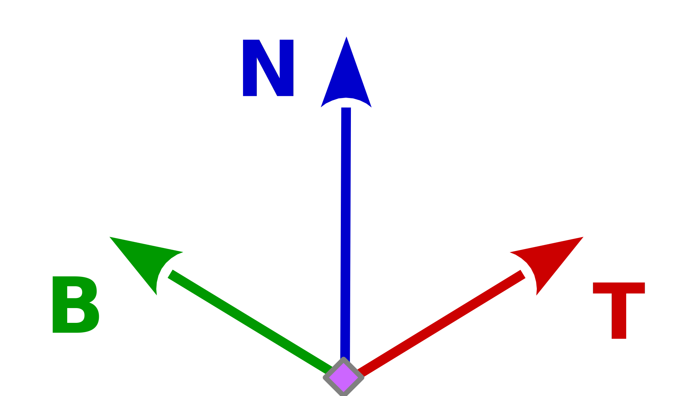
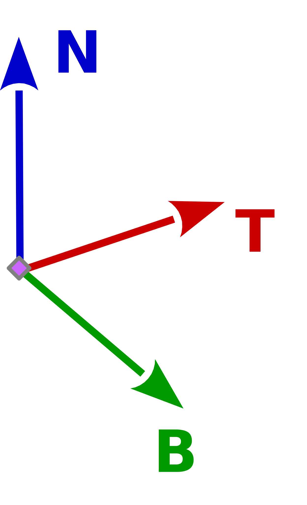
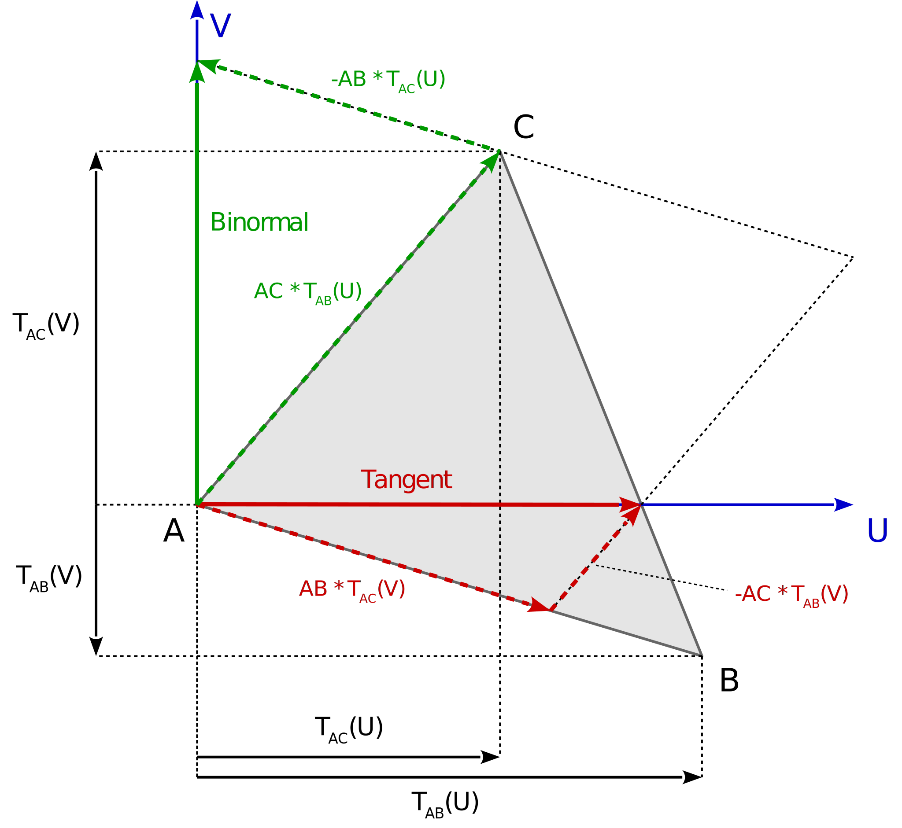

# Tangent space

## Relation system

In an [Right-Handed Coordinate System][3] (see further [Right-hand rule][5])

the Binormal Vector is calcualted by:

    B = N x T

while in an [Left-Handed Coordinate System][4]

the Binormal Vector is calcualted by:

    B = T x N

 
In OpenGL is commonly used a [Right-Handed Coordinate System][3], but this depends on the specification and definitions which are chosen by the user.

If a system is mirrored it changes from one system to the other. This may occur if a texture is mirrored or looked at from the backface.

 

## Tangent and Binormal

### Precomputed tangent

One way to get the tangential space in the shader is to pass the tanget as an attribute to the shader, just like the normalvector.
For this the tangents have to be pre-computed and stored in the mesh data.

### Calculating the Tangent in the Fragment Shader

The tangent and the binormal can be calculated by the GLSL derivate functions [`dFdx`, `dFdy`][6], that calcualtes the partial derivative of an argument with respect to `x` or `y`.

    vec3 vsPos    = ....; // fragment position in view space
    vec2 texCoord = ....; // texture coordinate of the fragment

    // derivations of the fragment position
    vec3 pos_dx   = dFdx( vsPos );
    vec3 pos_dy   = dFdy( vsPos );
    
    // derivations of the texture coordinate
    vec2 texC_dx  = dFdx( texCoord );
    vec2 texC_dy  = dFdy( texCoord );
    
    // tangent vector and binormal vector
    vec3 tangent  = texC_dy.y * pos_dx - texC_dx.y * pos_dy;
    vec3 binormal = texC_dx.x * pos_dy - texC_dy.x * pos_dx;

The *direction* of the binormal vector (`binormalSign`) can be calculated by the determinant of the 2*2 matrix created from the derivatives of the texture coordinates. The determinatne can be calucalted by:

    float texDet       = tc_dx.x * tc_dy.y - tc_dx.y * tc_dy.x;

Or the GLSL function [determinant][7]:

    float texDet       = determinant( mat2( tc_dx, tc_dy ) );
    vec3  tangentVec   = ( tc_dy.y * p_dx - tc_dx.y * p_dy ) / texDet;
    float binormalSign = sign(texDet);      

### Calculating the Tangent in a Geometry or Tesselation Shader

    vec3 vsPos[3]      = ....; // corner points of the triangle primitive in view space
    vec2 texCoord[3]   = ....; // coresponding texture cooridnates to the corner points of the prmitive

    vec3  p_dA         = vsPos[1].xyz - vsPos[0].xyz;
    vec3  p_dB         = vsPos[2].xyz - vsPos[0].xyz;
    vec2  tc_dA        = tecCoord[1].uv - tecCoord[0].uv;
    vec2  tc_dB        = tecCoord[2].uv - tecCoord[0].uv;
    float texDet       = determinant( mat2( tc_dA, tc_dB ) );
    
    vec3  tangentVec   = ( tc_dB.y * p_dA - tc_dA.y * p_dB ) / texDet;
    float binormalSign = sign(texDet);

 

## Tangent space matrix

If the **normalized normal vector** `n`, the tangent `t` and the binormal` b` are known, the tangent space can be calculated.

Of course the an orthonormalized tangent space matrix can be calcualted by using the cross product,
but this would only work for right-hand systems. If a matrix was mirrored (left-hand system) it will turn to a right hand system:

    t        = cross( cross( n, t ), t ); // orthonormalization of the tangent vector
    b        = cross( n, t );             // orthonormalization of the binormal vector may invert the binormal vector
    mat3 tbn = mat3( normalize(t), normalize(b), n );

In the code snippet above the binormal vector is reversed if the tangent space is a left-handed system.
To avoid this, the hard must be gone:

    t        = cross( cross( n, t ), t ); // orthonormalization of the tangent vector
    b        = cross( b, cross( b, n ) ); // orthonormalization of the binormal vectors to the normal vector 
    b        = cross( cross( t, b ), t ); // orthonormalization of the binormal vectors to the tangent vector
    mat3 tbn = mat3( normalize(t), normalize(b), n );

A common way to orthogonalize any matrix is the [Gram-Schmidt process][8]:

    t        = t - n * dot( t, n ); // orthonormalization ot the tangent vectors
    b        = b - n * dot( b, n ); // orthonormalization of the binormal vectors to the normal vector 
    b        = b - t * dot( b, t ); // orthonormalization of the binormal vectors to the tangent vector
    mat3 tbn = mat3( normalize(t), normalize(b), n );
   
Another possibility is to use the determinant of the 2*2 matrix which results from the derivations of the texture coordinates `texC_dx`, `texC_dy`
to take the direction of the binormal vector into account. The idea is that the determinant of a orthogonal matrix is 1 and the determined one of a orthogonal mirror matrix -1.

The determinant can eihter be calcualted by the GLSL function `determinant( mat2( texC_dx, texC_dy )`
or it can be calcualated by it formula `texC_dx.x * texC_dy.y - texC_dy.x * texC_dx.y`.

For the calculation of the orthonormalized tangent space matrix, the binormal vector is no longer required and the calculation of the unit vector
(`normalize`) of the binormal vector can be evaded.

    float texDet       = texC_dx.x * texC_dy.y - texC_dy.x * texC_dx.y;
    float binormalSign = sign(texDet);
    
    vec3 t             = normalize( t - n * dot( t, n ) );
    vec3 b             = binormalSign * cross( n, t );     // b is normlized because n and t are orthonormalized unit vectors
    mat3 tbn           = mat3( t, binormalSign * b, n );   // take in account the direction of the binormal vector

 

## Resources

- [How to calculate Tangent and Binormal?][1]
- [Calculating Binormal Vector][2]
- [Wikipedia - Tangent space][3] 

  
  [1]: https://stackoverflow.com/questions/5255806/how-to-calculate-tangent-and-binormal/44901073#44901073
  [2]: https://stackoverflow.com/questions/47117083/calculating-binormal-vector/47121567#47121567
  [3]: http://mathworld.wolfram.com/Right-HandedCoordinateSystem.html
  [4]: http://mathworld.wolfram.com/Left-HandedCoordinateSystem.html
  [5]: https://en.wikipedia.org/wiki/Right-hand_rule
  [6]: https://www.khronos.org/registry/OpenGL-Refpages/gl4/html/dFdx.xhtml
  [7]: https://www.khronos.org/registry/OpenGL-Refpages/gl4/html/determinant.xhtml
  [8]: https://en.wikipedia.org/wiki/Gram%E2%80%93Schmidt_process
  [9]: https://en.wikipedia.org/wiki/Tangent_space
 

-------------------

# TODO

- disadvantages of dynamically calcualted tangent
  - sudden deviation of the tangent at the boundaries of primitive 

- reserach

  - Explanation of dFdx [http://stackoverflow.com/questions/16365385/explanation-of-dfdx]
  - Derivatives I: Discontinuities and Gradients [http://hacksoflife.blogspot.co.at/2011/01/derivatives-i-discontinuities-and.html]
  - Normal Mapping without Precomputed Tangent Space Vectors [http://www.geeks3d.com/20130122/normal-mapping-without-precomputed-tangent-space-vectors/]
  - Followup: Normal Mapping Without Precomputed Tangents [http://www.thetenthplanet.de/archives/1180]
  - In a TBN Matrix are the normal, tangent, and bitangent vectors always perpendicular? [https://stackoverflow.com/questions/15433917/in-a-tbn-matrix-are-the-normal-tangent-and-bitangent-vectors-always-perpendicu]

- Inverse Tangent-Binormal-Normal Matrix

 

    mat3 inverseTBN( vec3 ptV, vec3 N, vec2 texCoord )
    {
      vec3  p_dx   = dFdx( ptV );
      vec3  p_dy   = dFdy( ptV );
      vec2  tc_dx  = dFdx( texCoord );
      vec2  tc_dy  = dFdy( texCoord );

      vec3 dp1perp = cross( N, p_dx );
      vec3 dp2perp = cross( p_dy, N );
      vec3 T = dp2perp * tc_dx.x + dp1perp * tc_dy.x;
      vec3 B = dp2perp * tc_dx.y + dp1perp * tc_dy.y;
      float invmax = inversesqrt( max( dot( T, T ), dot( B, B ) ) );
      return mat3( normalize( T * invmax ), normalize( B * invmax ), N );
    }

