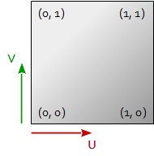
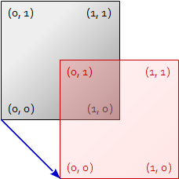
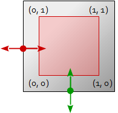
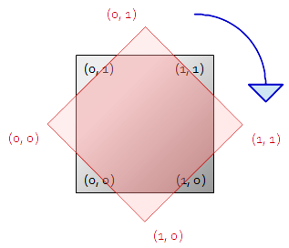
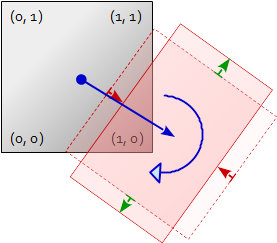
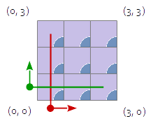
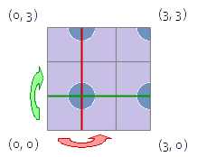

# Textures


## Texture Coordinate transformation

When we wrap a texture on a mesh, the texture maybe have to be translated, scaled and rotated.
In order to do this, a texture matrix is commonly used to perform the necessary transformations of the texture coordinates.

For a 2D texture, the lower left corner of the texture has the UV (at) coordinates (0, 0) and the upper right corner of the texture has the coordinates (1, 1).



For the transformation of a 2D texture with a 4*4 matrix, the XY part of the X-axis, the XY-part of the Y-axis and the XY-part of the translation has to be proper set.

```txt
          x     y    z     w
        --------------------
x axis :  xx    xy   0.0   0.0
y axis :  yx    yy   0.0   0.0
z axis :  0.0   0.0  1.0   0.0
trans  :  tx    ty   0.0   1.0
```

### Translation

To translate a texture the translation part of the matrix has to be set to the negative translation vector:

 

Setting up of a simple translation matrix for a 2D texture:

```cpp
using TVec4  = std::array< float, 4 >;
using TMat44 = std::array< TVec4, 4 >;

TMat44 TextureTrans( float tu, float tv )
{
    TMat44 m {
        TVec4{ 1.0f,  0.0f,  0.0f,  0.0f },
        TVec4{ 0.0f,  1.0f,  0.0f,  0.0f },
        TVec4{ 0.0f,  0.0f,  1.0f,  0.0f },
        TVec4{  -tu,   -tv,  0.0f,  1.0f }
    };
    return m;
}
```

### Scaling

For scaling the texture the axis have to be multiplied by the scale factor. If we want to scale the texture around its center (0.5, 0.5), the position of the texture must be corrected with the translation.



Setting up of a scaling matrix for a 2D texture, around its center point (0.5, 0.5):

```cpp
TMat44 TextureScale( float scaleU, float scaleV )
{
    float xx =  1.0f / scaleU;
    float yy =  1.0f / scaleV;
    float tx = 0.5f * (1.0f - xx);
    float ty = 0.5f * (1.0f - yy);

    TMat44 m {
        TVec4{   xx,  0.0f,  0.0f,  0.0f },
        TVec4{ 0.0f,    yy,  0.0f,  0.0f },
        TVec4{ 0.0f,  0.0f,  1.0f,  0.0f },
        TVec4{   tx,    ty,  0.0f,  1.0f }
    };
    return m;
}
```

### Rotation

To rotate a texture, we must turn the orthonormalized x axis and y axis. If we want to rotate the texture around its center (0.5, 0.5), the position of the texture must be corrected with the translation.  



Setting up of a clockwise rotation matrix for a 2D texture, around its center point (0.5, 0.5):

```cpp
TMat44 TextureRotate( float angDeg )
{
    float angRad = angDeg * 3.14159265f / 180.0f;
    float sinAng = sin( angRad );
    float cosAng = cos( angRad );

    float xx =  cosAng;
    float xy =  sinAng;
    float yx = -sinAng;
    float yy =  cosAng;
    float tx = 0.5f * (1.0f - xx - yx);
    float ty = 0.5f * (1.0f - xy - yy);

    TMat44 m {
        TVec4{   xx,    xy,  0.0f,  0.0f },
        TVec4{   yx,    yy,  0.0f,  0.0f },
        TVec4{ 0.0f,  0.0f,  1.0f,  0.0f },
        TVec4{   tx,    ty,  0.0f,  1.0f }
    };
    return m;
}
```

### Translate, Scale and Rotate

Finally we have to put it all together and to translate, scale and rotate the texture at once.



Setting up a texture matrix which which translates, scales, and clockwise rotate a texture around the center of the texture:

```cpp
TMat44 TextureMatrix( float tu, float tv, float scaleU, float scaleV, float angDeg )
{
    float angRad = angDeg * 3.14159265f / 180.0f;
    float sinAng = sin( angRad );
    float cosAng = cos( angRad );

    float xx =  cosAng / scaleU;
    float xy =  sinAng / scaleV;
    float yx = -sinAng / scaleU;
    float yy =  cosAng / scaleV;
    float tx = 0.5f * (1.0f - xx - yx) - tu * xx - tv * yx;
    float ty = 0.5f * (1.0f - xy - yy) - tu * xy - tv * yy;

    TMat44 m {
        TVec4{   xx,    xy,  0.0f,  0.0f },
        TVec4{   yx,    yy,  0.0f,  0.0f },
        TVec4{ 0.0f,  0.0f,  1.0f,  0.0f },
        TVec4{   tx,    ty,  0.0f,  1.0f }
    };
    return m;
}
```

## Texture Parameters

### Wrap parameter for texture coordinates

As seen above, the lower left corner of the texture has the UV (st) coordinates (0, 0) and the upper right corner of the texture has the coordinates (1, 1), but the texture coordinates of a mesh can be in any range. 
To handle this, it has to be defined how the texture coordinates are wrapped to the the texture.

The wrap parameter for the texture coordinate can be set with [glTextureParameter](https://www.khronos.org/registry/OpenGL-Refpages/gl4/html/glTexParameter.xhtml) using `GL_TEXTURE_WRAP_S`, `GL_TEXTURE_WRAP_T` and `GL_TEXTURE_WRAP_R`.

```cpp
glTexParameteri(GL_TEXTURE_2D, GL_TEXTURE_WRAP_S, GL_CLAMP_TO_EDGE);
glTexParameteri(GL_TEXTURE_2D, GL_TEXTURE_WRAP_T, GL_CLAMP_TO_EDGE);
```

The possible parameters are:

- `GL_CLAMP_TO_EDGE` causes the texture coordinates to be clamped to the range *[1/2N, 1 - 1/2N]*, where *N* is the size of the texture in the direction. 

- `GL_CLAMP_TO_BORDER` does the same as `GL_CLAMP_TO_EDGE`, but in cases where clamping, the fetched texel data is substituted with the color specified by `GL_TEXTURE_BORDER_COLOR`.

- `GL_REPEAT` causes the integer part of the texture coordinate to be ignored. The texture is **tiled**.



- `GL_MIRRORED_REPEAT`: If the integer part of the texture coordinate is even, then the it is ignored. In contrast to, if the integer part of the texture coordinate is odd, then the texture coordinate is set to *1 - frac(s)*. *fract(s)* is the fractional part of the texture coordinate. That causes the texture to be **mirrored** every 2nd time. 



- `GL_MIRROR_CLAMP_TO_EDGE` causes the the textue coordinate to be repeated as for `GL_MIRRORED_REPEAT `for one reptition of the texture, at which point the coordinate to be clamped as in `GL_CLAMP_TO_EDGE`.


Note the default value for `GL_TEXTURE_WRAP_S`, `GL_TEXTURE_WRAP_T` and `GL_TEXTURE_WRAP_R` is `GL_REPEAT`.


<br/><hr/>

<a href="https://stackexchange.com/users/7322082/rabbid76"></a>
