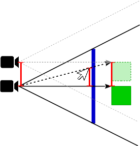
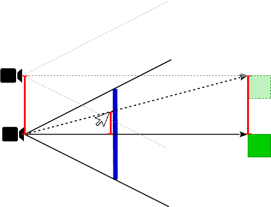

# Python OpenGL 4.6, GLM navigation

TODO:

- grid helper
- axis helper
- pain
- rotate / orbit - switch between different modes
- zoom

## Overview

### Data source

Vectors and matrices operations make use of the [PyGlm](https://pypi.org/project/PyGLM/), which is based on [OpenGL Mathematics (GLM)](https://glm.g-truc.net/0.9.9/index.html).
Matrices are generated by `glm.mat3` and `glm.mat4` and vectors are generated by `glm.vec3` and `glm.vec4`.  

```py
proj, inv_proj # projection matrix and inverse projection matrix
view, inv_view # view matrix and inverse view matrix
vp_rect        # (x, y, w, h) view port rectangle
               # x, y lower bottom origin of the viewport rectangle
               # w, h width and height of the viewport rectangle
cursor_pos     # (x, y) window position of the cursor (mouse)
cursor_depth   # representative depth at the current cursor position

width  = vp_rect[2]
height = vp_rect[3]

inv_wnd = glm.translate(glm.mat4(1), glm.vec3(-1, -1, 0))
inv_wnd = glm.scale(inv_wnd, glm.vec3(2/vp_rect[2], 2/vp_rect[3], 1))
inv_wnd = glm.translate(inv_wnd, glm.vec3(-vp_rect[0], -vp_rect[1], 0))
wnd     = glm.inverse(inv_wnd)

```

### Perspective "zoom" - move view position along view ray

See also [How to implement zoom towards mouse like in 3dsMax?](https://stackoverflow.com/questions/54057549/how-to-implement-zoom-towards-mouse-like-in-3dsmax/54158650#54158650)

#### Using `glm.unproject`

```py
# get world space position on view ray
pt_wnd   = glm.vec3(*cursor_pos, 1.0)
pt_world = glm.unProject(pt_wnd, view, proj, vp_rect)

# get view position
eye = glm.vec3(inv_view[3])

# get "zoom" direction and amount
ray_cursor = glm.normalize(pt_world - eye)

# translate view position and update view matrix
inv_view = glm.translate(glm.mat4(1), ray_cursor * delta) * inv_view
view     = glm.inverse(inv_view)
```

#### Using the view projection and window matrix

```py
# get world space position on view ray
pt_wnd     = glm.vec3(*cursor_pos, 1.0)
pt_h_world = inv_view * inv_proj * inv_wnd * glm.vec4(*pt_wnd, 1)
pt_world   = glm.vec3(pt_h_world) / pt_h_world.w
```

### Pane

See also [How to implement camera pan like in 3dsMax?](https://stackoverflow.com/questions/53758319/how-to-implement-camera-pan-like-in-3dsmax)  

The amount of displacement for the eye and target position depends on the depth of the object which is dragged on the viewport.

If the object is close to the eye position, then a translation on the viewport leads to a small displacement of the eye and target positions:



It the distance from the object to the eye is far, then a translation on the viewport leads to a large displacement of the eye and target positions:



Store the current cursor position and depth when pan is started:

```py
wnd_from = *cursor_pos, cursor_depth*2-1)
```

Translate the view planar to the viewport when the cursor position is updated:

```py
# get drag start and end
wnd_from = self.__pan_start
wnd_to   = glm.vec3(*cursor_pos, wnd_from[2])

# get drag start and world coordinates
pt_h_world_from = inv_view * inv_proj * inv_wnd * glm.vec4(*wnd_from, 1)
pt_world_from    = glm.vec3(pt_h_world_from) / pt_h_world_from.w
pt_h_world_to    = inv_view * inv_proj * inv_wnd * glm.vec4(*wnd_to, 1)
pt_world_to      = glm.vec3(pt_h_world_to) / pt_h_world_to.w

# get drag world translation
world_vec = pt_world_to - pt_world_from

# translate view position and update view matrix
inv_view     = glm.translate(glm.mat4(1), world_vec * -1) * inv_view
view         = glm.inverse(inv_view)

# set the start position for the next pan operation
wnd_from = wnd_to
```

### Rotate

See also [Proper way to handle camera rotations](https://stackoverflow.com/questions/54027740/proper-way-to-handle-camera-rotations)  

---

## Code listing