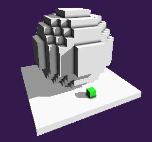

# Voxel Ray Tracing



```py
import os
import sys
currentWDir = os.getcwd()
print( 'current working directory: {}'.format( str(currentWDir) ) )
fileDir = os.path.dirname(os.path.abspath(__file__)) # det the directory of this file
print( 'current location of self: {}'.format( str(fileDir) ) )
parentDir = os.path.abspath(os.path.join(fileDir, os.pardir)) # get the parent directory of this file
sys.path.insert(0, parentDir)
print( 'insert system directory: {}'.format( str(parentDir) ) )
os.chdir( fileDir )
baseWDir = os.getcwd()
print( 'changed current working directory: {}'.format( str(baseWDir) ) )
print ( '' )

import math
import ctypes
from time import time
import numpy as np

from subprocess import call
from shutil import which

# PyGLM
import glm

# PyOpenGL import
from OpenGL.GL import *
from OpenGL.GLUT import *

from OpenGL.GL.shaders import *

# utility
from gl_util.gl4 import GL_Context
from gl_util.gl4 import GL_Program_GLSL, GL_Program_SpirV
from gl_util.gl4 import GL_Mesh
from gl_util.navigate import NavigationController


SIZEOF_FLAOT32 = np.finfo(np.float32).bits // 8

glsl_vert_draw_file = 'voxel_shader.vert'
glsl_frag_draw_file = 'voxel_shader.frag'
spv_vert_draw_file = 'voxel_shader_vert.spv'
spv_frag_draw_file = 'voxel_shader_frag.spv'
glsl_vert_hud_file = 'hud_shader.vert'
glsl_frag_hud_file = 'hud_shader.frag'
spv_vert_hud_file = 'hud_shader_vert.spv'
spv_frag_hud_file = 'hud_shader_frag.spv'

fileConvert = [
    (glsl_vert_draw_file, spv_vert_draw_file), (glsl_frag_draw_file, spv_frag_draw_file),
    (glsl_vert_hud_file, spv_vert_hud_file), (glsl_frag_hud_file, spv_frag_hud_file)]
glslVaidator = which('glslangValidator.exe')

if glslVaidator != None:
    print('Create Spire-V shader program')
    for glslFile, spvFile in fileConvert:
        glslPath = os.path.join(str(baseWDir), glslFile)
        spvPath  = os.path.join(str(baseWDir), spvFile)
        vspir_vert_cmd = '"' + glslVaidator + '" -V "' + glslPath + '" -o "' + spvPath + '"'
        call( vspir_vert_cmd )

#
# OpenGL cube mesh
#
class GL_MeshQuad(GL_Mesh):

    def __init__(self):

        attr_array = [0,0, 1,0, 1,1, 0,1]
        vertex_attributes = np.array(attr_array, dtype=np.float32)

        temp_vbo = np.empty(1, dtype=np.uint32)
        glCreateBuffers(len(temp_vbo), temp_vbo)
        self.__vbo = temp_vbo[0]

        temp_vao = np.empty(1, dtype=np.uint32)
        glCreateVertexArrays(len(temp_vao), temp_vao)
        vao = temp_vao[0]

        dynamic_buffer = False
        code = 0 if not dynamic_buffer else GL_DYNAMIC_STORAGE_BIT | GL_MAP_WRITE_BIT| GL_MAP_PERSISTENT_BIT
        glNamedBufferStorage(self.__vbo, vertex_attributes.nbytes, vertex_attributes, code)
        glVertexArrayVertexBuffer(vao, 0, self.__vbo, 0, 2*vertex_attributes.itemsize)

        vertex_spec = [(0, 2, GL_FLOAT, False, 0)]
        for vspec in vertex_spec:
            glVertexArrayAttribFormat(vao, *vspec)
            glVertexArrayAttribBinding(vao, vspec[0], 0)
            glEnableVertexArrayAttrib(vao, vspec[0])

        super().__init__(vao, 6, 0, GL_TRIANGLE_FAN)

#
# OpenGL cube mesh
#
class GL_MeshCube(GL_Mesh):

    def __init__(self):

        v = [ -1,-1,1,  1,-1,1,  1,1,1, -1,1,1, -1,-1,-1,  1,-1,-1,  1,1,-1, -1,1,-1 ]
        c = [ 1.0, 0.0, 0.0,   1.0, 0.5, 0.0,    1.0, 0.0, 1.0,   1.0, 1.0, 0.0,   0.0, 1.0, 0.0,   0.0, 0.0, 1.0 ]
        n = [ 0,0,1, 1,0,0, 0,0,-1, -1,0,0, 0,1,0, 0,-1,0 ]
        e = [ 0,1,2,3, 1,5,6,2, 5,4,7,6, 4,0,3,7, 3,2,6,7, 1,0,4,5 ]
        attr_array = []
        for si, vi, ci in [(si, vi, [0, 1, 2, 0, 2, 3][vi]) for si in range(6) for vi in range(6)]:
            i = si*4+ci
            attr_array.extend( [ v[e[i]*3], v[e[i]*3+1], v[e[i]*3+2] ] )
            attr_array.extend( [ n[si*3], n[si*3+1], n[si*3+2] ] )
            attr_array.extend( [ c[si*3], c[si*3+1], c[si*3+2], 1 ] ); 
        no_vert = len(attr_array) // 10

        vertex_attributes = np.array(attr_array, dtype=np.float32)

        temp_vbo = np.empty(1, dtype=np.uint32)
        glCreateBuffers(len(temp_vbo), temp_vbo)
        self.__vbo = temp_vbo[0]

        temp_vao = np.empty(1, dtype=np.uint32)
        glCreateVertexArrays(len(temp_vao), temp_vao)
        vao = temp_vao[0]

        dynamic_buffer = False
        code = 0 if not dynamic_buffer else GL_DYNAMIC_STORAGE_BIT | GL_MAP_WRITE_BIT| GL_MAP_PERSISTENT_BIT
        glNamedBufferStorage(self.__vbo, vertex_attributes.nbytes, vertex_attributes, code)
        glVertexArrayVertexBuffer(vao, 0, self.__vbo, 0, 10*vertex_attributes.itemsize)

        vertex_spec = [
            (0, 3, GL_FLOAT, False, 0),
            (1, 3, GL_FLOAT, False, 3*vertex_attributes.itemsize),
            (2, 4, GL_FLOAT, False, 6*vertex_attributes.itemsize)
        ]
        for vspec in vertex_spec:
            glVertexArrayAttribFormat(vao, *vspec)
            glVertexArrayAttribBinding(vao, vspec[0], 0)
            glEnableVertexArrayAttrib(vao, vspec[0])

        super().__init__(vao, no_vert, 0)


class VoxelMap:
    def __init__(self, shape, voxel):   
        self.__shape = shape
        self.__voxel = voxel
        self.__cube_model = glm.scale(glm.translate(glm.mat4(1), glm.vec3(-1)), glm.vec3(2))
        self.__invalid = True
        self.__current_mark = None
        self.__current_add = None

    @property
    def invalid(self):
        return self.__invalid

    @invalid.setter
    def invalid(self, invalid):
        self.__invalid = invalid

    @property
    def size(self):
        return self.__shape

    @property 
    def data(self):
        return self.__voxel

    @property 
    def cube_model(self):
        return self.__cube_model

    def lookup(self, map):
        if map[0] < 0 or map[0] >= self.__shape[0] or map[1] < 0 or map[1] >= self.__shape[1] or map[2] < 0 or map[2] >= self.__shape[2]:
            return 0
        return self.__voxel[map[2], map[1], map[0]]

    def set(self, map, value, invalid = True):
        self.__voxel[map[2], map[1], map[0]] = value
        self.__invalid = invalid

    def clear(self):
        if self.__current_mark:
            self.set(self.__current_mark, 1)
            self.__current_mark = None
        if self.__current_add:
            self.set(self.__current_add, 0)
            self.__current_add = None

    def mark(self, ray_origin, ray_direction):
        isect = self.intersect(ray_origin, ray_direction)
        if isect[0]:
            if self.__current_mark != isect[1]:
                self.clear()
                self.set(isect[1], 2)
                self.__current_mark = isect[1]
        elif self.__current_mark:
            self.clear()
    
    def delete(self, ray_origin, ray_direction):
        self.mark(ray_origin, ray_direction)
        if self.__current_mark:
            self.set(self.__current_mark, 0)
            self.__current_mark = None 

    def preview(self, ray_origin, ray_direction):
        if self.__current_add:
            self.set(self.__current_add, 0, False)
        isect = self.intersect(ray_origin, ray_direction)
        if self.__current_add:
            self.set(self.__current_add, 3, False)
        hit = isect[0]
        if hit:
            map = isect[1]
            side = isect[2]
            if side == 0:
                map.x += 1 if ray_direction[0] < 0 else -1 
            elif side == 1:
                map.y += 1 if ray_direction[1] < 0 else -1 
            else: 
                map.z += 1 if ray_direction[2] < 0 else -1 
            hit = 0 <= map.x < self.__shape[0] and 0 <= map.y < self.__shape[1] and 0 <= map.z < self.__shape[2]
        if hit:
            if self.__current_add != map:
                self.clear()
                self.set(map, 3)
                self.__current_add = map
        elif self.__current_add:
            self.clear()
        
    def add(self, ray_origin, ray_direction):
        self.preview(ray_origin, ray_direction)
        if self.__current_add:
            self.set(self.__current_add, 1)
            self.__current_add = None 

    def intersect(self, ray_origin, ray_direction):

        size = glm.ivec3(*self.size)
        abs_d = glm.abs(ray_direction)
        max_d = max(abs_d.x, max(abs_d.y, abs_d.z))
        dir = ray_direction / max_d / glm.vec3(size)
        origin = ray_origin * glm.vec3(size)

        map = glm.ivec3(origin + 1) - 1
        side = 0
        stepAmount = glm.ivec3(0)
        tDelta = abs(1.0 / dir)
        tMax = glm.vec3(0)
        voxel = 0

        if dir.x < 0:
            stepAmount.x = -1
            tMax.x = (origin.x - map.x) * tDelta.x
        elif dir.x > 0:
            stepAmount.x = 1
            tMax.x = (map.x + 1 - origin.x) * tDelta.x
        else:
            stepAmount.x = 0
            tMax.x = 0
        
        if dir.y < 0:
            stepAmount.y = -1
            tMax.y = (origin.y - map.y) * tDelta.y
        elif dir.y > 0:
            stepAmount.y = 1
            tMax.y = (map.y + 1 - origin.y) * tDelta.y
        else:
            stepAmount.y = 0
            tMax.y = 0
    
        if dir.z < 0:
            stepAmount.z = -1
            tMax.z = (origin.z - map.z) * tDelta.z
        elif dir.z > 0:
            stepAmount.z = 1
            tMax.z = (map.z + 1.0 - origin.z) * tDelta.z
        else:
            stepAmount.z = 0
            tMax.z = 0

        while True:
            if tMax.x < tMax.y:
                if tMax.x < tMax.z:
                    map.x += stepAmount.x
                    if (stepAmount.x > 0 and map.x >= size.x) or (stepAmount.x < 0 and map.x < 0):
                        return (False, map, side)
                    tMax.x += tDelta.x
                    side = 0
                else:
                    map.z += stepAmount.z
                    if (stepAmount.z > 0 and map.z >= size.z) or (stepAmount.z < 0 and map.z < 0):
                        return (False, map, side)
                    tMax.z += tDelta.z
                    side = 2    
            else:
                if tMax.y < tMax.z:
                    map.y += stepAmount.y
                    if (stepAmount.y > 0 and map.y >= size.y) or (stepAmount.y < 0 and map.y < 0):
                        return (False, map, side)
                    tMax.y += tDelta.y
                    side = 1
                else:
                    map.z += stepAmount.z
                    if (stepAmount.z > 0 and map.z >= size.z) or (stepAmount.z < 0 and map.z < 0):
                        return (False, map, side)
                    tMax.z += tDelta.z
                    side = 2
            voxel = self.lookup(map)
            if voxel != 0:
                break
        return (True, map, side)

class Button:
    def __init__(self, x, y, w, h, border, color, colorset):
        self.__pos = (x, y)
        self.__size = (w, h) 
        self.__pos_mark = (x - border, y - border)
        self.__size_mark = (w + 2*border, h + 2*border)
        self.__color = color 
        self.__color_set = colorset
        self.__curser_on = False
        self.__set = False

    def intersect(self, pos):
        return self.__pos[0] <= pos[0] <= self.__pos[0] + self.__size[0] and self.__pos[1] <= pos[1] <= self.__pos[1] + self.__size[1]

    def hover(self, pos):
        self.__curser_on = self.intersect(pos)

    def reset(self):
        self.__set = False

    def toggle(self):
        self.__set = not self.__set

    @property
    def position(self):
        return self.__pos_mark if self.__curser_on else self.__pos

    @property
    def size(self):
        return self.__size_mark if self.__curser_on else self.__size

    @property
    def color(self):
        return self.__color_set if self.__set else self.__color

    @property
    def isset(self):
        return self.__set

                
#
# GLUT window class
#
class GL_Window:

    def __init__(self, cx, cy, caption=b'OGL window', multisample=True):

        glutInit()

        self.__vp_size = (cx, cy)
        self.__view    = glm.mat4(1)
        self.__proj    = glm.mat4(1)

        self.__navigate_control = NavigationController(
            lambda : self.__view,
            lambda : self.__proj,
            lambda : glm.vec4(0, 0, *self.__vp_size),
            lambda x, y : self.__GetDepth(x, y),
            lambda _, __ : glm.vec3(0, 0, 0) )

        self.__glut_param = GLUT_RGBA | GLUT_DOUBLE | GLUT_ALPHA | GLUT_DEPTH
        if multisample == True:
            self.__glut_param = self.__glut_param | GLUT_MULTISAMPLE 
        self.__multisample_level = 8
        if multisample == True:
            glutSetOption( GLUT_MULTISAMPLE, self.__multisample_level )

        glutInitContextVersion( 4, 6 )
        glutInitContextProfile( GLUT_CORE_PROFILE )
        glutInitDisplayMode( self.__glut_param )

        glutInitWindowPosition( 0, 0 )
        glutInitWindowSize( self.__vp_size[0], self.__vp_size[1] )
        self.__id = glutCreateWindow( caption )

        self.__multisample  = multisample
        self.__context_info = GL_Context(True)

        print( 'Mutisample: {0}'.format( 'on ({})'.format(self.__multisample_level) if self.__multisample else 'off' ) )
        print('')
        print('')

        self._Init()

        glutIdleFunc(self.__Idle)

        glutReshapeFunc(self.__Resize)

        glutKeyboardFunc(self.__Keyboard)
        glutSpecialFunc(self.__SpecialKey)

        glutMouseFunc(self.__MouseButton)
        glutMotionFunc(self.__MouseMotion)
        glutPassiveMotionFunc(self.__MousePassiveMotion)
        glutEntryFunc(self.__MouseEntry)
        glutMouseWheelFunc(self.__MouseWheel)

        glutJoystickFunc(self.__Joystick)

        glutDisplayFunc(self.__Display)
        glutOverlayDisplayFunc(self.__OverlayDisplay)

    def Run(self):
        self.__vp_valid     = False
        self.__start_time   = time()
        self.__current_time = self.__start_time
        glutMainLoop()

    def __Idle(self):
        pass

    def __Resize(self, x, y):
        self.__vp_valid = False

    def __Keyboard(self, key, x, y):
        pass

    def __SpecialKey(self, key, x, y):
        pass

    def __MouseButton(self, button, state, x, y):
        wnd_pos = (x, self.__vp_size[1]-y) 
        if button == GLUT_RIGHT_BUTTON and state == GLUT_DOWN:
            self.__navigate_control.StartPan(wnd_pos)
        elif button == GLUT_RIGHT_BUTTON and state == GLUT_UP:
            self.__navigate_control.EndPan(wnd_pos)
        if button == GLUT_LEFT_BUTTON and state == GLUT_DOWN:
            button_i = -1
            for i, button in enumerate(self.__buttons):
                if button.intersect((x, y)):
                    button_i = i
                    break
            if button_i >= 0: 
                for i, button in enumerate(self.__buttons):
                    if i == button_i:
                        button.toggle()
                    else:
                        button.reset()
            ray = self.getCubeRay(wnd_pos)
            if self.__buttons[1].isset:
                self.__voxel_map.delete(*ray)
            elif self.__buttons[0].isset:
                self.__voxel_map.add(*ray)
            #self.__navigate_control.StartOrbit(wnd_pos, self.__navigate_control.ORBIT)
            self.__navigate_control.StartOrbit(wnd_pos, self.__navigate_control.ROTATE)
        elif button == GLUT_LEFT_BUTTON and state == GLUT_UP:
            self.__navigate_control.EndOrbit(wnd_pos)

    def __MouseMotion(self, x, y ):
        wnd_pos = (x, self.__vp_size[1]-y)
        self.__view, self.__update_view = self.__navigate_control.MoveCursorTo(wnd_pos) 
        
    def __MousePassiveMotion(self, x, y ): 
        wnd_pos = (x, self.__vp_size[1]-y)
        ray = self.getCubeRay(wnd_pos)
        if self.__buttons[1].isset:
            self.__voxel_map.mark(*ray)
        elif self.__buttons[0].isset:
            self.__voxel_map.preview(*ray)
        else:
            self.__voxel_map.clear()
        for button in self.__buttons:
            button.hover((x, y))

    def __MouseEntry(self, state):
        pass

    def __MouseWheel(self, wheel, direction, x, y):        
        wnd_pos = (x, self.__vp_size[1]-y) 
        self.__view, self.__update_view = self.__navigate_control.MoveOnLineOfSight(wnd_pos, direction)

    def __Joystick(self, buttons, xaxis, yaxis, zaxis):
        pass

    def __Display(self):
        self.__current_time = time()
        self.__time = self.__current_time - self.__start_time
        if self.__vp_valid == False:
            self.__vp_size  = ( glutGet( GLUT_WINDOW_WIDTH ), glutGet( GLUT_WINDOW_HEIGHT ) )
            self.__vp_valid = True
            glViewport(0, 0, *self.__vp_size)
            self.__proj  = glm.perspective(glm.radians(90), self.__vp_size[0]/self.__vp_size[1], 0.1, 100)
            self.__update_proj = True

        self._Draw(self.__time)
        self._DrawHUD(self.__time)
        glutSwapBuffers()
        glutPostRedisplay()

    def __OverlayDisplay(self):
        pass

    def __GetDepth(self, x, y):
        depth_buffer = glReadPixels(x, self.__vp_size[1]-y, 1, 1, GL_DEPTH_COMPONENT, GL_FLOAT)    
        depth = float(depth_buffer[0][0])
        if depth == 1:
            pt_drag  = glm.vec3(0, 0, 0)
            clip_pos = self.__proj * self.__view * glm.vec4(pt_drag, 1)
            ndc_pos  = glm.vec3(clip_pos) / clip_pos.w
            if ndc_pos.z > -1 and ndc_pos.z < 1:
                depth = ndc_pos.z * 0.5 + 0.5
        return depth

    def getCubeRay(self, wnd_pos):
        ndc_xy = wnd_pos[0] * 2 / self.__vp_size[0] - 1, wnd_pos[1] * 2 / self.__vp_size[1] - 1
        cube_mv = self.__view * self.__model * self.__voxel_map.cube_model
        cube_space = glm.inverse(cube_mv)
        inverse_prj = glm.inverse(self.__proj)
        view_dir1_h = inverse_prj * glm.vec4(*ndc_xy, 1, 1)
        view_dir0_h = inverse_prj * glm.vec4(*ndc_xy, -1, 1)
        view_dir = view_dir1_h.xyz / view_dir1_h.w - view_dir0_h.xyz / view_dir0_h.w
        cube_origin = cube_space[3].xyz
        cube_dir = glm.mat3(cube_space) * view_dir
        return (cube_origin, cube_dir)

    def _Init(self):

        # define map 

        vs = (16, 16, 16)
        voxel = np.zeros(vs, dtype=np.uint8)
        for i in range(vs[0]):
            for j in range(vs[1]):
                for k in range(vs[2]):
                    if i == 1:
                        voxel[i, j, k] = 1
                    dx, dy, dz = 7.5 - i, 7.5 - j, 7.5 - k
                    if dx*dx + dy*dy + dz*dz <= 36.5:
                        voxel[i, j, k] = 1
        self.__voxel_map = VoxelMap(vs, voxel)
        self.__color_mix = 1.0

        # define buttons
        colors = [(0, 0.5, 0, 1),  (0.5, 0, 0, 1),  (0, 0, 0.5, 1)]
        colorsset = [(0.25, 1, 0.25, 1),  (1, 0.25, 0.25, 1),  (0.25, 0.25, 1, 1)]
        size, distance, border = 30, 20, 5
        self.__buttons = []
        for i in range(2):
            self.__buttons.append(Button(distance + (distance + size) * i, distance, size, size, border, colors[i], colorsset[i])) 

        # create cube mesh

        self.__quad = GL_MeshQuad()
        self.__cube = GL_MeshCube()

        # model view projection data shader storage block

        self.__model = glm.mat4(1)
        self.__view  = glm.lookAt(glm.vec3(0,-3,0), glm.vec3(0,0,0), glm.vec3(0,0,1))
        self.__proj  = glm.perspective(glm.radians(90), self.__vp_size[0]/self.__vp_size[1], 0.1, 100)

        buffer_data = np.zeros(3*16, dtype=np.float32)
        for i in range(4):
            for j in range(4):
                buffer_data

        # create ssbo buffer objects
        temp_ssbo = np.empty(3, dtype=np.uint32)
        glCreateBuffers(len(temp_ssbo), temp_ssbo)
        
         # model view projection shader storage block

        self.__mvp_ssbo = temp_ssbo[0]
        dynamic_mvp_data = True
        code = 0 if not dynamic_mvp_data else GL_DYNAMIC_STORAGE_BIT | GL_MAP_WRITE_BIT| GL_MAP_PERSISTENT_BIT
        
        buffer_data = np.empty([3, 4, 4], dtype=np.float32)
        buffer_data[0] = self.__model
        buffer_data[1] = self.__view
        buffer_data[2] = self.__proj
        buffer_size = buffer_data.size * buffer_data.itemsize
        
        glNamedBufferStorage(self.__mvp_ssbo, 3*16*SIZEOF_FLAOT32, buffer_data, code)
        glBindBufferBase(GL_SHADER_STORAGE_BUFFER, 1, self.__mvp_ssbo)

        # light data shader storage block
        
        #light_data = [-2.0, -1.0, -0.5, 0.0, 0.2, 0.8, 0.01, 10.0]
        light_data = [-2.0, -1.0, -0.5, 0.0, 0.2, 0.8, 0.0, 10.0]
        light_data_buffer = np.array( light_data, dtype=np.float32 )

        self.__light_ssbo = temp_ssbo[1]
        dynamic_light_data = True
        code = 0 if not dynamic_light_data else GL_DYNAMIC_STORAGE_BIT | GL_MAP_WRITE_BIT| GL_MAP_PERSISTENT_BIT
        glNamedBufferStorage(self.__light_ssbo, light_data_buffer.nbytes, light_data_buffer, code)
        glBindBufferBase(GL_SHADER_STORAGE_BUFFER, 2, self.__light_ssbo)

        # cube data shader storage block

        self.__cube_ssbo = temp_ssbo[2]
        cube_buffer_data = np.empty([1, 4, 4], dtype=np.float32)
        cube_buffer_data[0] = glm.mat4(1)
        glNamedBufferStorage(self.__cube_ssbo, 1*16*SIZEOF_FLAOT32 + SIZEOF_FLAOT32, cube_buffer_data, code)
        glBindBufferBase(GL_SHADER_STORAGE_BUFFER, 3, self.__cube_ssbo)

        # create texture objects

        temp_tob = np.empty(1, dtype=np.uint32)
        glCreateTextures(GL_TEXTURE_3D, len(temp_tob), temp_tob)

        # voxel texture

        self.__voxel_tob = temp_tob[0]
        glTextureStorage3D(self.__voxel_tob, 1, GL_R8UI, *self.__voxel_map.size)
        glTextureParameteri(self.__voxel_tob, GL_TEXTURE_MIN_FILTER, GL_NEAREST)
        glTextureParameteri(self.__voxel_tob, GL_TEXTURE_MAG_FILTER, GL_NEAREST)
        glPixelStorei(GL_UNPACK_ALIGNMENT, 1)
        glBindTextureUnit(1, self.__voxel_tob)

        # set states

        self.__update_view = False
        self.__update_proj = False

        #glEnable(GL_MULTISAMPLE)
        glClearColor(0.2, 0.1, 0.3, 1.0)

        # initialize (compile and link) shader program 

        # This should be done after all OpenGL states have been set,
        # because NVIDIA optimize the current program for the current states an would have to recompile it if the states would change.
        # https://www.opengl.org/discussion_boards/showthread.php/175944-NVidia-280-x-and-GeForce-4xx?p=1229120&viewfull=1#post1229120 

        if os.path.isfile(spv_vert_draw_file) and os.path.isfile(spv_frag_draw_file):
            self.__draw_prog = GL_Program_SpirV(spv_vert_draw_file, spv_frag_draw_file)
        else:
            self.__draw_prog = GL_Program_GLSL(glsl_vert_draw_file, glsl_frag_draw_file)

        if os.path.isfile(spv_vert_hud_file) and os.path.isfile(spv_frag_hud_file):
            self.__hud_prog = GL_Program_SpirV(spv_vert_hud_file, spv_frag_hud_file)
        else:
            self.__hud_prog = GL_Program_GLSL(glsl_vert_hud_file, glsl_frag_hud_file)

        # create pipeline for draw mesh
 
        self.__draw_pipeline = np.empty(1, dtype=np.uint32)
        glGenProgramPipelines(1, self.__draw_pipeline)
        glUseProgramStages(self.__draw_pipeline[0], GL_VERTEX_SHADER_BIT | GL_FRAGMENT_SHADER_BIT, self.__draw_prog.Object())

        #al = ['inPos', 'inNV', 'inCol']
        #self.___attrib = self.__draw_prog.AttributeLocations(al)
        #print(self.___attrib)

        #ul = ['u_model', 'u_view', 'u_proj']
        #self.__uniform = self.__draw_prog.UniformLocations(ul)
        #print(self.__uniform)

        self.__hud_pipeline = np.empty(1, dtype=np.uint32)
        glGenProgramPipelines(1, self.__hud_pipeline)
        glUseProgramStages(self.__hud_pipeline[0], GL_VERTEX_SHADER_BIT | GL_FRAGMENT_SHADER_BIT, self.__hud_prog.Object())

    def _Draw(self, time):

        if self.__voxel_map.invalid:
            glTextureSubImage3D(self.__voxel_tob, 0, 0, 0, 0, *self.__voxel_map.size, GL_RED_INTEGER, GL_UNSIGNED_BYTE, self.__voxel_map.data)
            self.__voxel_map.invalid = False

        glBindBuffer(GL_SHADER_STORAGE_BUFFER, self.__mvp_ssbo)
        glBufferSubData(GL_SHADER_STORAGE_BUFFER, 0, glm.sizeof(glm.mat4), glm.value_ptr(self.__model)) 
        if self.__update_view:
            glBufferSubData(GL_SHADER_STORAGE_BUFFER, 1*glm.sizeof(glm.mat4), glm.sizeof(glm.mat4), glm.value_ptr(self.__view)) 
        if self.__update_proj:
            glBufferSubData(GL_SHADER_STORAGE_BUFFER, 2*glm.sizeof(glm.mat4), glm.sizeof(glm.mat4), glm.value_ptr(self.__proj)) 
        
        glBindBuffer(GL_SHADER_STORAGE_BUFFER, self.__cube_ssbo)
        glBufferSubData(GL_SHADER_STORAGE_BUFFER, 0, glm.sizeof(glm.mat4), glm.value_ptr(self.__voxel_map.cube_model)) 

        glBufferSubData(GL_SHADER_STORAGE_BUFFER, glm.sizeof(glm.mat4), SIZEOF_FLAOT32, (ctypes.c_float * 1)(self.__color_mix)) 

        glClear(GL_COLOR_BUFFER_BIT | GL_DEPTH_BUFFER_BIT)
        glEnable(GL_DEPTH_TEST)
        
        glBindProgramPipeline(self.__draw_pipeline[0])
        self.__cube.Bind()
        self.__cube.Draw()

    def _DrawHUD(self, time):

        glDisable(GL_DEPTH_TEST)

        glBindProgramPipeline(self.__hud_pipeline[0])
        self.__quad.Bind()
        hud_projection = glm.ortho(0, self.__vp_size[0], self.__vp_size[1], 0, -1, 1)
        glProgramUniformMatrix4fv(self.__hud_prog.Object(), 0, 1, GL_FALSE, glm.value_ptr(hud_projection))

        for button in self.__buttons:
            self.drawButton(button.position, button.size, button.color)

    def drawButton(self, pos, size, color):
        hud_model = glm.translate(glm.mat4(1), glm.vec3(*pos, 0)) * glm.scale(glm.mat4(1), glm.vec3(*size, 1))
        glProgramUniformMatrix4fv(self.__hud_prog.Object(), 1, 1, GL_FALSE, glm.value_ptr(hud_model))
        glProgramUniform4fv(self.__hud_prog.Object(), 2, 1, color)
        self.__quad.Draw()

#window = GL_Window(600, 400)
window = GL_Window(800, 600)
window.Run()

```