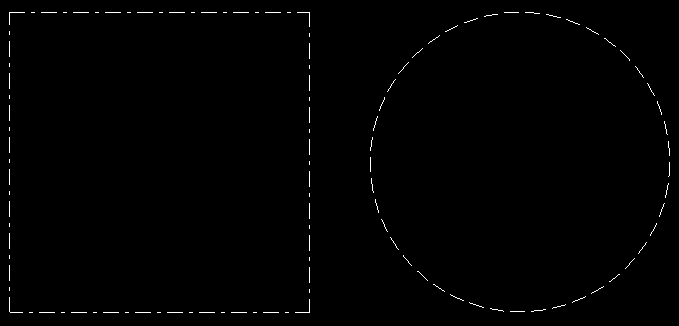
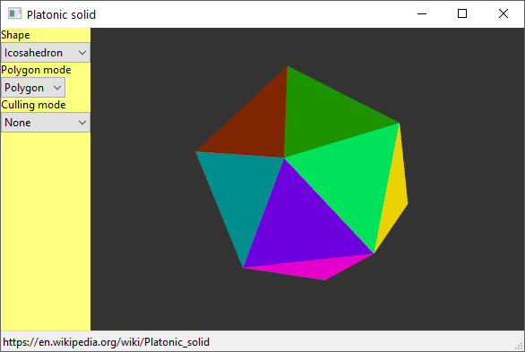
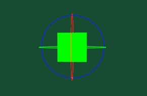
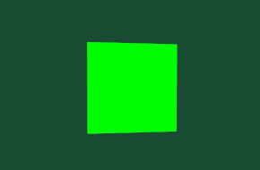

"The only way to go fast, is to go well."  
Robert C. Martin, Clean Architecture

---

# C++

[C++ code snippets](../documentation/cpp_code_snippets.md)

## Hello Triangle

[Hello Triangle - GLFW](../example/cpp/hello_triangle/hello_triangle_glfw/hello_triangle_glfw.cpp)  

## Thick lines

[Thick lines with OpenGL core profile](../documentation/thick_line_shader.md)

[thick line strip ssbo](../example/cpp/opengl_line_thickness/thick_line_strip_ssbo.cpp)  
  

[thick line, geometry shader](../example/cpp/opengl/example_shader_geometry_1_line.cpp)  
  

## Dashed lines

[Dashed line shader](../documentation/dashed_line_shader.md)  

[dashed_line_segments](../example/cpp/opengl_line_stipple/dashed_line_segments.cpp)  
[dashed_line_strip](../example/cpp/opengl_line_stipple/dashed_line_strip.cpp)  
[stippled_line_segments](../example/cpp/opengl_line_stipple/stippled_line_segments.cpp)  
  

[stippled_line_gllinestipple](../example/cpp/opengl_line_stipple/stippled_line_gllinestipple.cpp)  
[stippled_line_fixedattribute_glLineStipple](../example/cpp/opengl_line_stipple/stippled_line_fixedattribute_glLineStipple.cpp)  
[stippled_line_fixedattribute_texture_alpha_OpenGLES100](../example/cpp/opengl_line_stipple/stippled_line_fixedattribute_texture_alpha_OpenGLES100.cpp)  
[stippled_line_shader](../example/cpp/opengl_line_stipple/stippled_line_shader.cpp)  
  

## Platonic solid

> [Wikipedia - Platonic solid](https://en.wikipedia.org/wiki/Platonic_solid)
>
>In three-dimensional space, a Platonic solid is a regular, convex polyhedron. It is constructed by congruent (identical in shape and size), regular (all angles equal and all sides equal), polygonal faces with the same number of faces meeting at each vertex. Five solids meet these criteria.

[Platonic solid](../example/cpp/wx_widget_opengl_platonic_solid)  
  

## Navigate

[Navigate](cpp/example_navigate_1_orbit.md)  

[example_navigate_1_orbit](../example/cpp/opengl/example_navigate_1_orbit.cpp)  
  

## Rubik's Cube

[rubiks_cube_glfw](../example/cpp/opengl_render_utility/rubiks_cube_glfw.cpp)  

## OpenGL 4 Examples

[example_glm_animation_1](../example/cpp/opengl/example_glm_animation_1.cpp)  
  

---

[example_mesh_1_instancing](../example/cpp/opengl/example_mesh_1_instancing.cpp)  
  

---

[example_mesh_3_c_cube](../example/cpp/opengl/example_mesh_3_c_cube.cpp)  
  

---

[example_mesh_4_cube_flat](../example/cpp/opengl/example_mesh_4_cube_flat.cpp)  
  

---

[example_mesh_5](../example/cpp/opengl/example_mesh_5.cpp)  
  

---

[example_mesh_7_raytrace](../example/cpp/opengl/example_mesh_7_raytrace.cpp)  
  

---

[example_mesh_8_surface_of_revolution](../example/cpp/opengl/example_mesh_8_surface_of_revolution.cpp)  
  

---

[example_noise_1](../example/cpp/opengl/example_noise_1.cpp)  
  

---

[example_freeglut_text_freetype](../example/cpp/opengl/example_freeglut_text_freetype.cpp)  
  

---

[example_glfw_text_freetype](../example/cpp/opengl/example_glfw_text_freetype.cpp)  
  

---

## Immediate mode (Legacy) OpenGL examples

[example_beginend_cube](../example/cpp/opengl_legacy/example_beginend_cube.cpp)  
[example_beginend_freeglut_1](../example/cpp/opengl_legacy/example_beginend_freeglut_1.cpp)  
[example_beginend_shader_1](../example/cpp/opengl_legacy/example_beginend_shader_1.cpp)  
  

---

[example_fixedattribute_cube_1](../example/cpp/opengl_legacy/example_fixedattribute_cube_1.cpp)  
  

---

[example_fixedattribute_sphere_1_slices](../example/cpp/opengl_legacy/example_fixedattribute_sphere_1_slices.cpp)  
  

---

[example_glu_sphere_1](../example/cpp/opengl_legacy/example_glu_sphere_1.cpp)  
  

## Emscripten examples

[emscripten](https://emscripten.org/)

[Emscrpten OpenGL ES 2.0 triangle](../example/cpp/emscripten_opengl_minimal_example/emscripten_opengl_es2_sdl/emscripten_opengl_es2_sdl.cpp) &nbsp;&nbsp;&nbsp;&nbsp;
[Preview](https://rabbid76.github.io/graphics-snippets/example/cpp/emscripten_opengl_minimal_example/emscripten_opengl_es2_sdl/emscripten_opengl_es2_sdl.html)

[Emscrpten OpenGL ES 3.0 triangle](../example/cpp/emscripten_opengl_minimal_example/emscripten_opengl_es3_sdl/emscripten_opengl_es3_sdl.cpp) &nbsp;&nbsp;&nbsp;&nbsp;
[Preview](https://rabbid76.github.io/graphics-snippets/example/cpp/emscripten_opengl_minimal_example/emscripten_opengl_es3_sdl/emscripten_opengl_es3_sdl.html)
