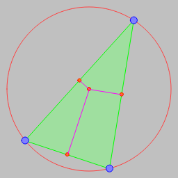
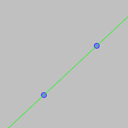
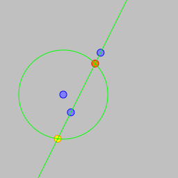

"Every time you write a comment, you should grimace and feel the failure of your ability of expression."  
Robert C. Martin, The Robert C. Martin Clean Code Collection (Collection)

---

# [p5.js](https://p5js.org/) and [Processing](https://processing.org/)

## [p5.js](https://p5js.org/)

[Circle by 3 points](../example/p5.js/p5js_circle_3_points.html)  

[ Endless line through by 2 points - p5.js](../example/p5.js/p5js_endless_line.html)  

[ Intersect line and circle](../example/p5.js/p5js_circle_line_intersection.html)  

[Random shape - p5.js](../example/p5.js/random_shape_1.html)  

[Ray intersect line and reflect](../example/p5.js/p5js_intersect_line_reflect.html)  
  

## [p5.js](https://p5js.org/) StackOverflow example

[Bouncing ball](https://rabbid76.github.io/graphics-snippets/processing/p5_js_stackoverflow/p5js_so_bounceing_ball_1.htm)

## [Processing](https://processing.org/)

[noise curve](../example/processing/shape_noise_curve/shape_noise_curve.pde)
