

"I'm a programmer. I like programming. And the best way I've found to have a positive impact on code is to write it."  
Robert C. Martin, Clean Architecture

---

# Python examples

[Python code snippets](../documentation/python_code_snippets.md)

## Examples

### Mesh

[OpenGL 4.6, Direct State Access (DSA), Spir-V Shader Program](https://github.com/Rabbid76/graphics-snippets/blob/master/example/python/dsa_spirv_cube/example_python_dsa_spirv.md)  
[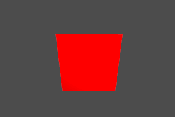](https://github.com/Rabbid76/graphics-snippets/blob/master/example/python/dsa_spirv_cube/example_python_dsa_spirv.md)

[Mesh](../example/python/mesh/glut_opengl_shader_ctypes_glm_meshes.py)  
[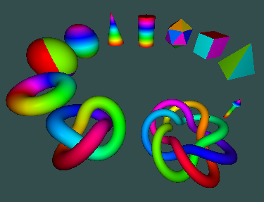](../example/python/mesh/glut_opengl_shader_ctypes_glm_meshes.py)

[Mesh in Tkinter frame](../example/python/mesh/tkinter_opengl_shader_ctypes_glm_meshes.py)  
[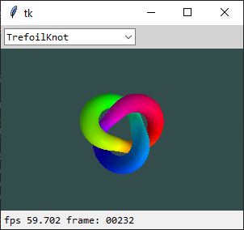](../example/python/mesh/tkinter_opengl_shader_ctypes_glm_meshes.py)

[Instancing](../example/python/mesh/glut_opengl_shader_instancing_cube.py)  
[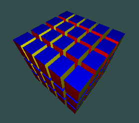](../example/python/mesh/glut_opengl_shader_instancing_cube.py)

[Visualizing a 3D NumPy array with PyOpenGL](python/glut_opengl_shader_instancing_array.md)  

[Draw elements](../example/python/mesh/glut_opengl_draw_elements.py)

### Geometry shader

[Geometry](../documentation/geometry.md)  
  
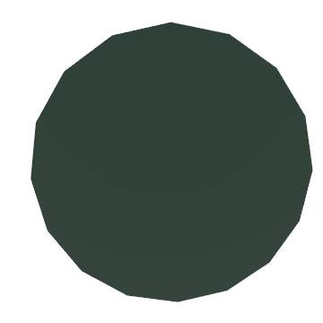
### Tessellation shader

[Tessellation](../documentation/tessellation.md)  
  
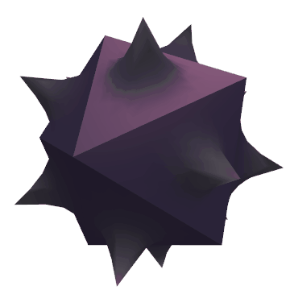

### Model, View and Projection

[OpenGL 4.6, Python OpenGL 4.6, GLM navigation](https://github.com/Rabbid76/graphics-snippets/blob/master/example/python/navigation_glm/example_python_navigation_glm.md)  
[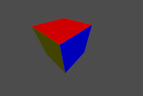](https://github.com/Rabbid76/graphics-snippets/blob/master/example/python/navigation_glm/example_python_navigation_glm.md)

### Text

[OpenGL 4.6, Python OpenGL 4.6, freetype text](https://github.com/Rabbid76/graphics-snippets/blob/master/example/python/text_freetype/freetype_text.md)  
  

### Voxel

[OpenGL 4.6, Python OpenGL 4.6, voxel ray tracing](https://github.com/Rabbid76/graphics-snippets/blob/master/example/python/voxel_raytrace/voxel_raytrace.md)  
[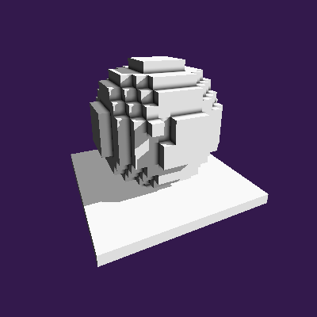](https://github.com/Rabbid76/graphics-snippets/blob/master/example/python/voxel_raytrace/voxel_raytrace.md)

### Shadow

[Shadow](../example/python/shadow/glut_opengl_shader_ctypes_glm_shadow_volume.py)  
[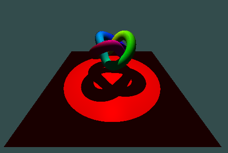](../example/python/shadow/glut_opengl_shader_ctypes_glm_shadow_volume.py)  

### Parallax

[Parallax](../example/python/parallax/glut_opengl_shader_glm_cube_parallax.py)  
[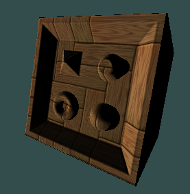](../example/python/parallax/glut_opengl_shader_glm_cube_parallax.py)

[Relief mapping with geometry shader](../example/python/parallax/parallax_009_protruded_displ_mapping_geo_tbn/protruded_displ_mapping_geo_tbn.py)  
[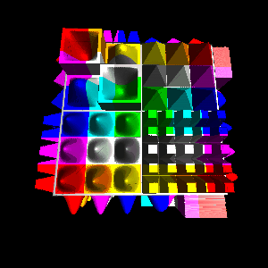](../example/python/parallax/parallax_009_protruded_displ_mapping_geo_tbn/protruded_displ_mapping_geo_tbn.py)

### SSAO

[no SSAO, diffuse light](../example/python\/ssao_and_hbao/no_ssao_diffuse_light.py)  
[fixed SSAO](../example/python/ssao_and_hbao/ssao_fixed.py)  
[kernel SSAO](../example/python/ssao_and_hbao/ssao_kernel.py)  
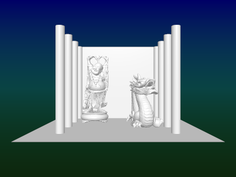
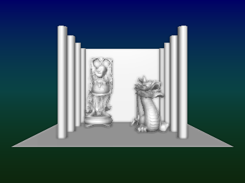
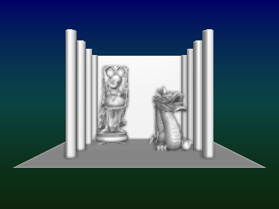

### 2D shader

[2D rounded rectangle](../example/python/opengl_minimal_example/minimal_example_shader_2d_rounded_rectangle.py)  

[2D rounded rectangle with shadow](../example/python/opengl_minimal_example/minimal_example_shader_2d_rounded_rectangle_shadow.py)  

### Ray marching shader

[Ray marching - shapes](../example/python/opengl_minimal_example/minimal_example_shader_ray_march_shapes.py)  

## Minimal example

[Debug Output](../example/python/opengl_minimal_example/minimal_example_debug_output.py)

[Texture](../example/python/opengl_minimal_example/minimal_example_texture.py)

[Cub Mesh (glut)](../example/python/opengl_minimal_example/minimal_example_shader_mesh.py)

[Cube Mesh (glfw)](../example/python/opengl_minimal_example/minimal_example_mesh_cube.py)  
[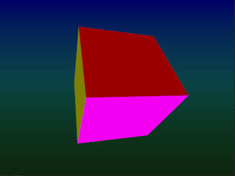](../example/python/opengl_minimal_example/minimal_example_mesh_cube.py) 

[Wood shader](../example/python/opengl_minimal_example/minimal_example_wood_shader.py)  
[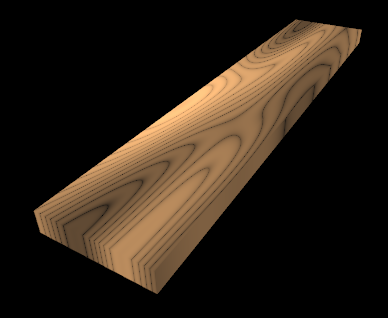](../example/python/opengl_minimal_example/minimal_example_wood_shader.py) 

[Zoom](../example/python/opengl_minimal_example/minimal_example_zoom.py)  

[Pan cube 1](../example/python/opengl_minimal_example/minimal_example_pan_1.py)  
[Pan cube 2](../example/python/opengl_minimal_example/minimal_example_pan_2.py)

[Wavefront (obj) - viewer](../example/python/opengl_minimal_example/minimal_example_wavefront_viewer.py)  
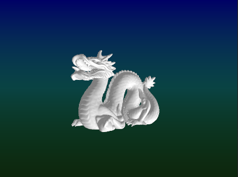

[Compute shader](../example/python/opengl_minimal_example/minimal_example_compute_shader.py)

[Shader 2D](../example/python/opengl_minimal_example/minimal_example_shader_2d.py)

[Freetype - Hello world](../example/python/opengl_minimal_example/minimal_example_shader_text_freetype_hello_world.py)  

[Shared context](../example/python/opengl_minimal_example/minimal_example_shared_context.py)

## PyGame

See

- [PyGame Examples and Answers](https://github.com/Rabbid76/PyGameExamplesAndAnswers)
- [PyGameRayTracing](https://github.com/Rabbid76/PyGameRayTracing)

## Legacy OpenGL

[Immediate mode and legacy OpenGL](content_python_legacy.md)

## Math

[.obj to raw vertices converter with normals in python](https://stackoverflow.com/questions/54649416/obj-to-raw-vertices-converter-with-normals-in-python/54847016#54847016)  
