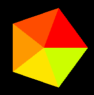

---

# Immediate mode and legacy OpenGL

## Primitive

### Point

[point size and smooth point](../example/python/legacy_opengl/point_size_point_smooth.py)  

### Line

[wireframe cube](../example/python/legacy_opengl/line_wireframe_cube.py)  

### Shapes

[platonic solids](../example/python/legacy_opengl/platonic_solids.py)  

## Shader

[legacy shader minimal example](../example/python/legacy_opengl/shader_legacy_minimal_example.py)

## Glu

### Glu Shapes

[glu sphere - PLI texture](../example/python/legacy_opengl/glu_sphere_pli_texture.py)  

## Glut

[glut minimal example](../example/python/legacy_opengl/glut_minimal_example.py)

### Glut Shapes

[glut solid cylinder](../example/python/legacy_opengl/glut_solid_cylinder.py)  

[glut solid cylinder between 2 points](../example/python/legacy_opengl/glut_solid_cylinder_between_points.py)  

[glut wire teapot](../example/python/legacy_opengl/glut_wire_teapot.py)  
[glut solid teapot](../example/python/legacy_opengl/glut_solid_teapot.py)  

### Text

[glut bitmap character - window position](../example/python/legacy_opengl/glut_text_bitmap_character_window_position.py)  

[glut bitmap character - raster position](../example/python/legacy_opengl/glut_text_bitmap_character_raster_position.py)  

[glut stroke character](../example/python/legacy_opengl/glut_text_stroke_character.py)  

### Event loop

[glut event loop - close window](../example/python/legacy_opengl/glut_event_loop_close.py)

## Glfw

[glut minimal example - CamelCase](../example/python/legacy_opengl/glfw_minimal_example_CamelCase.py)

[glut minimal example - snake case](../example/python/legacy_opengl/glfw_minimal_example_snake_case.py)

## PyGame

[pygame minimal example](../example/python/legacy_opengl/pygame_minimal_example.py)
