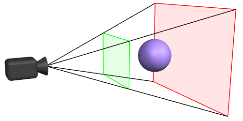

"You keep on learning and learning, and pretty soon you learn something no one has learned before"
Richard P. Feynman

---

# three.js

[Examples](https://rabbid76.github.io/graphics-snippets/example/nodejs/three_js_examples/deployment/)  
[Examples](../example/nodejs/three_js_examples/deployment/)  

[ Perspective Viewing Frustum](https://rabbid76.github.io/graphics-snippets/example/threejs/three_perspective.html)

## StackOverflow examples - three.js

[ BSP geometry - subtract cube](https://rabbid76.github.io/graphics-snippets/example/threejs/stackoverflow/geometry_bsp_subtract_cube.html)

[ BSP geometry - subtract sphere](https://rabbid76.github.io/graphics-snippets/example/threejs/stackoverflow/geometry_bsp_subtract_sphere.html)

[ BSP geometry - subtract heart](https://rabbid76.github.io/graphics-snippets/example/threejs/stackoverflow/geometry_bsp_subtract_heart.html)

[ geometry - extrude](https://rabbid76.github.io/graphics-snippets/example/threejs/stackoverflow/geometry_extrude.html)

[Logarithmic depth buffer (cube)](https://rabbid76.github.io/graphics-snippets/html/stackoverrflow_threejs/logarithmic_depth_cube.html)

[ Dashed line shader](https://rabbid76.github.io/graphics-snippets/example/threejs/stackoverflow/dashed_line.html)

[ Cube tilt (axis)](https://rabbid76.github.io/graphics-snippets/example/threejs/stackoverflow/pivote_rotate_group.html)
