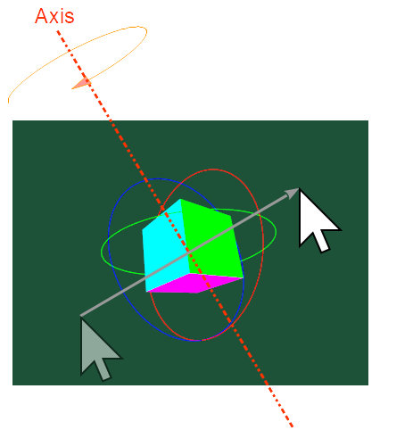
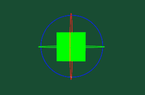

[](https://stackoverflow.com/users/5577765/rabbid76?tab=profile)

"Once I get on a puzzle, I can't get off."  
Richard P. Feynman

---

# Navigate

## Orbit

When dragging the mouse, the object must be rotated around an axis that is perpendicular to the direction of movement of the mouse. The pivot is the orin of the model.

[](../../example/cpp/opengl/example_navigate_1_orbit.cpp)  

Rotate the mouse movement vector by 90 ° in the XY plane of the view. Since this is a vector in view space, the vector must be transformed from view space into world space. The matrix that transforms a vector from view space to world space is the inverse matrix of the upper left 3x3 of the view matrix:

```cpp
vec2 drag_start;
vec2 drag_end;
```

```cpp
glm::mat3 to_world = glm::inverse(glm::mat3(view_matrix));
glm::vec2 drag_vec = glm::vec2(drag_end.x - drag_start.x, drag_start.y - drag_end.y);
glm::vec3 axis_vec = glm::normalize(to_world * glm::vec3(-drag_vec.y, drag_vec.x, 0));
```

Create a rotation matrix around the axis. The angle depends on the length of the vector (`height` is the height of the viewport in pixels):

```cpp
GLfloat angle = glm::length(drag_vec) / height / 2 * M_PI;
drag_rotation = glm::rotate(glm::mat4(1.0f), angle, axis_vec);
```

Compute a rotation matrix while dragging the mouse. Concatenate the rotation matrix and the model matrix after the drag ends:

```cpp
glm::mat4 view_matrix(1.0f);
glm::mat4 model_rotation(1.0f);
glm::mat4 drag_rotation(1.0f);
glm::vec2 drag_start(0.0f);
bool drag = false;

void mouse_button_callback(GLFWwindow* window, int button, int action, int mods)
{
    if (button != GLFW_MOUSE_BUTTON_LEFT)
        return;

    if (action == GLFW_PRESS)
    {
        drag = true;
        double xpos, ypos;
        glfwGetCursorPos(window, &xpos, &ypos);
        drag_start = glm::vec2(xpos, ypos);
    }
    else if (action == GLFW_RELEASE)
    {
        drag = false;
        model_rotation = drag_rotation * model_rotation;
        drag_rotation = glm::mat4(1.0f);
    }
}

void cursor_position_callback(GLFWwindow* window, double xpos, double ypos)
{
    if (!drag)
        return;

    glm::mat3 to_world = glm::inverse(glm::mat3(view_matrix));
    glm::vec2 drag_vec = glm::vec2(xpos - drag_start.x, drag_start.y - ypos);
    
    glm::vec3 axis_vec = glm::normalize(to_world * glm::vec3(-drag_vec.y, drag_vec.x, 0));
    GLfloat angle = glm::length(drag_vec) / height / 2 * M_PI;
    
    drag_rotation = glm::rotate(glm::mat4(1.0f), angle, axis_vec);
}
```

The model matrix is the concatenation of `drag_rotation` and `model_rotation`:

```cpp
glm::mat4 model = drag_rotation * model_rotation;
```

---

Complete example:

[](../../example/cpp/opengl/example_navigate_1_orbit.cpp)

```cpp
#include <GL/glew.h>
#include <GL/gl.h>
#include <glm/glm.hpp>
#include <glm/gtc/matrix_transform.hpp>
#include <glm/gtc/type_ptr.hpp>
#include <GLFW/glfw3.h>
#include <vector>
#include <string>
#include <stdexcept>
#include <iostream>
#define _USE_MATH_DEFINES
#include <cmath>
#include <math.h>
#ifndef M_PI
#define M_PI 3.14159265358979323846 
#endif

std::string sh_vert = R"(
#version 460 core

layout (location = 0) in vec4 a_position;
layout (location = 1) in vec3 a_uvw;

out vec3 v_uvw;

layout (location = 0) uniform mat4 u_projection;
layout (location = 1) uniform mat4 u_view;
layout (location = 2) uniform mat4 u_model;

void main() 
{
    v_uvw = a_uvw;
    gl_Position = u_projection * u_view * u_model * a_position;
}
)";

std::string sh_frag = R"(
#version 460 core

out vec4 frag_color;
in vec3 v_uvw;

vec3 HUEtoRGB(in float H)
{
    float R = abs(H * 6.0 - 3.0) - 1.0;
    float G = 2.0 - abs(H * 6.0 - 2.0);
    float B = 2.0 - abs(H * 6.0 - 4.0);
    return clamp(vec3(R, G, B), 0.0, 1.0);
}

void main()
{
    frag_color = vec4(HUEtoRGB(v_uvw.z), 1.0);
}
)";

class ShaderProgram
{
public:
    GLuint programObject;
    static ShaderProgram newProgram(const std::string& vsh, const std::string& fsh);
private:
    GLuint compileShader(const std::string& sourceCode, GLenum shaderType);
    void linkProgram(std::vector<GLuint> shObjs);
    void compileStatus(GLuint shader);
    void linkStatus();
};

class VertexArrayObject
{
public:
    GLuint vaoObject = 0;
    GLsizei noOfVertices = 0;
    GLsizei noOfIndices = 0;
    static VertexArrayObject newCube();
    static VertexArrayObject newCircles();
    static VertexArrayObject newVAO(const std::vector<GLfloat>& varray, const std::vector<GLuint>& iarray);
};

class DebugOutput
{
public:
    DebugOutput(bool error_only = false);
private:
    static void __stdcall DebugCallback(GLuint source, GLuint type, GLuint id, GLuint severity, GLint length, const GLchar* message, const GLvoid* userParam);
};

int width = 800, height = 600;
glm::mat4 view_matrix(1.0f);
glm::mat4 model_rotation(1.0f);
glm::mat4 drag_rotation(1.0f);
glm::vec2 drag_start(0.0f);
bool drag = false;

void mouse_button_callback(GLFWwindow* window, int button, int action, int mods)
{
    if (button != GLFW_MOUSE_BUTTON_LEFT)
        return;

    if (action == GLFW_PRESS)
    {
        drag = true;
        double xpos, ypos;
        glfwGetCursorPos(window, &xpos, &ypos);
        drag_start = glm::vec2(xpos, ypos);
    }
    else if (action == GLFW_RELEASE)
    {
        drag = false;
        model_rotation = drag_rotation * model_rotation;
        drag_rotation = glm::mat4(1.0f);
    }
}

void cursor_position_callback(GLFWwindow* window, double xpos, double ypos)
{
    if (!drag)
        return;

    glm::mat3 to_world = glm::inverse(glm::mat3(view_matrix));
    glm::vec2 drag_vec = glm::vec2(xpos - drag_start.x, drag_start.y - ypos);
    
    glm::vec3 axis_vec = glm::normalize(to_world * glm::vec3(-drag_vec.y, drag_vec.x, 0));
    GLfloat angle = glm::length(drag_vec) / height / 2 * M_PI;
    
    drag_rotation = glm::rotate(glm::mat4(1.0f), angle, axis_vec);
}

int main(void)
{
    if (glfwInit() == GLFW_FALSE)
        throw std::runtime_error( "error initializing glfw" );

    glfwWindowHint(GLFW_SAMPLES, 8);
    GLFWwindow * window = glfwCreateWindow(width, height, "OGL window", nullptr, nullptr);
    if (window == nullptr)
    {
        glfwTerminate();
        throw std::runtime_error( "error initializing window" ); 
    }
    glfwSetMouseButtonCallback(window, mouse_button_callback);
    glfwSetCursorPosCallback(window, cursor_position_callback);
    glfwMakeContextCurrent(window);

    if ( glewInit() != GLEW_OK )
        throw std::runtime_error( "error initializing glew" );
    DebugOutput debugOutput;

    auto progam = ShaderProgram::newProgram(sh_vert, sh_frag);
    auto cube = VertexArrayObject::newCube();
    auto circles = VertexArrayObject::newCircles();
    glUseProgram(progam.programObject);
    glEnable( GL_DEPTH_TEST );
    glClearColor(0.1f, 0.3f, 0.2f, 0.0f);

    view_matrix = glm::lookAt(glm::vec3(0.0f, 0.0f, 7.0f), glm::vec3(0.0f, 0.0f, 0.0f), glm::vec3(0.0f, 1.0f, 0.0f));
    glUniformMatrix4fv(1, 1, GL_FALSE, glm::value_ptr(view_matrix));

    while (!glfwWindowShouldClose(window))
    {
        glfwGetFramebufferSize(window, &width, &height);
        
        float ascpect = (float)width / (float)height;
        glm::mat4 project = glm::perspective(glm::radians(60.0f), ascpect, 0.1f, 20.0f);        
        glUniformMatrix4fv(0, 1, GL_FALSE, glm::value_ptr(project));
        glm::mat4 model = drag_rotation * model_rotation;

        glViewport(0, 0, width, height);
        glClear( GL_COLOR_BUFFER_BIT | GL_DEPTH_BUFFER_BIT );
      
        glUniformMatrix4fv(2, 1, GL_FALSE, glm::value_ptr(model));
        glBindVertexArray(cube.vaoObject);
        glDrawElements(GL_TRIANGLES, cube.noOfIndices, GL_UNSIGNED_INT, nullptr);
        
        glUniformMatrix4fv(2, 1, GL_FALSE, glm::value_ptr(glm::scale(model, glm::vec3(2.5f))));
        glBindVertexArray(circles.vaoObject);
        glDrawElements(GL_LINES, circles.noOfIndices, GL_UNSIGNED_INT, nullptr);

        glfwSwapBuffers(window);
        glfwPollEvents();
    }

    glfwDestroyWindow(window);
    glfwTerminate();

    return 0;
}

ShaderProgram ShaderProgram::newProgram(const std::string& vsh, const std::string& fsh)
{
    ShaderProgram program;
    auto shObjs = std::vector<GLuint>
    {
        program.compileShader(vsh, GL_VERTEX_SHADER),
        program.compileShader(fsh, GL_FRAGMENT_SHADER),
    };
    for (auto shObj : shObjs)
        program.compileStatus(shObj);
    program.linkProgram(shObjs);
    for (auto shObj : shObjs)
        glDeleteShader(shObj);
    return program;
}

GLuint ShaderProgram::compileShader(const std::string& sourceCode, GLenum shaderType)
{
    auto shaderObj = glCreateShader(shaderType);
    const char* srcCodePtr = sourceCode.c_str();
    glShaderSource(shaderObj, 1, &srcCodePtr, nullptr);
    glCompileShader(shaderObj);
    return shaderObj;
}

void ShaderProgram::linkProgram(std::vector<GLuint> shObjs)
{
    programObject = glCreateProgram();
    for (auto shObj : shObjs)
        glAttachShader(programObject, shObj);
    glLinkProgram(programObject);
    linkStatus();
}

void ShaderProgram::compileStatus(GLuint shader)
{
    GLint status = GL_TRUE;
    glGetShaderiv(shader, GL_COMPILE_STATUS, &status);
    if (status == GL_FALSE)
    {
        GLint logLen;
        glGetShaderiv(shader, GL_INFO_LOG_LENGTH, &logLen);
        std::vector< char >log(logLen);
        GLsizei written;
        glGetShaderInfoLog(shader, logLen, &written, log.data());
        std::cout << "compile error:" << std::endl << log.data() << std::endl;
    }
}

void ShaderProgram::linkStatus()
{
    GLint status = GL_TRUE;
    glGetProgramiv(programObject, GL_LINK_STATUS, &status);
    if (status == GL_FALSE)
    {
        GLint logLen;
        glGetProgramiv(programObject, GL_INFO_LOG_LENGTH, &logLen);
        std::vector< char >log(logLen);
        GLsizei written;
        glGetProgramInfoLog(programObject, logLen, &written, log.data());
        std::cout << "link error:" << std::endl << log.data() << std::endl;
    }
}

VertexArrayObject VertexArrayObject::newCube()
{
    static const std::vector<GLfloat> vertices{ -1, -1, -1, 1, -1, -1, 1, 1, -1, -1, 1, -1, -1, -1, 1, 1, -1, 1, 1, 1, 1, -1, 1, 1 };
    static const std::vector<GLfloat> uv{ 0, 0, 1, 0, 1, 1, 0, 1 };
    static const std::vector<size_t> faces{ 0, 1, 2, 3, 1, 5, 6, 2, 5, 4, 7, 6, 4, 0, 3, 7, 3, 2, 6, 7, 1, 0, 4, 5 };

    std::vector<GLfloat> varray;
    std::vector<GLuint> iarray;
    for (auto si = 0; si < faces.size() / 4; si++)
    {
        for (auto qi = 0; qi < 4; qi++)
        {
            varray.insert(varray.end(), vertices.begin() + faces[si * 4 + qi] * 3, vertices.begin() + faces[si * 4 + qi] * 3 + 3);
            std::vector<GLfloat> uvw{ 0, 0, (GLfloat)si * 4.0f / (GLfloat)faces.size() };
            varray.insert(varray.end(), uvw.begin(), uvw.end());
        }
        std::vector<GLuint> indices{ 4u * si, 4u * si + 1, 4u * si + 2, 4u * si, 4u * si + 2, 4u * si + 3 };
        iarray.insert(iarray.end(), indices.begin(), indices.end());
    }

    return newVAO(varray, iarray);
}

VertexArrayObject VertexArrayObject::newCircles()
{
    const GLuint noC = 360;
    std::vector<GLfloat> varray;
    std::vector<GLuint> iarray;

    for (int i = 0; i <= noC; i++)
    {
        GLfloat angle = static_cast<GLfloat>(i * 2 * M_PI / noC);
        GLfloat c = cos(angle), s = sin(angle);
        std::vector<GLfloat> va{ 0, c, s, 0, 0, 0, s, 0, c, 0, 0, 1.0f / 3.0f, c, s, 0, 0, 0, 2.0f / 3.0f };
        varray.insert(varray.end(), va.begin(), va.end());
    }
    for (GLuint ci = 0; ci < 3; ci++)
    {
        for (GLuint i = 0; i <= noC; i++)
        {
            std::vector<GLuint> ia{ i * 3 + ci, ((i + 1) % noC) * 3 + ci };
            iarray.insert(iarray.end(), ia.begin(), ia.end());
        }
    }

    return newVAO(varray, iarray);
}

VertexArrayObject VertexArrayObject::newVAO(const std::vector<GLfloat>& varray, const std::vector<GLuint>& iarray)
{
    VertexArrayObject vao;
    vao.noOfIndices = static_cast<GLsizei>(iarray.size());
    vao.noOfVertices = static_cast<GLsizei>(varray.size() / 6);

    GLuint bufferObjects[2];
    glGenBuffers(2, bufferObjects);;
    glGenVertexArrays(1, &vao.vaoObject);

    glBindVertexArray(vao.vaoObject);
    glEnableVertexAttribArray(0);
    glEnableVertexAttribArray(1);
    glBindBuffer(GL_ARRAY_BUFFER, bufferObjects[0]);
    glBufferData(GL_ARRAY_BUFFER, varray.size() * sizeof(*varray.data()), varray.data(), GL_STATIC_DRAW);
    glVertexAttribPointer(0, 3, GL_FLOAT, GL_FALSE, 6 * sizeof(*varray.data()), 0);
    glVertexAttribPointer(1, 3, GL_FLOAT, GL_FALSE, 6 * sizeof(*varray.data()), (void*)(3 * sizeof(*varray.data())));
    if (vao.noOfIndices > 0)
    {
        glBindBuffer(GL_ELEMENT_ARRAY_BUFFER, bufferObjects[1]);
        glBufferData(GL_ELEMENT_ARRAY_BUFFER, iarray.size() * sizeof(*iarray.data()), iarray.data(), GL_STATIC_DRAW);
    }
    glBindVertexArray(0);
    glDeleteBuffers(2, bufferObjects);

    return vao;
}

void __stdcall DebugOutput::DebugCallback(GLuint source, GLuint type, GLuint id, GLuint severity, GLint length, const GLchar* message, const GLvoid* userParam)
{
    std::cout << message << std::endl;
}

DebugOutput::DebugOutput(bool error_only)
{
    if (glDebugMessageCallback != nullptr && glDebugMessageControl != nullptr)
    {
        glDebugMessageCallback(DebugOutput::DebugCallback, nullptr);
        if (error_only)
        {
            glDebugMessageControl(GL_DONT_CARE, GL_DONT_CARE, GL_DONT_CARE, 0, NULL, GL_FALSE);
            glDebugMessageControl(GL_DEBUG_SOURCE_API, GL_DEBUG_TYPE_ERROR, GL_DONT_CARE, 0, NULL, GL_TRUE);
        }
        else
        {
            glDebugMessageControl(GL_DONT_CARE, GL_DONT_CARE, GL_DONT_CARE, 0, nullptr, GL_TRUE);
        }
        glEnable(GL_DEBUG_OUTPUT);
        glEnable(GL_DEBUG_OUTPUT_SYNCHRONOUS);
    }
}
```